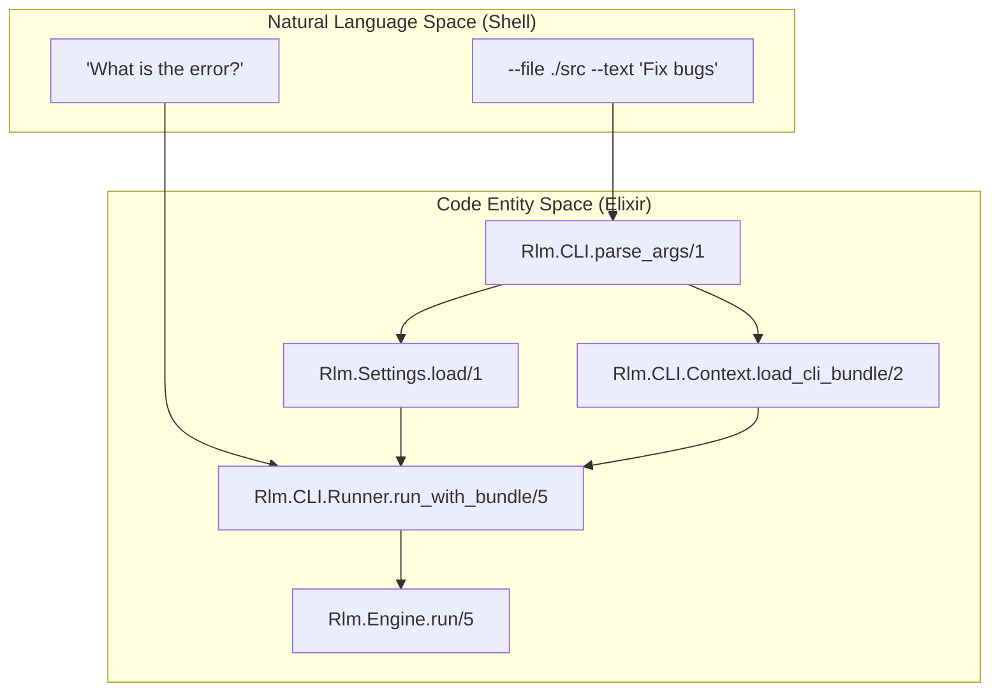
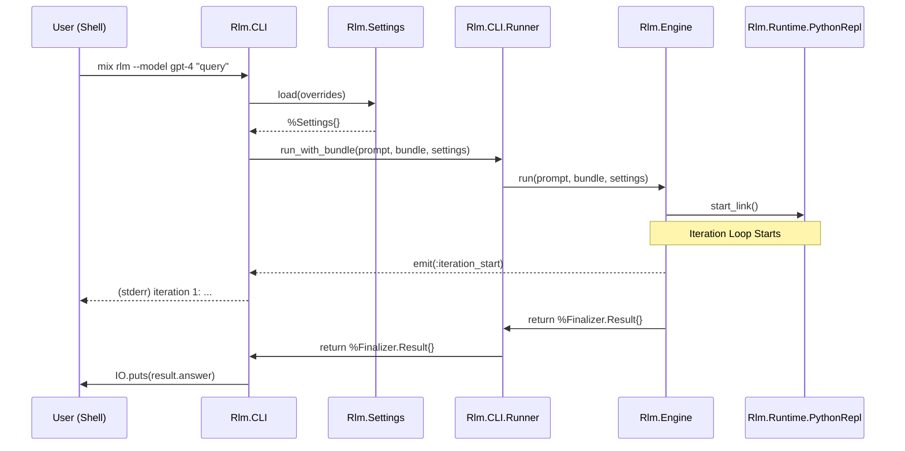

# CLI Entrypoint and Session
Relevant source files
- [.formatter.exs](https://github.com/Cody-W-Tucker/rlm/blob/4bc8e1ba/.formatter.exs)
- [bin/rlm-postmortem-json](https://github.com/Cody-W-Tucker/rlm/blob/4bc8e1ba/bin/rlm-postmortem-json)
- [config/runtime.exs](https://github.com/Cody-W-Tucker/rlm/blob/4bc8e1ba/config/runtime.exs)
- [lib/mix/tasks/rlm.ex](https://github.com/Cody-W-Tucker/rlm/blob/4bc8e1ba/lib/mix/tasks/rlm.ex)
- [lib/rlm.ex](https://github.com/Cody-W-Tucker/rlm/blob/4bc8e1ba/lib/rlm.ex)
- [lib/rlm/application.ex](https://github.com/Cody-W-Tucker/rlm/blob/4bc8e1ba/lib/rlm/application.ex)
- [lib/rlm/cli.ex](https://github.com/Cody-W-Tucker/rlm/blob/4bc8e1ba/lib/rlm/cli.ex)
- [lib/rlm/cli/context.ex](https://github.com/Cody-W-Tucker/rlm/blob/4bc8e1ba/lib/rlm/cli/context.ex)
- [lib/rlm/cli/events.ex](https://github.com/Cody-W-Tucker/rlm/blob/4bc8e1ba/lib/rlm/cli/events.ex)
- [lib/rlm/cli/runner.ex](https://github.com/Cody-W-Tucker/rlm/blob/4bc8e1ba/lib/rlm/cli/runner.ex)
- [lib/rlm/cli/session.ex](https://github.com/Cody-W-Tucker/rlm/blob/4bc8e1ba/lib/rlm/cli/session.ex)
- [lib/rlm/engine/README.md](https://github.com/Cody-W-Tucker/rlm/blob/4bc8e1ba/lib/rlm/engine/README.md?plain=1)
- [lib/rlm/settings.ex](https://github.com/Cody-W-Tucker/rlm/blob/4bc8e1ba/lib/rlm/settings.ex)
- [priv/runtime/exec.py](https://github.com/Cody-W-Tucker/rlm/blob/4bc8e1ba/priv/runtime/exec.py)
- [test/rlm/cli/workflow_test.exs](https://github.com/Cody-W-Tucker/rlm/blob/4bc8e1ba/test/rlm/cli/workflow_test.exs)

The RLM CLI serves as the primary interface for executing grounded language model runs. It supports both one-shot execution via standard shell arguments and an interactive session mode with persistent context. The CLI layer is responsible for argument parsing, configuration merging, context assembly, and real-time event reporting.

## Overview of CLI Components

The CLI architecture is divided into specialized modules that handle the transition from raw user input to a structured `Rlm.Engine` execution.

| Module | Responsibility |
| --- | --- |
| `Rlm.CLI` | Top-level entrypoint and argument parsing logic [lib/rlm/cli.ex1-121](https://github.com/Cody-W-Tucker/rlm/blob/4bc8e1ba/lib/rlm/cli.ex#L1-L121) |
| `Rlm.CLI.Runner` | Orchestrates the engine run and persists the resulting `RunStore` data [lib/rlm/cli/runner.ex1-29](https://github.com/Cody-W-Tucker/rlm/blob/4bc8e1ba/lib/rlm/cli/runner.ex#L1-L29) |
| `Rlm.CLI.Session` | Manages interactive state, slash commands, and incremental context loading [lib/rlm/cli/session.ex1-210](https://github.com/Cody-W-Tucker/rlm/blob/4bc8e1ba/lib/rlm/cli/session.ex#L1-L210) |
| `Rlm.CLI.Context` | Translates CLI flags (`--file`, `--url`, `--text`) into `Rlm.Context.Loader` calls [lib/rlm/cli/context.ex1-83](https://github.com/Cody-W-Tucker/rlm/blob/4bc8e1ba/lib/rlm/cli/context.ex#L1-L83) |
| `Rlm.CLI.Events` | Formats engine progress events for display on `stderr` or interactive `stdout`[lib/rlm/cli/events.ex1-55](https://github.com/Cody-W-Tucker/rlm/blob/4bc8e1ba/lib/rlm/cli/events.ex#L1-L55) |

## Argument Parsing and Dispatch

The CLI uses `OptionParser` to handle a variety of switches that control both the environment and the context provided to the model.

### Execution Flow: One-Shot

1. **Entry**: `Rlm.CLI.main/1` is called by the `mix rlm` task or the compiled binary [lib/rlm/cli.ex45-54](https://github.com/Cody-W-Tucker/rlm/blob/4bc8e1ba/lib/rlm/cli.ex#L45-L54)
2. **Parsing**: `parse_args/1` processes switches like `--model`, `--provider`, and `--judgment-style`[lib/rlm/cli.ex96-105](https://github.com/Cody-W-Tucker/rlm/blob/4bc8e1ba/lib/rlm/cli.ex#L96-L105)
3. **Settings**: `build_settings/1` merges CLI overrides into the global `Rlm.Settings`[lib/rlm/cli.ex107-116](https://github.com/Cody-W-Tucker/rlm/blob/4bc8e1ba/lib/rlm/cli.ex#L107-L116)
4. **Context**: `Context.load_cli_bundle/2` aggregates all files, URLs, and stdin into a single bundle [lib/rlm/cli/context.ex33-38](https://github.com/Cody-W-Tucker/rlm/blob/4bc8e1ba/lib/rlm/cli/context.ex#L33-L38)
5. **Runner**: `Runner.run_with_bundle/5` initiates the engine and triggers persistence [lib/rlm/cli/runner.ex16-27](https://github.com/Cody-W-Tucker/rlm/blob/4bc8e1ba/lib/rlm/cli/runner.ex#L16-L27)

### Data Flow: From Shell to Engine

The following diagram maps the transition from natural language shell arguments to internal code entities.

**CLI Input Mapping**

Sources: [lib/rlm/cli.ex73-94](https://github.com/Cody-W-Tucker/rlm/blob/4bc8e1ba/lib/rlm/cli.ex#L73-L94)[lib/rlm/cli/runner.ex16-27](https://github.com/Cody-W-Tucker/rlm/blob/4bc8e1ba/lib/rlm/cli/runner.ex#L16-L27)[lib/rlm/settings.ex66-110](https://github.com/Cody-W-Tucker/rlm/blob/4bc8e1ba/lib/rlm/settings.ex#L66-L110)

## Interactive Session (`Rlm.CLI.Session`)

Interactive mode allows users to build context incrementally and run multiple queries against the same persistent state.

### Slash Commands

The session supports several built-in commands for managing the environment [lib/rlm/cli/session.ex156-169](https://github.com/Cody-W-Tucker/rlm/blob/4bc8e1ba/lib/rlm/cli/session.ex#L156-L169):

- `/file <path>`: Adds files or directories to the current context [lib/rlm/cli/session.ex211-220](https://github.com/Cody-W-Tucker/rlm/blob/4bc8e1ba/lib/rlm/cli/session.ex#L211-L220)
- `/paste`: Starts a multi-line input mode until "EOF" is typed [lib/rlm/cli/session.ex89-101](https://github.com/Cody-W-Tucker/rlm/blob/4bc8e1ba/lib/rlm/cli/session.ex#L89-L101)
- `/context`: Displays the currently loaded context sources and byte counts [lib/rlm/cli/session.ex67-70](https://github.com/Cody-W-Tucker/rlm/blob/4bc8e1ba/lib/rlm/cli/session.ex#L67-L70)
- `/clear-context`: Resets the context bundle to empty [lib/rlm/cli/session.ex72-75](https://github.com/Cody-W-Tucker/rlm/blob/4bc8e1ba/lib/rlm/cli/session.ex#L72-L75)
- `/model <id>`: Switches the LLM model for subsequent runs [lib/rlm/cli/session.ex195-209](https://github.com/Cody-W-Tucker/rlm/blob/4bc8e1ba/lib/rlm/cli/session.ex#L195-L209)

### Inline Context Loading

Users can load context directly within a prompt using the `@` prefix. For example:
`@lib/rlm/cli.ex How does the dispatcher work?`
The `Context.inline_context_prompt/1` function splits these tokens, loading the file before sending the remaining text as the prompt [lib/rlm/cli/context.ex54-58](https://github.com/Cody-W-Tucker/rlm/blob/4bc8e1ba/lib/rlm/cli/context.ex#L54-L58)

## Event Reporting

The `Rlm.CLI.Events` module provides two distinct reporters that subscribe to the `Rlm.Engine` event stream.

### Stderr Reporter

Used in one-shot runs (via `--verbose`). It outputs technical details about iterations and generated code [lib/rlm/cli/events.ex7-13](https://github.com/Cody-W-Tucker/rlm/blob/4bc8e1ba/lib/rlm/cli/events.ex#L7-L13)

- **iteration_start**: Logs the iteration number and prompt [lib/rlm/cli/events.ex23-25](https://github.com/Cody-W-Tucker/rlm/blob/4bc8e1ba/lib/rlm/cli/events.ex#L23-L25)
- **generated_code**: Logs the size of the Python code generated by the model [lib/rlm/cli/events.ex27-29](https://github.com/Cody-W-Tucker/rlm/blob/4bc8e1ba/lib/rlm/cli/events.ex#L27-L29)
- **iteration_output**: Captures and prints `stdout`/`stderr` from the Python runtime [lib/rlm/cli/events.ex31-33](https://github.com/Cody-W-Tucker/rlm/blob/4bc8e1ba/lib/rlm/cli/events.ex#L31-L33)

### Interactive Reporter

Used during `Rlm.CLI.Session` loops. It uses a more descriptive format with bracketed prefixes (e.g., `[progress]`, `[sub-query]`) to keep the user informed during long-running recursive tasks [lib/rlm/cli/events.ex15-21](https://github.com/Cody-W-Tucker/rlm/blob/4bc8e1ba/lib/rlm/cli/events.ex#L15-L21)[lib/rlm/cli/events.ex37-53](https://github.com/Cody-W-Tucker/rlm/blob/4bc8e1ba/lib/rlm/cli/events.ex#L37-L53)

## Post-Mortem and Utilities

### `bin/rlm-postmortem-json`

This utility script is a wrapper around the `mix rlm.post_mortem` task. It allows developers to analyze the JSON traces stored in the `storage_dir`[bin/rlm-postmortem-json1-6](https://github.com/Cody-W-Tucker/rlm/blob/4bc8e1ba/bin/rlm-postmortem-json#L1-L6) It is typically used to diagnose grounding failures or model hallucinations by inspecting the `iteration_records` and `failure_history` of a completed run.

### Python Salvage during Execution

The CLI also benefits from the runtime's ability to salvage malformed responses. If the model fails to close a triple-quoted string in a `FINAL()` call, `priv/runtime/exec.py` attempts to recover the text via `recover_unterminated_final/2`[priv/runtime/exec.py46-68](https://github.com/Cody-W-Tucker/rlm/blob/4bc8e1ba/priv/runtime/exec.py#L46-L68) This prevents the CLI from crashing on minor syntax errors in the model's output.

## System Interaction Diagram

This diagram illustrates how the CLI entrypoint coordinates with the Settings and Runtime layers.

**CLI-Engine Coordination**

Sources: [lib/rlm/cli.ex73-88](https://github.com/Cody-W-Tucker/rlm/blob/4bc8e1ba/lib/rlm/cli.ex#L73-L88)[lib/rlm/cli/runner.ex16-27](https://github.com/Cody-W-Tucker/rlm/blob/4bc8e1ba/lib/rlm/cli/runner.ex#L16-L27)[lib/rlm/engine/README.md7-17](https://github.com/Cody-W-Tucker/rlm/blob/4bc8e1ba/lib/rlm/engine/README.md?plain=1#L7-L17)[lib/rlm/cli/events.ex23-25](https://github.com/Cody-W-Tucker/rlm/blob/4bc8e1ba/lib/rlm/cli/events.ex#L23-L25)