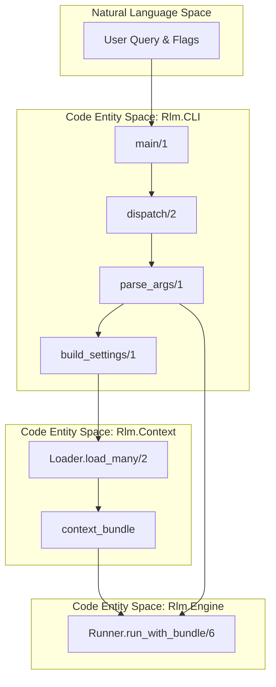
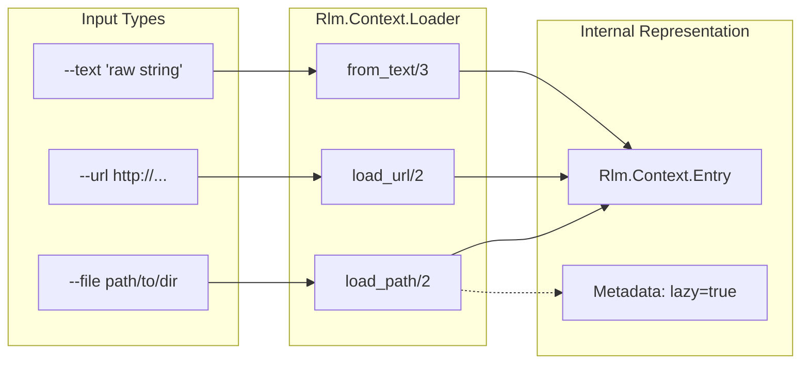

# CLI and Context Loading
Relevant source files
- [lib/rlm/cli.ex](https://github.com/Cody-W-Tucker/rlm/blob/4bc8e1ba/lib/rlm/cli.ex)
- [lib/rlm/context/loader.ex](https://github.com/Cody-W-Tucker/rlm/blob/4bc8e1ba/lib/rlm/context/loader.ex)
- [lib/rlm/settings.ex](https://github.com/Cody-W-Tucker/rlm/blob/4bc8e1ba/lib/rlm/settings.ex)
- [priv/runtime/exec.py](https://github.com/Cody-W-Tucker/rlm/blob/4bc8e1ba/priv/runtime/exec.py)
- [test/rlm/cli/workflow_test.exs](https://github.com/Cody-W-Tucker/rlm/blob/4bc8e1ba/test/rlm/cli/workflow_test.exs)
- [test/rlm/context/loader_test.exs](https://github.com/Cody-W-Tucker/rlm/blob/4bc8e1ba/test/rlm/context/loader_test.exs)

The **CLI** and **Context Loading** systems form the entrypoint and ingestion pipeline for `rlm`. The CLI parses user intent and configuration, while the Context Loader transforms various external data sources—files, URLs, and raw text—into a structured `context_bundle` that the `Rlm.Engine` uses to ground the LLM's execution.

## System Overview

The interaction begins at `Rlm.CLI.main/1`, which dispatches to a runner that coordinates settings resolution and context ingestion.

### Entrypoint and Session

The CLI provides a `mix rlm` task and a standalone executable. It handles argument parsing for model selection, provider overrides, and judgment styles (e.g., `compass`). It also manages the lifecycle of a run, including real-time progress reporting to `stderr`.

For details on argument parsing and interactive sessions, see [CLI Entrypoint and Session](/Cody-W-Tucker/rlm/6.1-cli-entrypoint-and-session).

### Context Loading Pipeline

The `Rlm.Context.Loader` is responsible for building the data environment. It supports recursive directory scanning, glob patterns, and HTTP fetching. A key feature is the distinction between **preloaded text** (loaded into the prompt) and **lazy entries** (available for the Python runtime to read on-demand).

For details on ingestion logic and safety limits, see [Context Loading](/Cody-W-Tucker/rlm/6.2-context-loading).

## Logical Flow: From Input to Engine

The following diagram illustrates how raw CLI arguments are transformed into the internal structs required to start an `Rlm.Engine` run.

**CLI to Engine Data Flow**

Sources: [lib/rlm/cli.ex45-88](https://github.com/Cody-W-Tucker/rlm/blob/4bc8e1ba/lib/rlm/cli.ex#L45-L88)[lib/rlm/context/loader.ex13-22](https://github.com/Cody-W-Tucker/rlm/blob/4bc8e1ba/lib/rlm/context/loader.ex#L13-L22)

## Component Mapping

The system bridges user-provided paths and strings into structured Elixir entities.

| System Concept | Code Entity | Description |
| --- | --- | --- |
| **Settings** | `Rlm.Settings` | Validated struct containing timeouts, model IDs, and safety limits [lib/rlm/settings.ex18-39](https://github.com/Cody-W-Tucker/rlm/blob/4bc8e1ba/lib/rlm/settings.ex#L18-L39) |
| **Context Entry** | `Rlm.Context.Entry` | A single unit of context (File, URL, or Text) [lib/rlm/context/loader.ex4-5](https://github.com/Cody-W-Tucker/rlm/blob/4bc8e1ba/lib/rlm/context/loader.ex#L4-L5) |
| **Context Bundle** | `Map` (Bundle) | A collection of entries, aggregate byte counts, and preloaded text [lib/rlm/context/loader.ex9-11](https://github.com/Cody-W-Tucker/rlm/blob/4bc8e1ba/lib/rlm/context/loader.ex#L9-L11) |
| **Progress Reporter** | `Rlm.CLI.Events` | Handles emitting iteration events to the terminal [lib/rlm/cli.ex85](https://github.com/Cody-W-Tucker/rlm/blob/4bc8e1ba/lib/rlm/cli.ex#L85-L85) |

**Context Entity Association**

Sources: [lib/rlm/context/loader.ex53-73](https://github.com/Cody-W-Tucker/rlm/blob/4bc8e1ba/lib/rlm/context/loader.ex#L53-L73)[lib/rlm/context/loader.ex78-85](https://github.com/Cody-W-Tucker/rlm/blob/4bc8e1ba/lib/rlm/context/loader.ex#L78-L85)

## Safety and Validation

The CLI and Loader enforce strict safety boundaries to prevent the LLM from being overwhelmed or the host system from being exhausted:

- **File Limits**: Limits the total number of files loaded (default 10,000) [lib/rlm/settings.ex199](https://github.com/Cody-W-Tucker/rlm/blob/4bc8e1ba/lib/rlm/settings.ex#L199-L199)
- **Byte Limits**: Distinguishes between `max_context_bytes` (preloaded into prompt) and `max_lazy_file_bytes` (total size of files available to the Python `read_file` tool) [lib/rlm/settings.ex197-198](https://github.com/Cody-W-Tucker/rlm/blob/4bc8e1ba/lib/rlm/settings.ex#L197-L198)
- **Path Exclusion**: Automatically ignores sensitive or bulky directories like `.git`, `_build`, and `node_modules`[lib/rlm/context/loader.ex7](https://github.com/Cody-W-Tucker/rlm/blob/4bc8e1ba/lib/rlm/context/loader.ex#L7-L7)
- **Timeout Enforcement**: Settings resolve multi-layered timeouts (connect, first byte, idle, and total) for provider requests [lib/rlm/settings.ex192-195](https://github.com/Cody-W-Tucker/rlm/blob/4bc8e1ba/lib/rlm/settings.ex#L192-L195)

Sources: [lib/rlm/settings.ex187-211](https://github.com/Cody-W-Tucker/rlm/blob/4bc8e1ba/lib/rlm/settings.ex#L187-L211)[lib/rlm/context/loader.ex185-197](https://github.com/Cody-W-Tucker/rlm/blob/4bc8e1ba/lib/rlm/context/loader.ex#L185-L197)