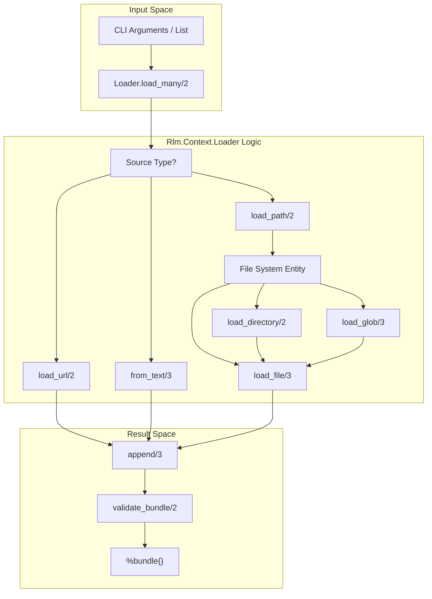
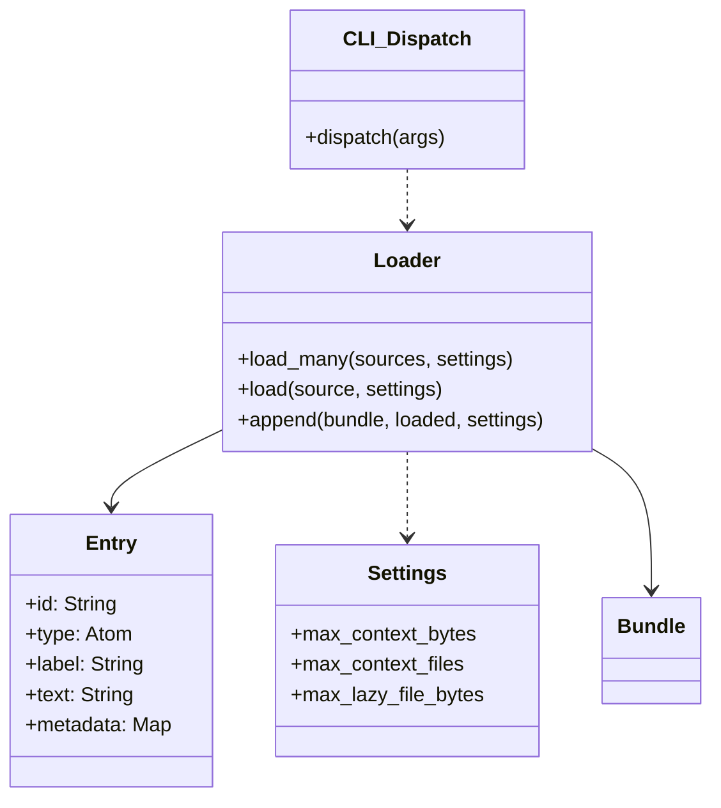

# Context Loading
Relevant source files
- [lib/rlm/context/entry.ex](https://github.com/Cody-W-Tucker/rlm/blob/4bc8e1ba/lib/rlm/context/entry.ex)
- [lib/rlm/context/loader.ex](https://github.com/Cody-W-Tucker/rlm/blob/4bc8e1ba/lib/rlm/context/loader.ex)
- [lib/rlm/settings.ex](https://github.com/Cody-W-Tucker/rlm/blob/4bc8e1ba/lib/rlm/settings.ex)
- [test/rlm/cli/workflow_test.exs](https://github.com/Cody-W-Tucker/rlm/blob/4bc8e1ba/test/rlm/cli/workflow_test.exs)
- [test/rlm/context/loader_test.exs](https://github.com/Cody-W-Tucker/rlm/blob/4bc8e1ba/test/rlm/context/loader_test.exs)

The `Rlm.Context.Loader` module is responsible for aggregating diverse data sources—including local files, directories, glob patterns, inline text, and remote URLs—into a unified `context_bundle`. This bundle serves as the primary data substrate for the RLM engine, allowing the model to interact with both preloaded text and lazily-accessed file systems.

## Context Bundle Structure

The loader produces a map known as a "bundle," which categorizes content into preloaded entries (fully read into memory) and lazy entries (metadata-only, intended for runtime file access).

### The Entry Struct

Every source is represented by an `Rlm.Context.Entry` struct:

- **`id`**: A unique identifier generated via `unique_id/0`.
- **`type`**: The source category (`:file`, `:text`, `:url`).
- **`label`**: A human-readable identifier (e.g., a file path or URL).
- **`text`**: The actual content (empty for lazy file entries).
- **`bytes`**: The size of the `text` field in bytes.
- **`metadata`**: A map containing source-specific info like `source_kind` (`:glob`, `:directory`, etc.) and `lazy` status.

### Bundle Fields

The aggregate bundle contains:

- `entries`: All `Entry` structs.
- `text`: Concatenated text from all preloaded sources.
- `bytes`: Total byte count of preloaded text.
- `lazy_entries`: A subset of entries representing files available for the Python runtime to read.
- `lazy_bytes`: Total byte count of files referenced lazily.

**Sources:**[lib/rlm/context/entry.ex1-7](https://github.com/Cody-W-Tucker/rlm/blob/4bc8e1ba/lib/rlm/context/entry.ex#L1-L7)[lib/rlm/context/loader.ex9-11](https://github.com/Cody-W-Tucker/rlm/blob/4bc8e1ba/lib/rlm/context/loader.ex#L9-L11)

## Loading Workflow

The `Rlm.Context.Loader.load/2` function acts as the primary dispatcher, identifying the source type and invoking the appropriate private loader.

### Logical Data Flow

The following diagram illustrates how raw input strings are transformed into a validated bundle.

"Context Loading Pipeline"

**Sources:**[lib/rlm/context/loader.ex13-73](https://github.com/Cody-W-Tucker/rlm/blob/4bc8e1ba/lib/rlm/context/loader.ex#L13-L73)

## Source Implementations

### Local Files and Directories

- **Directories**: Recursively scans for files using `Path.wildcard/2` with `**/*`. It automatically excludes specific segments like `.git`, `_build`, `deps`, and `node_modules` to prevent context bloat [lib/rlm/context/loader.ex7-8](https://github.com/Cody-W-Tucker/rlm/blob/4bc8e1ba/lib/rlm/context/loader.ex#L7-L8)[lib/rlm/context/loader.ex91-113](https://github.com/Cody-W-Tucker/rlm/blob/4bc8e1ba/lib/rlm/context/loader.ex#L91-L113)
- **Globs**: Expands patterns (e.g., `lib/**/*.ex`) and validates that matches exist [lib/rlm/context/loader.ex115-142](https://github.com/Cody-W-Tucker/rlm/blob/4bc8e1ba/lib/rlm/context/loader.ex#L115-L142)
- **Lazy Loading**: By default, files are loaded as `lazy` entries. Their `text` field remains empty in Elixir, but their paths are registered so the Python `Rlm.Runtime` can access them via `read_file` or `grep_files`[lib/rlm/context/loader.ex75-89](https://github.com/Cody-W-Tucker/rlm/blob/4bc8e1ba/lib/rlm/context/loader.ex#L75-L89)

### URLs

The loader uses `Req` to fetch remote content. It follows up to 3 redirects and enforces a 30-second timeout. URL content is always preloaded into the `text` field of the bundle [lib/rlm/context/loader.ex152-177](https://github.com/Cody-W-Tucker/rlm/blob/4bc8e1ba/lib/rlm/context/loader.ex#L152-L177)

### Path Resolution

The loader supports relative paths. If the environment variable `RLM_CALLER_CWD` is set (typically by the CLI), the loader expands relative paths against that directory instead of the system's current working directory [lib/rlm/context/loader.ex144-150](https://github.com/Cody-W-Tucker/rlm/blob/4bc8e1ba/lib/rlm/context/loader.ex#L144-L150)

**Sources:**[lib/rlm/context/loader.ex91-177](https://github.com/Cody-W-Tucker/rlm/blob/4bc8e1ba/lib/rlm/context/loader.ex#L91-L177)[test/rlm/context/loader_test.exs40-57](https://github.com/Cody-W-Tucker/rlm/blob/4bc8e1ba/test/rlm/context/loader_test.exs#L40-L57)

## Safety Limits and Validation

To prevent memory exhaustion or LLM context window overflows, `Rlm.Settings` defines several constraints that the loader enforces during the `append/3` and `validate_bundle/2` phases.

| Setting | Description | Default Range |
| --- | --- | --- |
| `max_context_bytes` | Max bytes for preloaded text (URLs, inline). | 1KB - 100MB |
| `max_lazy_file_bytes` | Max size for a single lazy file. | 1KB - 10GB |
| `max_context_files` | Max number of files allowed in a bundle. | 1 - 10,000 |

### Validation Logic

1. **File Count**: If a directory or glob expansion exceeds `max_context_files`, loading halts with an error [lib/rlm/context/loader.ex100-102](https://github.com/Cody-W-Tucker/rlm/blob/4bc8e1ba/lib/rlm/context/loader.ex#L100-L102)
2. **Text Size**: Inline text and URL bodies are checked against `max_context_bytes`[lib/rlm/context/loader.ex207-213](https://github.com/Cody-W-Tucker/rlm/blob/4bc8e1ba/lib/rlm/context/loader.ex#L207-L213)
3. **Lazy Size**: Individual files are checked against `max_lazy_file_bytes` before being added as lazy entries [lib/rlm/context/loader.ex77](https://github.com/Cody-W-Tucker/rlm/blob/4bc8e1ba/lib/rlm/context/loader.ex#L77-L77)

**Sources:**[lib/rlm/settings.ex187-201](https://github.com/Cody-W-Tucker/rlm/blob/4bc8e1ba/lib/rlm/settings.ex#L187-L201)[lib/rlm/context/loader.ex183-213](https://github.com/Cody-W-Tucker/rlm/blob/4bc8e1ba/lib/rlm/context/loader.ex#L183-L213)

## Code Entity Association

This diagram bridges the high-level loading concepts to the specific Elixir modules and settings involved in the process.

"Context Loading Code Entities"

**Sources:**[lib/rlm/context/loader.ex1-51](https://github.com/Cody-W-Tucker/rlm/blob/4bc8e1ba/lib/rlm/context/loader.ex#L1-L51)[lib/rlm/settings.ex18-39](https://github.com/Cody-W-Tucker/rlm/blob/4bc8e1ba/lib/rlm/settings.ex#L18-L39)[lib/rlm/context/entry.ex1-7](https://github.com/Cody-W-Tucker/rlm/blob/4bc8e1ba/lib/rlm/context/entry.ex#L1-L7)