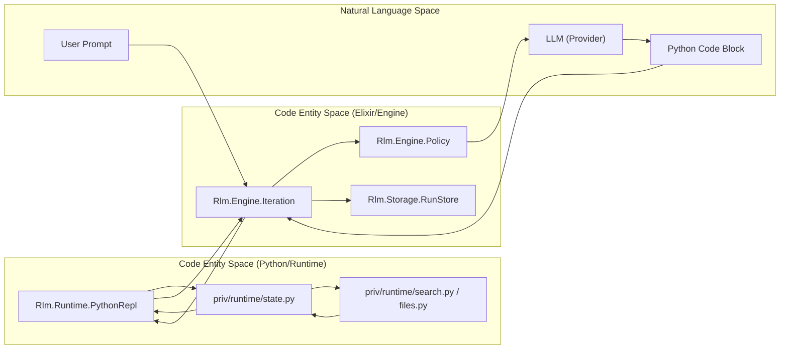
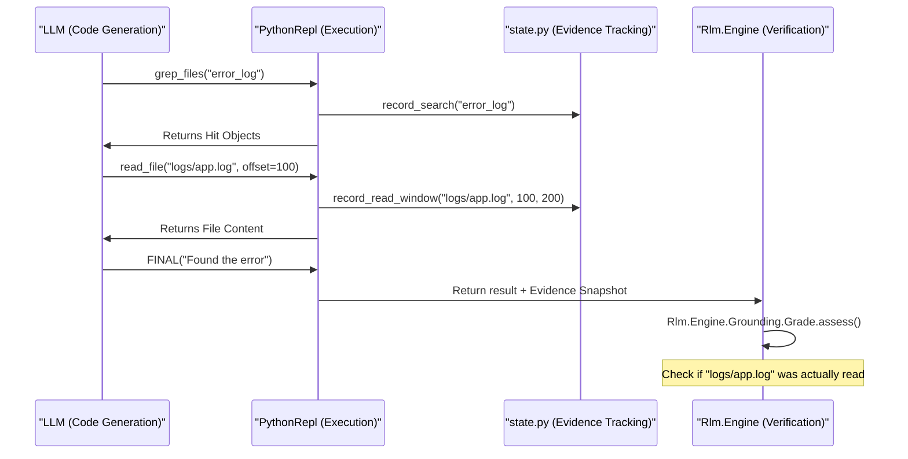

# Core Concepts and Terminology
Relevant source files
- [README.md](https://github.com/Cody-W-Tucker/rlm/blob/4bc8e1ba/README.md?plain=1)
- [lib/rlm/engine/prompt/base.ex](https://github.com/Cody-W-Tucker/rlm/blob/4bc8e1ba/lib/rlm/engine/prompt/base.ex)
- [test/rlm/engine/policy_test.exs](https://github.com/Cody-W-Tucker/rlm/blob/4bc8e1ba/test/rlm/engine/policy_test.exs)

This page outlines the foundational ideas that drive the `rlm` codebase. It explains the conceptual framework of a grounded Recursive Language Model (RLM) and the specific mechanisms used to ensure that model-authored code remains reliable, inspectable, and evidence-backed.

## Grounded RLM

A **Grounded RLM** is a recursive agent that is programmatically forced to "earn" its conclusions through verifiable evidence [README.md28-40](https://github.com/Cody-W-Tucker/rlm/blob/4bc8e1ba/README.md?plain=1#L28-L40) Unlike standard RAG (Retrieval-Augmented Generation) which often injects context blindly, `rlm` provides the model with a Python REPL and a suite of inspection tools. The model must use these tools to scout, search, and read the corpus before it is allowed to finalize an answer [test/rlm/engine/policy_test.exs90-108](https://github.com/Cody-W-Tucker/rlm/blob/4bc8e1ba/test/rlm/engine/policy_test.exs#L90-L108)

The system enforces grounding by grading the model's interaction with the data. If a model attempts to provide an answer without having performed sufficient "read" operations on the files it "searched," the system can challenge the answer or block unsupported citations [README.md32-40](https://github.com/Cody-W-Tucker/rlm/blob/4bc8e1ba/README.md?plain=1#L32-L40)

### Grounding Levels and Grades

Grounding is not binary; it is assessed on a scale:

- **Structural Grade:** (A–F) Based on the depth of inspection (e.g., `read_backed_multi` vs `search_only`) [lib/rlm/engine/prompt/base.ex40-52](https://github.com/Cody-W-Tucker/rlm/blob/4bc8e1ba/lib/rlm/engine/prompt/base.ex#L40-L52)
- **Semantic Level:** Evaluates the quality of the claim (e.g., `verified_with_challenge`, `behaviorally_supported`) [lib/rlm/engine/prompt/base.ex165-170](https://github.com/Cody-W-Tucker/rlm/blob/4bc8e1ba/lib/rlm/engine/prompt/base.ex#L165-L170)

**Sources:**[README.md28-40](https://github.com/Cody-W-Tucker/rlm/blob/4bc8e1ba/README.md?plain=1#L28-L40)[test/rlm/engine/policy_test.exs90-108](https://github.com/Cody-W-Tucker/rlm/blob/4bc8e1ba/test/rlm/engine/policy_test.exs#L90-L108)[lib/rlm/engine/prompt/base.ex40-52](https://github.com/Cody-W-Tucker/rlm/blob/4bc8e1ba/lib/rlm/engine/prompt/base.ex#L40-L52)

---

## The Generate-Execute-Verify Loop

The core execution flow of `rlm` is a recursive loop managed by the Elixir engine. Each iteration follows a strict "Generate-Execute-Verify" pattern:

1. **Generate:** The Engine assembles a system prompt, context metadata, and feedback from previous iterations. The LLM responds with a single Python code block [lib/rlm/engine/prompt/base.ex61-63](https://github.com/Cody-W-Tucker/rlm/blob/4bc8e1ba/lib/rlm/engine/prompt/base.ex#L61-L63)
2. **Execute:** The code is sent to a persistent Python subprocess (`Rlm.Runtime.PythonRepl`) [lib/rlm/engine/prompt/base.ex28-29](https://github.com/Cody-W-Tucker/rlm/blob/4bc8e1ba/lib/rlm/engine/prompt/base.ex#L28-L29)
3. **Verify:** The engine captures the output, classifies any failures, and evaluates the grounding state. If the model calls `FINAL(answer)`, the loop terminates; otherwise, the results are fed back into the next iteration [README.md11-15](https://github.com/Cody-W-Tucker/rlm/blob/4bc8e1ba/README.md?plain=1#L11-L15)[lib/rlm/engine/prompt/base.ex56-57](https://github.com/Cody-W-Tucker/rlm/blob/4bc8e1ba/lib/rlm/engine/prompt/base.ex#L56-L57)

### Conceptual to Code Mapping: Execution Flow

| Concept | Code Entity | File Path |
| --- | --- | --- |
| **Iteration Loop** | `Rlm.Engine.Iteration` | `lib/rlm/engine/iteration.ex` |
| **Python Bridge** | `Rlm.Runtime.PythonRepl` | `lib/rlm/runtime/python_repl.ex` |
| **Prompt Assembly** | `Rlm.Engine.Prompt.Base` | [lib/rlm/engine/prompt/base.ex1-4](https://github.com/Cody-W-Tucker/rlm/blob/4bc8e1ba/lib/rlm/engine/prompt/base.ex#L1-L4) |
| **Finalization** | `FINAL(answer)` | [lib/rlm/engine/prompt/base.ex56](https://github.com/Cody-W-Tucker/rlm/blob/4bc8e1ba/lib/rlm/engine/prompt/base.ex#L56-L56) |

**Sources:**[lib/rlm/engine/prompt/base.ex1-63](https://github.com/Cody-W-Tucker/rlm/blob/4bc8e1ba/lib/rlm/engine/prompt/base.ex#L1-L63)[README.md11-15](https://github.com/Cody-W-Tucker/rlm/blob/4bc8e1ba/README.md?plain=1#L11-L15)

---

## Budgets and Constraints

To prevent runaway recursion and cost blowups, `rlm` operates under strict, finite budgets that are communicated to the model in every prompt [lib/rlm/engine/prompt/base.ex30-33](https://github.com/Cody-W-Tucker/rlm/blob/4bc8e1ba/lib/rlm/engine/prompt/base.ex#L30-L33)

- **Iteration Budget:** The maximum number of round-trips between the LLM and the REPL (defaulting to `max_iterations`). As the budget nears zero, the engine triggers "Endgame" logic, instructing the model to stop searching and synthesize an answer [lib/rlm/engine/prompt/base.ex13-23](https://github.com/Cody-W-Tucker/rlm/blob/4bc8e1ba/lib/rlm/engine/prompt/base.ex#L13-L23)
- **Sub-query Budget:** The number of times the model can call `llm_query()` or `async_llm_query()` to process text chunks [lib/rlm/engine/prompt/base.ex32-33](https://github.com/Cody-W-Tucker/rlm/blob/4bc8e1ba/lib/rlm/engine/prompt/base.ex#L32-L33)
- **Metadata Budget:** Constraints on the size of the file list and context summaries provided to the LLM to prevent prompt-stuffing [test/rlm/engine/policy_test.exs38-41](https://github.com/Cody-W-Tucker/rlm/blob/4bc8e1ba/test/rlm/engine/policy_test.exs#L38-L41)

**Sources:**[lib/rlm/engine/prompt/base.ex13-33](https://github.com/Cody-W-Tucker/rlm/blob/4bc8e1ba/lib/rlm/engine/prompt/base.ex#L13-L33)[test/rlm/engine/policy_test.exs38-41](https://github.com/Cody-W-Tucker/rlm/blob/4bc8e1ba/test/rlm/engine/policy_test.exs#L38-L41)

---

## Sub-queries and Parallelism

Models often need to process more text than can fit in a single prompt or perform reasoning over multiple chunks of data. `rlm` handles this via **Sub-queries**:

- **`llm_query(sub_context, instruction)`**: A synchronous call that asks the LLM (or a designated `sub_model`) to process a specific string [lib/rlm/engine/prompt/base.ex54](https://github.com/Cody-W-Tucker/rlm/blob/4bc8e1ba/lib/rlm/engine/prompt/base.ex#L54-L54)
- **`async_llm_query(sub_context, instruction)`**: An asynchronous version that allows the model to dispatch multiple queries in one Python block for parallel execution [lib/rlm/engine/prompt/base.ex55](https://github.com/Cody-W-Tucker/rlm/blob/4bc8e1ba/lib/rlm/engine/prompt/base.ex#L55-L55)

The engine intercepts these calls from the Python runtime, executes them against the LLM provider, and returns the text results to the Python namespace [lib/rlm/engine/prompt/base.ex78-80](https://github.com/Cody-W-Tucker/rlm/blob/4bc8e1ba/lib/rlm/engine/prompt/base.ex#L78-L80)

**Sources:**[lib/rlm/engine/prompt/base.ex54-80](https://github.com/Cody-W-Tucker/rlm/blob/4bc8e1ba/lib/rlm/engine/prompt/base.ex#L54-L80)

---

## The Compass Protocol

The **Compass** is a persistent knowledge map stored within the run state. It allows the model to maintain a "mental model" or "index" of its findings across multiple iterations without polluting the global Python namespace with massive variables.

- **`SET_COMPASS(map_value)`**: Saves a dictionary of insights or state [lib/rlm/engine/prompt/base.ex57](https://github.com/Cody-W-Tucker/rlm/blob/4bc8e1ba/lib/rlm/engine/prompt/base.ex#L57-L57)
- **`GET_COMPASS()`**: Retrieves the stored map in subsequent iterations [lib/rlm/engine/prompt/base.ex57](https://github.com/Cody-W-Tucker/rlm/blob/4bc8e1ba/lib/rlm/engine/prompt/base.ex#L57-L57)

This protocol is essential for long-running tasks where the model must remember what it has already searched or what contradictions it has found [test/rlm/engine/policy_test.exs165-169](https://github.com/Cody-W-Tucker/rlm/blob/4bc8e1ba/test/rlm/engine/policy_test.exs#L165-L169)

**Sources:**[lib/rlm/engine/prompt/base.ex57](https://github.com/Cody-W-Tucker/rlm/blob/4bc8e1ba/lib/rlm/engine/prompt/base.ex#L57-L57)[test/rlm/engine/policy_test.exs165-169](https://github.com/Cody-W-Tucker/rlm/blob/4bc8e1ba/test/rlm/engine/policy_test.exs#L165-L169)

---

## System Overview Diagram

The following diagram illustrates the relationship between the Natural Language Space (the user and LLM) and the Code Entity Space (the Elixir and Python components).

### Data Flow and Component Interaction

**Sources:**[README.md67-68](https://github.com/Cody-W-Tucker/rlm/blob/4bc8e1ba/README.md?plain=1#L67-L68)[lib/rlm/engine/prompt/base.ex28-63](https://github.com/Cody-W-Tucker/rlm/blob/4bc8e1ba/lib/rlm/engine/prompt/base.ex#L28-L63)[test/rlm/engine/policy_test.exs4-5](https://github.com/Cody-W-Tucker/rlm/blob/4bc8e1ba/test/rlm/engine/policy_test.exs#L4-L5)

### Grounding and Evidence Lifecycle

**Sources:**[lib/rlm/engine/prompt/base.ex35-57](https://github.com/Cody-W-Tucker/rlm/blob/4bc8e1ba/lib/rlm/engine/prompt/base.ex#L35-L57)[test/rlm/engine/policy_test.exs104-160](https://github.com/Cody-W-Tucker/rlm/blob/4bc8e1ba/test/rlm/engine/policy_test.exs#L104-L160)[README.md30-40](https://github.com/Cody-W-Tucker/rlm/blob/4bc8e1ba/README.md?plain=1#L30-L40)