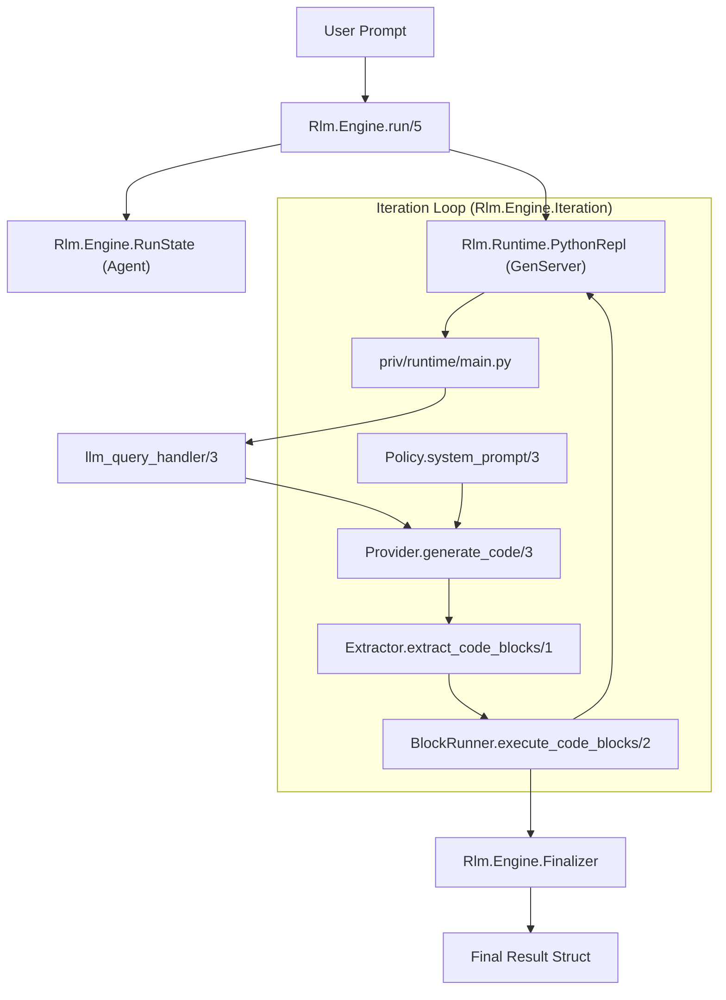
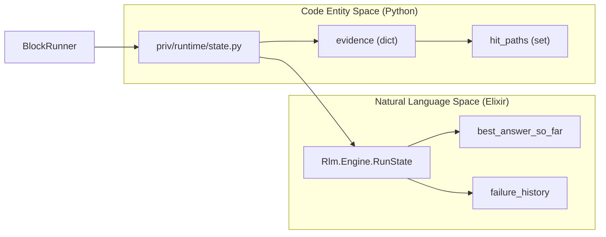

# Engine Architecture
Relevant source files
- [lib/rlm/engine.ex](https://github.com/Cody-W-Tucker/rlm/blob/4bc8e1ba/lib/rlm/engine.ex)
- [lib/rlm/engine/answer_quality.ex](https://github.com/Cody-W-Tucker/rlm/blob/4bc8e1ba/lib/rlm/engine/answer_quality.ex)
- [lib/rlm/engine/finalizer.ex](https://github.com/Cody-W-Tucker/rlm/blob/4bc8e1ba/lib/rlm/engine/finalizer.ex)
- [lib/rlm/engine/iteration.ex](https://github.com/Cody-W-Tucker/rlm/blob/4bc8e1ba/lib/rlm/engine/iteration.ex)
- [lib/rlm/engine/policy.ex](https://github.com/Cody-W-Tucker/rlm/blob/4bc8e1ba/lib/rlm/engine/policy.ex)
- [lib/rlm/engine/prompt.ex](https://github.com/Cody-W-Tucker/rlm/blob/4bc8e1ba/lib/rlm/engine/prompt.ex)
- [lib/rlm/engine/run_state.ex](https://github.com/Cody-W-Tucker/rlm/blob/4bc8e1ba/lib/rlm/engine/run_state.ex)
- [priv/runtime.py](https://github.com/Cody-W-Tucker/rlm/blob/4bc8e1ba/priv/runtime.py)
- [priv/runtime/jsondoc.py](https://github.com/Cody-W-Tucker/rlm/blob/4bc8e1ba/priv/runtime/jsondoc.py)
- [priv/runtime/protocol.py](https://github.com/Cody-W-Tucker/rlm/blob/4bc8e1ba/priv/runtime/protocol.py)

The `Rlm.Engine` module serves as the central orchestration layer of the RLM system. It manages a persistent state machine that bridges the high-level goals of the user (Natural Language Space) with the concrete execution of code and data retrieval (Code Entity Space).

The engine is responsible for maintaining a persistent Python subprocess, managing the iterative Generate-Execute-Verify loop, and coordinating between the LLM provider and the grounding system to ensure that every answer is backed by evidence.

## Orchestration Lifecycle

A run begins in `Rlm.Engine.run/5`, which initializes the `Rlm.Engine.RunState` agent and boots the `Rlm.Runtime.PythonRepl`. The engine then enters a recursive iteration loop that continues until the model produces a final answer, exhausts its iteration budget, or encounters an unrecoverable failure.

### Start-to-Finish Flow

1. **Startup**: `Rlm.Engine` starts the `PythonRepl` and sets up the `llm_query_handler` to allow the Python runtime to call back into the Elixir host for sub-queries [lib/rlm/engine.ex11-17](https://github.com/Cody-W-Tucker/rlm/blob/4bc8e1ba/lib/rlm/engine.ex#L11-L17)
2. **Context Injection**: The `context_bundle` metadata and file sources are synchronized with the Python environment [lib/rlm/engine.ex45-47](https://github.com/Cody-W-Tucker/rlm/blob/4bc8e1ba/lib/rlm/engine.ex#L45-L47)
3. **Iteration Loop**: `Rlm.Engine.Iteration.run/7` kicks off the `execute_iterations` loop [lib/rlm/engine/iteration.ex16-33](https://github.com/Cody-W-Tucker/rlm/blob/4bc8e1ba/lib/rlm/engine/iteration.ex#L16-L33)
4. **Finalization**: `Rlm.Engine.Finalizer` aggregates the history, grounding grades, and execution records into a final result struct [lib/rlm/engine/finalizer.ex9-44](https://github.com/Cody-W-Tucker/rlm/blob/4bc8e1ba/lib/rlm/engine/finalizer.ex#L9-L44)

### System Component Interaction

The following diagram illustrates how `Rlm.Engine` coordinates the transition from natural language prompts to executable Python code and back to structured evidence.

**Engine Orchestration Overview**

Sources: [lib/rlm/engine.ex11-31](https://github.com/Cody-W-Tucker/rlm/blob/4bc8e1ba/lib/rlm/engine.ex#L11-L31)[lib/rlm/engine/iteration.ex35-52](https://github.com/Cody-W-Tucker/rlm/blob/4bc8e1ba/lib/rlm/engine/iteration.ex#L35-L52)[lib/rlm/engine/iteration.ex89-128](https://github.com/Cody-W-Tucker/rlm/blob/4bc8e1ba/lib/rlm/engine/iteration.ex#L89-L128)

---

## Core Sub-Concerns

The engine's responsibilities are divided into four major functional areas, each handled by specialized child modules.

### Iteration Loop and Finalization

The core of the engine is a recursive loop in `Rlm.Engine.Iteration`. Each turn, it requests code from the LLM, executes it in the `PythonRepl`, and classifies the result. If the code calls `FINAL(value)`, the `Finalizer` takes over to package the answer with its associated grounding evidence.

For details, see [Iteration Loop and Finalization](/Cody-W-Tucker/rlm/2.1-iteration-loop-and-finalization).

### Prompt Generation

The engine uses `Rlm.Engine.Policy` to assemble the context-aware prompts required for each turn. This includes the `Base` system prompt, `ContextStrategy` for managing large file lists, and `IterationFeedback` which provides the LLM with the results (STDOUT/STDERR) of its previous code execution.

For details, see [Prompt Generation](/Cody-W-Tucker/rlm/2.2-prompt-generation).

### Response Extraction and Salvage

LLM responses are rarely pure code. `Rlm.Engine.Response.Extractor` is responsible for finding fenced Python blocks. If a response is malformed, the system can attempt to "salvage" content or use `RecoveryConstraints` to force the model to adhere to the required format in the next turn.

For details, see [Response Extraction and Salvage](/Cody-W-Tucker/rlm/2.3-response-extraction-and-salvage).

### Failure Classification and Recovery

Not all errors are fatal. The engine classifies execution errors, timeouts, and grounding violations into `Rlm.Engine.Failure` structs. The `Recovery.Strategy` then decides if the engine should adjust its behavior (e.g., disabling async sub-queries) and retry the iteration.

For details, see [Failure Classification and Recovery](/Cody-W-Tucker/rlm/2.4-failure-classification-and-recovery).

---

## State Management and Evidence Bridge

The `Rlm.Engine.RunState` agent acts as the "source of truth" for the duration of a run, tracking token usage, sub-query counts, and the "best-so-far" answer in case of a crash. It bridges the gap between the stateless LLM and the stateful Python environment.

**Natural Language to Code Entity Mapping**

Sources: [lib/rlm/engine/run_state.ex7-24](https://github.com/Cody-W-Tucker/rlm/blob/4bc8e1ba/lib/rlm/engine/run_state.ex#L7-L24)[priv/runtime/jsondoc.py4-5](https://github.com/Cody-W-Tucker/rlm/blob/4bc8e1ba/priv/runtime/jsondoc.py#L4-L5)[lib/rlm/engine/iteration.ex148-162](https://github.com/Cody-W-Tucker/rlm/blob/4bc8e1ba/lib/rlm/engine/iteration.ex#L148-L162)

### Key Engine Components

| Component | Responsibility | File Path |
| --- | --- | --- |
| `RunState` | Agent tracking tokens, sub-queries, and recovery flags. | [lib/rlm/engine/run_state.ex](https://github.com/Cody-W-Tucker/rlm/blob/4bc8e1ba/lib/rlm/engine/run_state.ex) |
| `Iteration` | Orchestrates the `execute_iterations` recursive loop. | [lib/rlm/engine/iteration.ex](https://github.com/Cody-W-Tucker/rlm/blob/4bc8e1ba/lib/rlm/engine/iteration.ex) |
| `Policy` | High-level interface for prompt and feedback assembly. | [lib/rlm/engine/policy.ex](https://github.com/Cody-W-Tucker/rlm/blob/4bc8e1ba/lib/rlm/engine/policy.ex) |
| `Finalizer` | Shapes the final output, including grounding grades. | [lib/rlm/engine/finalizer.ex](https://github.com/Cody-W-Tucker/rlm/blob/4bc8e1ba/lib/rlm/engine/finalizer.ex) |
| `AnswerQuality` | Heuristics to prevent "leaking" raw code/logs into answers. | [lib/rlm/engine/answer_quality.ex](https://github.com/Cody-W-Tucker/rlm/blob/4bc8e1ba/lib/rlm/engine/answer_quality.ex) |

Sources: [lib/rlm/engine.ex4-9](https://github.com/Cody-W-Tucker/rlm/blob/4bc8e1ba/lib/rlm/engine.ex#L4-L9)[lib/rlm/engine/iteration.ex4-14](https://github.com/Cody-W-Tucker/rlm/blob/4bc8e1ba/lib/rlm/engine/iteration.ex#L4-L14)