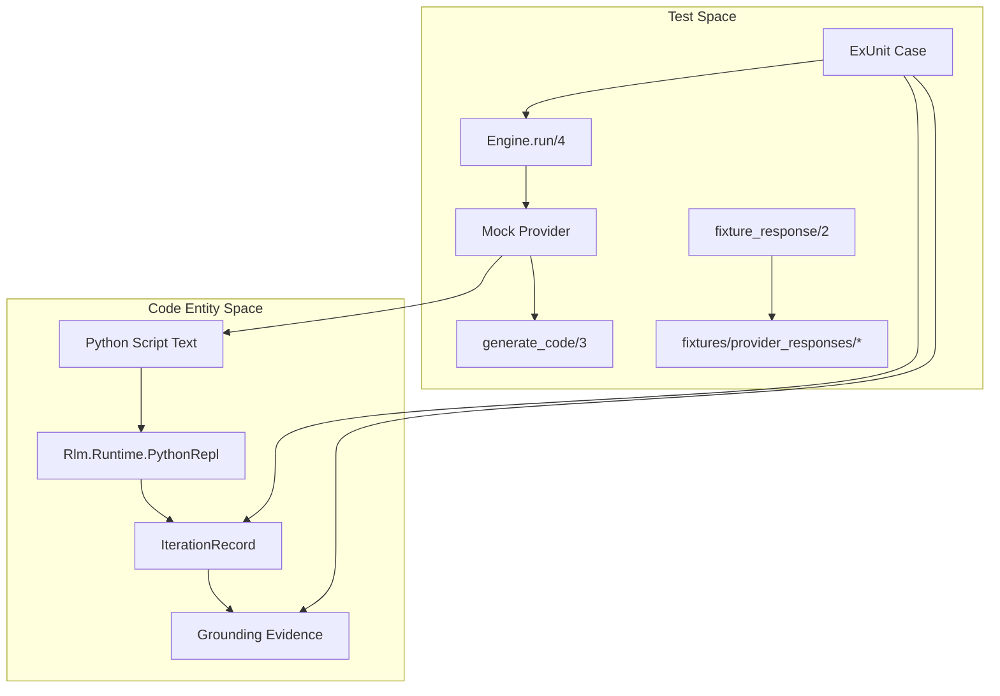
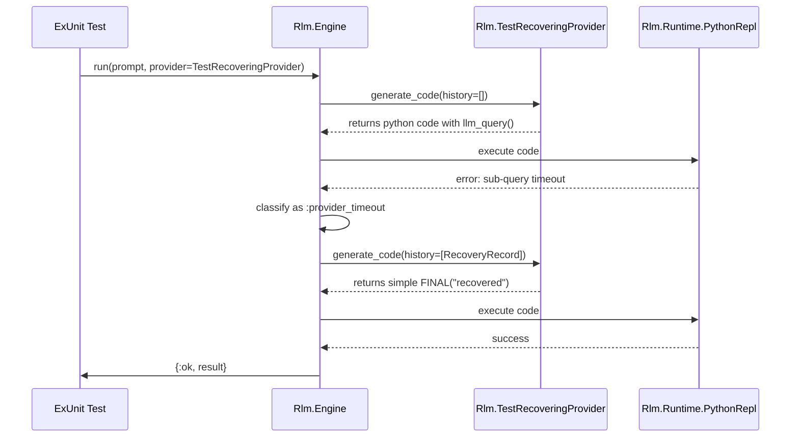

# Engine Integration Tests and Mock Providers
Relevant source files
- [test/rlm/engine/async_recovery_test.exs](https://github.com/Cody-W-Tucker/rlm/blob/4bc8e1ba/test/rlm/engine/async_recovery_test.exs)
- [test/rlm/engine/file_access_test.exs](https://github.com/Cody-W-Tucker/rlm/blob/4bc8e1ba/test/rlm/engine/file_access_test.exs)
- [test/rlm/engine/jsonl_test.exs](https://github.com/Cody-W-Tucker/rlm/blob/4bc8e1ba/test/rlm/engine/jsonl_test.exs)
- [test/support/engine_test_support.ex](https://github.com/Cody-W-Tucker/rlm/blob/4bc8e1ba/test/support/engine_test_support.ex)

This page describes the integration testing infrastructure for the `Rlm.Engine`. These tests validate the orchestration of the LLM provider, the Python runtime, and the grounding system. Because the engine is designed to handle non-deterministic LLM behavior, the test suite relies on a catalog of **Mock Providers** that simulate specific edge cases, failure modes, and complex execution paths.

## Overview of Test Infrastructure

The integration tests primarily reside in `test/rlm/engine/` and use the `Rlm.Engine.run/4` entry point [test/rlm/engine/file_access_test.exs17](https://github.com/Cody-W-Tucker/rlm/blob/4bc8e1ba/test/rlm/engine/file_access_test.exs#L17-L17) The infrastructure is designed to verify that the engine correctly:

1. **Extracts and executes** Python code from provider responses.
2. **Tracks evidence** generated by the Python runtime for grounding assessment.
3. **Recovers** from runtime errors, syntax issues, and sub-query timeouts.
4. **Enforces grounding policies** before allowing a final answer.

### EngineTestSupport and Fixtures

`Rlm.EngineTestSupport` provides utilities for managing test data and file-based mock responses.

- **`build_fixture_corpus/1`**: Generates a temporary directory structure with markdown files to simulate a real-world document set for search and read tests [test/support/engine_test_support.ex10-27](https://github.com/Cody-W-Tucker/rlm/blob/4bc8e1ba/test/support/engine_test_support.ex#L10-L27)
- **`fixture_response/2`**: Loads a text file from `test/fixtures/provider_responses/` and performs string replacements. This allows tests to inject dynamic values (like absolute paths) into static LLM response templates [test/support/engine_test_support.ex2-8](https://github.com/Cody-W-Tucker/rlm/blob/4bc8e1ba/test/support/engine_test_support.ex#L2-L8)

Sources: [test/support/engine_test_support.ex1-28](https://github.com/Cody-W-Tucker/rlm/blob/4bc8e1ba/test/support/engine_test_support.ex#L1-L28)[test/rlm/engine/file_access_test.exs1-100](https://github.com/Cody-W-Tucker/rlm/blob/4bc8e1ba/test/rlm/engine/file_access_test.exs#L1-L100)

## The Mock Provider Catalog

Mock providers implement the `Rlm.Providers.Provider` behaviour [test/support/engine_test_support.ex31](https://github.com/Cody-W-Tucker/rlm/blob/4bc8e1ba/test/support/engine_test_support.ex#L31-L31) They are used to inject specific Python scripts into the `Rlm.Engine.Iteration` loop.

### Core Execution Mocks

| Provider | Purpose | Key Behavior |
| --- | --- | --- |
| `Rlm.TestLoopProvider` | Basic smoke test | Returns a simple `print('working')` script [test/support/engine_test_support.ex30-40](https://github.com/Cody-W-Tucker/rlm/blob/4bc8e1ba/test/support/engine_test_support.ex#L30-L40) |
| `Rlm.TestPlainPythonProvider` | Fence-less execution | Returns raw Python without Markdown code fences to test the salvage pipeline [test/support/engine_test_support.ex191-201](https://github.com/Cody-W-Tucker/rlm/blob/4bc8e1ba/test/support/engine_test_support.ex#L191-L201) |
| `Rlm.TestMultiFenceProvider` | State persistence | Returns two separate Python blocks; verifies that the second block can access variables defined in the first [test/support/engine_test_support.ex203-229](https://github.com/Cody-W-Tucker/rlm/blob/4bc8e1ba/test/support/engine_test_support.ex#L203-L229) |
| `Rlm.TestMalformedFenceProvider` | Extraction failure | Returns a code block missing the `python` language identifier to trigger recovery [test/support/engine_test_support.ex174-189](https://github.com/Cody-W-Tucker/rlm/blob/4bc8e1ba/test/support/engine_test_support.ex#L174-L189) |

### Async and Sub-query Mocks

These providers test the `llm_query` and `async_llm_query` callbacks within the Python runtime.

| Provider | Test Case | Implementation Detail |
| --- | --- | --- |
| `Rlm.TestAsyncProvider` | Unawaited calls | Calls `async_llm_query` without `await`. The engine must detect the coroutine and resolve it [test/support/engine_test_support.ex60-76](https://github.com/Cody-W-Tucker/rlm/blob/4bc8e1ba/test/support/engine_test_support.ex#L60-L76) |
| `Rlm.TestTopLevelAwaitProvider` | Top-level await | Uses `await` at the top level of the script. Triggers the `async_wrapper` recovery path [test/support/engine_test_support.ex78-94](https://github.com/Cody-W-Tucker/rlm/blob/4bc8e1ba/test/support/engine_test_support.ex#L78-L94) |
| `Rlm.TestParallelAsyncProvider` | Concurrency | Uses `asyncio.gather` to run multiple sub-queries in parallel. Verified via timing [test/support/engine_test_support.ex114-145](https://github.com/Cody-W-Tucker/rlm/blob/4bc8e1ba/test/support/engine_test_support.ex#L114-L145) |
| `Rlm.TestSubqueryErrorProvider` | Error routing | Simulates a timeout in a sub-query. Verifies the error is routed to Python `stderr`[test/support/engine_test_support.ex96-112](https://github.com/Cody-W-Tucker/rlm/blob/4bc8e1ba/test/support/engine_test_support.ex#L96-L112) |

Sources: [test/support/engine_test_support.ex30-230](https://github.com/Cody-W-Tucker/rlm/blob/4bc8e1ba/test/support/engine_test_support.ex#L30-L230)[test/rlm/engine/async_recovery_test.exs1-128](https://github.com/Cody-W-Tucker/rlm/blob/4bc8e1ba/test/rlm/engine/async_recovery_test.exs#L1-L128)

## Grounding and File Access Tests

The engine uses specific mocks to verify that search and read actions are correctly recorded in the `Grounding.Grade`[test/rlm/engine/file_access_test.exs37-38](https://github.com/Cody-W-Tucker/rlm/blob/4bc8e1ba/test/rlm/engine/file_access_test.exs#L37-L38)

### Evidence Tracking Flow

The `Rlm.TestEvidenceTrackingProvider` executes a series of search and read operations. The test asserts that the resulting `iteration_record` contains structured evidence like `search_count`, `read_files`, and `read_windows`[test/rlm/engine/file_access_test.exs40-46](https://github.com/Cody-W-Tucker/rlm/blob/4bc8e1ba/test/rlm/engine/file_access_test.exs#L40-L46)

### JSONL and Structured Data

Tests in `Rlm.Engine.JsonlTest` verify the `jsonl.py` tools.

- **Search Promotion**: `Rlm.TestJsonlSearchPromotionProvider` simulates a two-step process where the first iteration only performs searches, and the second iteration performs targeted reads on the discovered lines [test/rlm/engine/jsonl_test.exs146-184](https://github.com/Cody-W-Tucker/rlm/blob/4bc8e1ba/test/rlm/engine/jsonl_test.exs#L146-L184)
- **Handoff Validation**: `Rlm.TestInvalidSubqueryContextProvider` verifies that `llm_query` rejects non-string data, forcing the model to use `render_json` or `render_jsonl` first [test/rlm/engine/jsonl_test.exs82-109](https://github.com/Cody-W-Tucker/rlm/blob/4bc8e1ba/test/rlm/engine/jsonl_test.exs#L82-L109)

### Integration Data Flow (Natural Language to Code)

The following diagram bridges the conceptual "Mocking" requirement to the specific code entities involved in an integration test run.

Title: Engine Integration Test Data Flow

Sources: [test/rlm/engine/file_access_test.exs17-46](https://github.com/Cody-W-Tucker/rlm/blob/4bc8e1ba/test/rlm/engine/file_access_test.exs#L17-L46)[test/support/engine_test_support.ex1-8](https://github.com/Cody-W-Tucker/rlm/blob/4bc8e1ba/test/support/engine_test_support.ex#L1-L8)

## Failure and Recovery Testing

The engine's ability to "salvage" work from failed iterations is tested using providers that produce malformed or partial output.

### Salvage Mechanisms

- **Unterminated Triple Quotes**: `Rlm.TestUnterminatedFinalProvider` returns a `FINAL()` call where the string is never closed. The engine uses `Rlm.Engine.Response.Salvage` to extract the partial text [test/rlm/engine/async_recovery_test.exs63-83](https://github.com/Cody-W-Tucker/rlm/blob/4bc8e1ba/test/rlm/engine/async_recovery_test.exs#L63-L83)
- **Partial Answers**: `Rlm.PartialThenErrorProvider` prints progress to `stdout` before a provider timeout occurs. The test verifies that `result.answer` contains the captured `stdout` instead of a generic error [test/rlm/engine/async_recovery_test.exs85-97](https://github.com/Cody-W-Tucker/rlm/blob/4bc8e1ba/test/rlm/engine/async_recovery_test.exs#L85-L97)

### Recovery Iterations

The `Rlm.TestRecoveringProvider` is used to test multi-turn recovery. It fails the first iteration (via sub-query timeout) and checks the `history` in the second call to `generate_code`. If it sees "Recovery mode", it returns a simplified final answer [test/support/engine_test_support.ex150-167](https://github.com/Cody-W-Tucker/rlm/blob/4bc8e1ba/test/support/engine_test_support.ex#L150-L167)

Title: Recovery Logic and Mock Interaction

Sources: [test/support/engine_test_support.ex147-172](https://github.com/Cody-W-Tucker/rlm/blob/4bc8e1ba/test/support/engine_test_support.ex#L147-L172)[test/rlm/engine/async_recovery_test.exs116-127](https://github.com/Cody-W-Tucker/rlm/blob/4bc8e1ba/test/rlm/engine/async_recovery_test.exs#L116-L127)