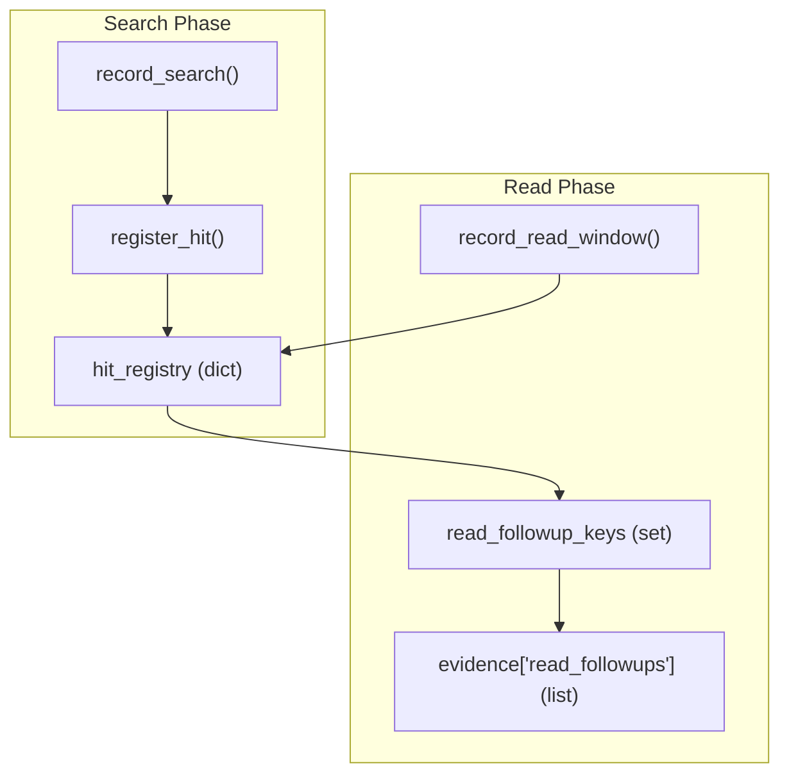
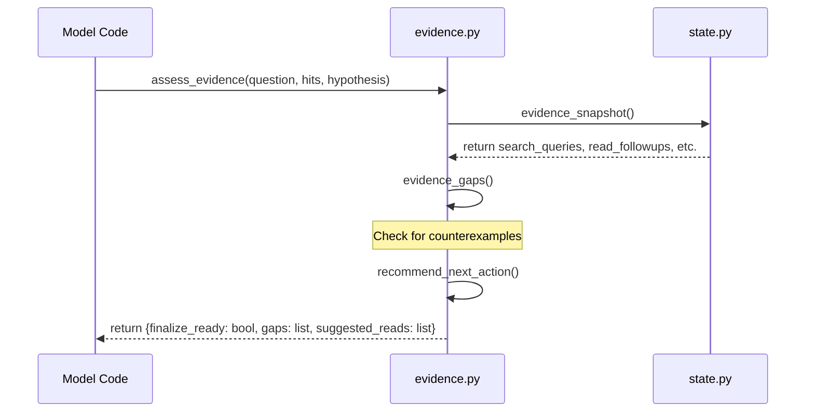

# Evidence Tracking (Python Runtime State)
Relevant source files
- [lib/rlm/engine/grounding/grade.ex](https://github.com/Cody-W-Tucker/rlm/blob/4bc8e1ba/lib/rlm/engine/grounding/grade.ex)
- [priv/runtime/evidence.py](https://github.com/Cody-W-Tucker/rlm/blob/4bc8e1ba/priv/runtime/evidence.py)
- [priv/runtime/state.py](https://github.com/Cody-W-Tucker/rlm/blob/4bc8e1ba/priv/runtime/state.py)
- [test/rlm/engine/grounding/grade_test.exs](https://github.com/Cody-W-Tucker/rlm/blob/4bc8e1ba/test/rlm/engine/grounding/grade_test.exs)
- [test/rlm/engine/recovery_strategy_test.exs](https://github.com/Cody-W-Tucker/rlm/blob/4bc8e1ba/test/rlm/engine/recovery_strategy_test.exs)

The evidence tracking system is a specialized instrumentation layer within the Python runtime that monitors how the model interacts with the provided data corpus. It records every search, hit, and file read to ensure that the final answer is grounded in verifiable evidence rather than LLM hallucinations.

## Overview

The core of evidence tracking resides in `priv/runtime/state.py`, which maintains a global (per-process) state of the model's investigative progress [priv/runtime/state.py1-23](https://github.com/Cody-W-Tucker/rlm/blob/4bc8e1ba/priv/runtime/state.py#L1-L23) This state is persistent across multiple execution iterations, allowing the system to build a cumulative "investigation log."

### Key Tracking Entities

- **Search Patterns**: The specific strings or regexes the model uses to query the corpus [priv/runtime/state.py12](https://github.com/Cody-W-Tucker/rlm/blob/4bc8e1ba/priv/runtime/state.py#L12-L12)
- **Hits**: Specific lines or records in files that matched a search pattern [priv/runtime/state.py22](https://github.com/Cody-W-Tucker/rlm/blob/4bc8e1ba/priv/runtime/state.py#L22-L22)
- **Read Windows**: The specific byte offsets or line ranges the model has explicitly requested to view [priv/runtime/state.py17](https://github.com/Cody-W-Tucker/rlm/blob/4bc8e1ba/priv/runtime/state.py#L17-L17)
- **Read Followups**: A correlation between a search hit and a subsequent read, proving the model actually inspected the evidence it found [priv/runtime/state.py18](https://github.com/Cody-W-Tucker/rlm/blob/4bc8e1ba/priv/runtime/state.py#L18-L18)

## Data Flow: Hit-to-Read Correlation

The system distinguishes between "scouting" (searching) and "grounding" (reading). A critical metric for the Elixir grounding engine is the **Read Followup**, which occurs when a model reads a file window containing a previously registered hit.

### The Correlation Pipeline

1. **`record_search(pattern, source)`**: Records a new search intent and assigns it a unique ID [priv/runtime/state.py180-194](https://github.com/Cody-W-Tucker/rlm/blob/4bc8e1ba/priv/runtime/state.py#L180-L194)
2. **`register_hit(query, path, line, text)`**: Links a specific file location to a search ID [priv/runtime/state.py196-208](https://github.com/Cody-W-Tucker/rlm/blob/4bc8e1ba/priv/runtime/state.py#L196-L208)
3. **`record_read_window(path, offset, limit)`**: Triggered whenever a file is read. It iterates through the `hit_registry` for that path to see if the read window covers any known hits [priv/runtime/state.py210-237](https://github.com/Cody-W-Tucker/rlm/blob/4bc8e1ba/priv/runtime/state.py#L210-L237)
4. **`evidence_snapshot()`**: Serializes the current state for the Elixir engine to consume at the end of an iteration [priv/runtime/state.py124-134](https://github.com/Cody-W-Tucker/rlm/blob/4bc8e1ba/priv/runtime/state.py#L124-L134)

### Runtime State Correlation Logic

Sources: [priv/runtime/state.py180-237](https://github.com/Cody-W-Tucker/rlm/blob/4bc8e1ba/priv/runtime/state.py#L180-L237)

## Search Classification

The system automatically classifies searches into four "kinds" based on the patterns used. This classification is used by the Elixir `Grade` module to determine the semantic quality of the grounding.

| Kind | Purpose | Example Patterns |
| --- | --- | --- |
| `theory_loaded` | Searches for high-level architectural or strategic concepts. | `iterative`, `mvp`, `thin slice` |
| `counterexample` | Explicit attempts to find evidence that contradicts the current hypothesis. | `counterexample`, `however`, `unexpected` |
| `expected_support` | Initial scouting or broad proposals. | `start with`, `first`, `architecture` |
| `behavioral` | Default category for concrete evidence gathering. | (Any pattern not matching above) |

The classification logic uses case-insensitive regex matching defined in `classify_search_kind`[priv/runtime/state.py165-178](https://github.com/Cody-W-Tucker/rlm/blob/4bc8e1ba/priv/runtime/state.py#L165-L178)

Sources: [priv/runtime/state.py25-69](https://github.com/Cody-W-Tucker/rlm/blob/4bc8e1ba/priv/runtime/state.py#L25-L69)[priv/runtime/state.py165-178](https://github.com/Cody-W-Tucker/rlm/blob/4bc8e1ba/priv/runtime/state.py#L165-L178)

## The `assess_evidence()` API

Model-authored code can call `assess_evidence()` (defined in `priv/runtime/evidence.py`) to get a self-diagnostic report of its grounding progress [priv/runtime/evidence.py10-30](https://github.com/Cody-W-Tucker/rlm/blob/4bc8e1ba/priv/runtime/evidence.py#L10-L30)

This function performs several normalization and analysis steps:

1. **`normalize_hits`**: Converts various Hit object types into a standard dictionary format [priv/runtime/evidence.py33-84](https://github.com/Cody-W-Tucker/rlm/blob/4bc8e1ba/priv/runtime/evidence.py#L33-L84)
2. **`evidence_gaps`**: Identifies missing steps in the investigation, such as "No counterexample pass recorded yet" [priv/runtime/evidence.py157-178](https://github.com/Cody-W-Tucker/rlm/blob/4bc8e1ba/priv/runtime/evidence.py#L157-L178)
3. **`suggest_reads`**: Looks at hits that haven't been followed up with a read and suggests specific `offset`/`limit` parameters [priv/runtime/evidence.py181-213](https://github.com/Cody-W-Tucker/rlm/blob/4bc8e1ba/priv/runtime/evidence.py#L181-L213)

### Grounding Assessment Flow

Sources: [priv/runtime/evidence.py10-30](https://github.com/Cody-W-Tucker/rlm/blob/4bc8e1ba/priv/runtime/evidence.py#L10-L30)[priv/runtime/evidence.py157-178](https://github.com/Cody-W-Tucker/rlm/blob/4bc8e1ba/priv/runtime/evidence.py#L157-L178)[priv/runtime/evidence.py226-235](https://github.com/Cody-W-Tucker/rlm/blob/4bc8e1ba/priv/runtime/evidence.py#L226-L235)

## Elixir Integration

At the end of every Python execution, the Elixir `Rlm.Engine` captures the output of `evidence_snapshot()`. This data is then passed to `Rlm.Engine.Grounding.Grade.assess/2` to calculate the final grounding score [lib/rlm/engine/grounding/grade.ex6-22](https://github.com/Cody-W-Tucker/rlm/blob/4bc8e1ba/lib/rlm/engine/grounding/grade.ex#L6-L22)

### Metrics Aggregation

The Elixir side aggregates evidence across all iterations, merging `MapSet` objects to ensure unique counts of:

- `read_windows`
- `hit_paths`
- `read_followups` (broken down by `query_kind`)

This aggregation allows the system to grant an "A" grade even if the evidence was gathered across multiple turns [test/rlm/engine/grounding/grade_test.exs83-109](https://github.com/Cody-W-Tucker/rlm/blob/4bc8e1ba/test/rlm/engine/grounding/grade_test.exs#L83-L109)

### Failure Recovery

If the grounding grade is insufficient, the `Rlm.Engine.Recovery.Strategy` uses the `assess_evidence()` function to guide the model toward better investigative practices rather than just retrying the same failed logic [test/rlm/engine/recovery_strategy_test.exs45-52](https://github.com/Cody-W-Tucker/rlm/blob/4bc8e1ba/test/rlm/engine/recovery_strategy_test.exs#L45-L52)

Sources: [lib/rlm/engine/grounding/grade.ex24-71](https://github.com/Cody-W-Tucker/rlm/blob/4bc8e1ba/lib/rlm/engine/grounding/grade.ex#L24-L71)[test/rlm/engine/grounding/grade_test.exs83-109](https://github.com/Cody-W-Tucker/rlm/blob/4bc8e1ba/test/rlm/engine/grounding/grade_test.exs#L83-L109)[test/rlm/engine/recovery_strategy_test.exs45-52](https://github.com/Cody-W-Tucker/rlm/blob/4bc8e1ba/test/rlm/engine/recovery_strategy_test.exs#L45-L52)