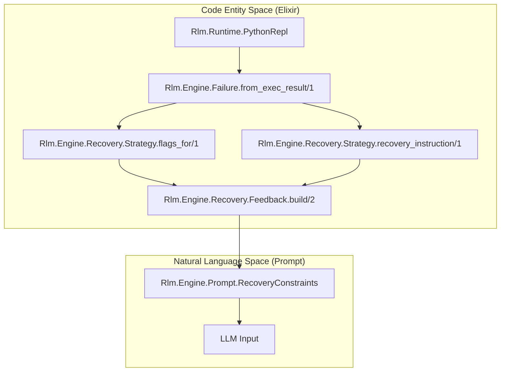
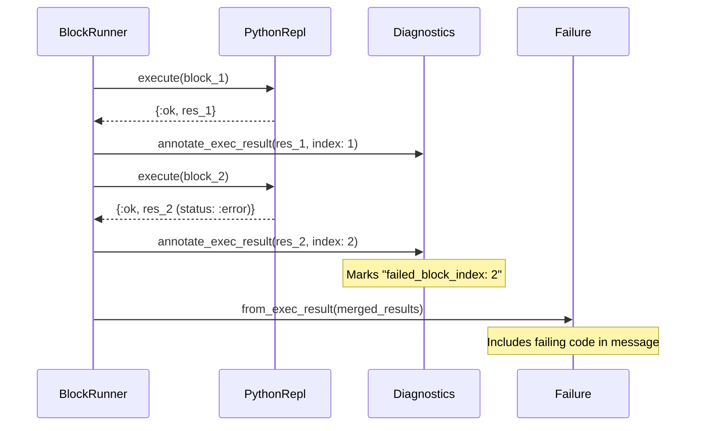

# Failure Classification and Recovery
Relevant source files
- [lib/rlm/engine/execution/block_runner.ex](https://github.com/Cody-W-Tucker/rlm/blob/4bc8e1ba/lib/rlm/engine/execution/block_runner.ex)
- [lib/rlm/engine/execution/diagnostics.ex](https://github.com/Cody-W-Tucker/rlm/blob/4bc8e1ba/lib/rlm/engine/execution/diagnostics.ex)
- [lib/rlm/engine/failure.ex](https://github.com/Cody-W-Tucker/rlm/blob/4bc8e1ba/lib/rlm/engine/failure.ex)
- [lib/rlm/engine/recovery.ex](https://github.com/Cody-W-Tucker/rlm/blob/4bc8e1ba/lib/rlm/engine/recovery.ex)
- [lib/rlm/engine/recovery/strategy.ex](https://github.com/Cody-W-Tucker/rlm/blob/4bc8e1ba/lib/rlm/engine/recovery/strategy.ex)
- [priv/runtime/evidence.py](https://github.com/Cody-W-Tucker/rlm/blob/4bc8e1ba/priv/runtime/evidence.py)
- [test/rlm/engine/async_recovery_test.exs](https://github.com/Cody-W-Tucker/rlm/blob/4bc8e1ba/test/rlm/engine/async_recovery_test.exs)
- [test/rlm/engine/core_runtime_test.exs](https://github.com/Cody-W-Tucker/rlm/blob/4bc8e1ba/test/rlm/engine/core_runtime_test.exs)
- [test/rlm/engine/failure_test.exs](https://github.com/Cody-W-Tucker/rlm/blob/4bc8e1ba/test/rlm/engine/failure_test.exs)
- [test/rlm/engine/recovery_constraints_test.exs](https://github.com/Cody-W-Tucker/rlm/blob/4bc8e1ba/test/rlm/engine/recovery_constraints_test.exs)
- [test/rlm/engine/recovery_strategy_test.exs](https://github.com/Cody-W-Tucker/rlm/blob/4bc8e1ba/test/rlm/engine/recovery_strategy_test.exs)

The RLM engine implements a structured recovery system to handle the inherent non-determinism and fragility of LLM-authored code. When an iteration fails—whether due to a Python syntax error, a provider timeout, or a grounding policy violation—the system does not immediately terminate. Instead, it classifies the error into a structured `Failure` object, applies a `Recovery.Strategy` to adjust the engine's behavior, and provides targeted feedback to the model for a subsequent retry.

## Failure Classification Logic

Failures are categorized into classes that determine their recoverability and the specific advice given to the model. Classification occurs via `Rlm.Engine.Failure.from_stage/2` for orchestration errors or `Rlm.Engine.Failure.from_exec_result/1` for errors emerging from the Python runtime.

### Failure Categories

| Class | Source Stage | Description |
| --- | --- | --- |
| `:provider_timeout` | `:provider` / `:subquery` | The LLM provider failed to respond within the `RequestManager` deadlines [lib/rlm/engine/failure.ex136-140](https://github.com/Cody-W-Tucker/rlm/blob/4bc8e1ba/lib/rlm/engine/failure.ex#L136-L140) |
| `:python_exec_error` | `:runtime` | General Python exceptions or logic errors during execution [lib/rlm/engine/failure.ex166-181](https://github.com/Cody-W-Tucker/rlm/blob/4bc8e1ba/lib/rlm/engine/failure.ex#L166-L181) |
| `:async_wrapper_syntax_error` | `:runtime` | Malformed code specifically within an `async` block that prevents the runtime's fallback wrapper from compiling [lib/rlm/engine/failure.ex68-69](https://github.com/Cody-W-Tucker/rlm/blob/4bc8e1ba/lib/rlm/engine/failure.ex#L68-L69) |
| `:insufficient_grounding` | `:grounding` | The model attempted to finalize an answer without meeting the minimum evidence requirements (e.g., 3 relevant files/windows) [lib/rlm/engine/failure.ex183-187](https://github.com/Cody-W-Tucker/rlm/blob/4bc8e1ba/lib/rlm/engine/failure.ex#L183-L187) |
| `:unpresentable_final_answer` | `:runtime` | The `FINAL()` call contained raw evidence logs or JSON dumps instead of a concise prose answer [lib/rlm/engine/failure.ex127-134](https://github.com/Cody-W-Tucker/rlm/blob/4bc8e1ba/lib/rlm/engine/failure.ex#L127-L134) |
| `:subquery_budget_exhausted` | `:subquery` | The model exceeded the `max_sub_queries` setting [lib/rlm/engine/failure.ex151-153](https://github.com/Cody-W-Tucker/rlm/blob/4bc8e1ba/lib/rlm/engine/failure.ex#L151-L153) |

Sources: [lib/rlm/engine/failure.ex10-27](https://github.com/Cody-W-Tucker/rlm/blob/4bc8e1ba/lib/rlm/engine/failure.ex#L10-L27)[lib/rlm/engine/failure.ex29-50](https://github.com/Cody-W-Tucker/rlm/blob/4bc8e1ba/lib/rlm/engine/failure.ex#L29-L50)[lib/rlm/engine/failure.ex127-191](https://github.com/Cody-W-Tucker/rlm/blob/4bc8e1ba/lib/rlm/engine/failure.ex#L127-L191)

## Recovery Strategy and Constraints

Once a failure is classified, `Rlm.Engine.Recovery.Strategy` maps the failure class to a set of engine flags and natural language instructions. This transformation ensures that the next iteration is constrained to avoid repeating the same mistake.

### Recovery Flags

The system uses flags to modify the environment of the recovery iteration:

- `recovery_mode`: Enables stricter prompt constraints and prioritizes convergence [lib/rlm/engine/recovery/strategy.ex7](https://github.com/Cody-W-Tucker/rlm/blob/4bc8e1ba/lib/rlm/engine/recovery/strategy.ex#L7-L7)
- `async_disabled`: Forces the model to use sequential logic if async wrappers previously failed [lib/rlm/engine/recovery/strategy.ex11](https://github.com/Cody-W-Tucker/rlm/blob/4bc8e1ba/lib/rlm/engine/recovery/strategy.ex#L11-L11)
- `broad_subqueries_disabled`: Prevents the model from spawning complex sub-queries, forcing it to use direct reasoning or narrow reads [lib/rlm/engine/recovery/strategy.ex17-41](https://github.com/Cody-W-Tucker/rlm/blob/4bc8e1ba/lib/rlm/engine/recovery/strategy.ex#L17-L41)

### Recovery Feedback Loop

The diagram below illustrates how a runtime error is transformed into a recovery prompt.

**Failure to Feedback Flow**

Sources: [lib/rlm/engine/recovery/strategy.ex6-46](https://github.com/Cody-W-Tucker/rlm/blob/4bc8e1ba/lib/rlm/engine/recovery/strategy.ex#L6-L46)[lib/rlm/engine/recovery/strategy.ex48-90](https://github.com/Cody-W-Tucker/rlm/blob/4bc8e1ba/lib/rlm/engine/recovery/strategy.ex#L48-L90)[lib/rlm/engine/failure.ex210-218](https://github.com/Cody-W-Tucker/rlm/blob/4bc8e1ba/lib/rlm/engine/failure.ex#L210-L218)[lib/rlm/engine/execution/block_runner.ex31-46](https://github.com/Cody-W-Tucker/rlm/blob/4bc8e1ba/lib/rlm/engine/execution/block_runner.ex#L31-L46)

## Execution Diagnostics and Hints

To help the model recover from specific API misuses, the system annotates execution results with contextual hints. If a `TypeError` occurs during a `read_file` operation, the `Failure` module appends a specific hint to the `message` field.

### Targeted Runtime Hints

- **read_file Misuse**: If the model treats the string returned by `read_file()` as a dictionary, the system provides a hint: *"read_file() returns one string with N: line content lines... do not treat each line like a dict."*[lib/rlm/engine/failure.ex111-115](https://github.com/Cody-W-Tucker/rlm/blob/4bc8e1ba/lib/rlm/engine/failure.ex#L111-L115)
- **grep_files Argument Error**: If the model invents a separate filter instead of using the `path` argument, it receives a hint to scope the search correctly [lib/rlm/engine/failure.ex105-110](https://github.com/Cody-W-Tucker/rlm/blob/4bc8e1ba/lib/rlm/engine/failure.ex#L105-L110)

### Sequential Block Execution

When multiple Python blocks are provided in a single response, `Rlm.Engine.Execution.BlockRunner` executes them sequentially. If one block fails, the system captures the index and code of the failing block to provide precise feedback [lib/rlm/engine/execution/diagnostics.ex4-23](https://github.com/Cody-W-Tucker/rlm/blob/4bc8e1ba/lib/rlm/engine/execution/diagnostics.ex#L4-L23)

**Multi-Block Failure Capture**

Sources: [lib/rlm/engine/execution/block_runner.ex7-22](https://github.com/Cody-W-Tucker/rlm/blob/4bc8e1ba/lib/rlm/engine/execution/block_runner.ex#L7-L22)[lib/rlm/engine/execution/diagnostics.ex4-23](https://github.com/Cody-W-Tucker/rlm/blob/4bc8e1ba/lib/rlm/engine/execution/diagnostics.ex#L4-L23)[lib/rlm/engine/failure.ex85-102](https://github.com/Cody-W-Tucker/rlm/blob/4bc8e1ba/lib/rlm/engine/failure.ex#L85-L102)

## Termination vs. Recovery

The iteration loop decides whether to attempt recovery based on three criteria defined in `Rlm.Engine.Recovery.allowed?/4`:

1. The `Failure` must be marked as `recoverable: true`[lib/rlm/engine/recovery.ex9](https://github.com/Cody-W-Tucker/rlm/blob/4bc8e1ba/lib/rlm/engine/recovery.ex#L9-L9)
2. A recovery has not already been attempted in the current run (`run_state.recovery_attempted?`) [lib/rlm/engine/recovery.ex9](https://github.com/Cody-W-Tucker/rlm/blob/4bc8e1ba/lib/rlm/engine/recovery.ex#L9-L9)
3. The current iteration count is less than `max_iterations`[lib/rlm/engine/recovery.ex10](https://github.com/Cody-W-Tucker/rlm/blob/4bc8e1ba/lib/rlm/engine/recovery.ex#L10-L10)

If recovery is not allowed, the engine terminates and returns the best partial answer found in the iteration history, typically derived from `stdout` if no `FINAL()` value was produced [test/rlm/engine/async_recovery_test.exs85-97](https://github.com/Cody-W-Tucker/rlm/blob/4bc8e1ba/test/rlm/engine/async_recovery_test.exs#L85-L97)

Sources: [lib/rlm/engine/recovery.ex8-11](https://github.com/Cody-W-Tucker/rlm/blob/4bc8e1ba/lib/rlm/engine/recovery.ex#L8-L11)[lib/rlm/engine/failure.ex210-218](https://github.com/Cody-W-Tucker/rlm/blob/4bc8e1ba/lib/rlm/engine/failure.ex#L210-L218)[test/rlm/engine/core_runtime_test.exs62-73](https://github.com/Cody-W-Tucker/rlm/blob/4bc8e1ba/test/rlm/engine/core_runtime_test.exs#L62-L73)