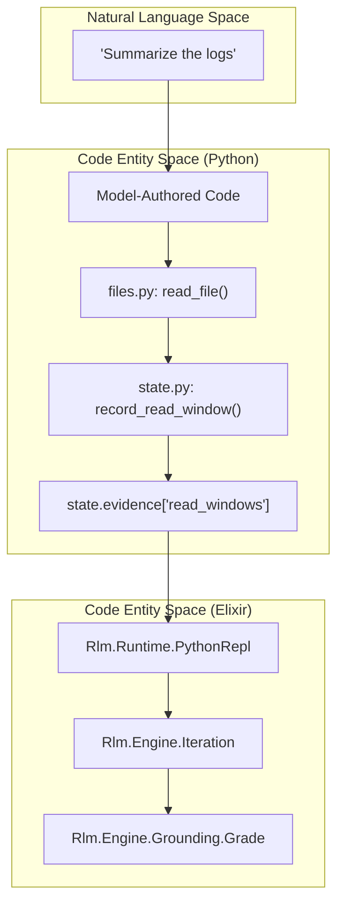
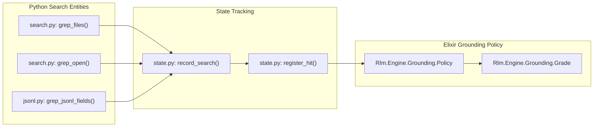

# File Access, Search, and JSONL Tools
Relevant source files
- [lib/rlm/engine/answer_quality.ex](https://github.com/Cody-W-Tucker/rlm/blob/4bc8e1ba/lib/rlm/engine/answer_quality.ex)
- [lib/rlm/engine/run_state.ex](https://github.com/Cody-W-Tucker/rlm/blob/4bc8e1ba/lib/rlm/engine/run_state.ex)
- [priv/runtime/files.py](https://github.com/Cody-W-Tucker/rlm/blob/4bc8e1ba/priv/runtime/files.py)
- [priv/runtime/jsondoc.py](https://github.com/Cody-W-Tucker/rlm/blob/4bc8e1ba/priv/runtime/jsondoc.py)
- [priv/runtime/jsonl.py](https://github.com/Cody-W-Tucker/rlm/blob/4bc8e1ba/priv/runtime/jsonl.py)
- [priv/runtime/search.py](https://github.com/Cody-W-Tucker/rlm/blob/4bc8e1ba/priv/runtime/search.py)
- [test/rlm/engine/file_access_test.exs](https://github.com/Cody-W-Tucker/rlm/blob/4bc8e1ba/test/rlm/engine/file_access_test.exs)
- [test/rlm/engine/json_doc_test.exs](https://github.com/Cody-W-Tucker/rlm/blob/4bc8e1ba/test/rlm/engine/json_doc_test.exs)
- [test/rlm/engine/jsonl_test.exs](https://github.com/Cody-W-Tucker/rlm/blob/4bc8e1ba/test/rlm/engine/jsonl_test.exs)
- [test/support/runtime_compat_test_providers.ex](https://github.com/Cody-W-Tucker/rlm/blob/4bc8e1ba/test/support/runtime_compat_test_providers.ex)

The Python runtime provides a specialized set of data-access tools designed to allow model-authored code to explore large datasets without overwhelming the LLM's context window. These tools handle path normalization, security enforcement via an allowed-file list, and automatic evidence tracking for the grounding system.

## File System Access

The `files.py` module provides basic primitives for discovering and reading files within the provided context bundle. It uses a `PathRef` class to ensure that file paths can be accessed both as strings and as dictionary-like objects, accommodating common LLM coding patterns [priv/runtime/files.py4-9](https://github.com/Cody-W-Tucker/rlm/blob/4bc8e1ba/priv/runtime/files.py#L4-L9)

### Discovery and Sampling

- **`list_files(limit, offset)`**: Returns a paginated list of all files currently available in the runtime environment [priv/runtime/files.py11-16](https://github.com/Cody-W-Tucker/rlm/blob/4bc8e1ba/priv/runtime/files.py#L11-L16)
- **`sample_files(limit)`**: Selects a distributed sample of files across the entire available set. This is useful for the model to understand the breadth of a large corpus without listing every file [priv/runtime/files.py18-46](https://github.com/Cody-W-Tucker/rlm/blob/4bc8e1ba/priv/runtime/files.py#L18-L46)

### Reading and Peeking

The system distinguishes between "peeking" (scouting) and "reading" (grounding).

- **`read_file(path, offset, limit)`**: Reads a specific window of lines. This call is considered "strong evidence" and triggers `state.record_read_window` to inform the grounding engine [priv/runtime/files.py49-56](https://github.com/Cody-W-Tucker/rlm/blob/4bc8e1ba/priv/runtime/files.py#L49-L56)
- **`peek_file(path, limit, offset)`**: Reads a small window (max 80 lines) for initial inspection. This is recorded in `state.evidence["previewed_files"]` but does not count as a full read for grounding purposes [priv/runtime/files.py99-104](https://github.com/Cody-W-Tucker/rlm/blob/4bc8e1ba/priv/runtime/files.py#L99-L104)

### Data Flow: File Access to Grounding

The following diagram shows how a call to `read_file` in the Python space translates to evidence in the Elixir engine.

**File Evidence Pipeline**

**Sources:**[priv/runtime/files.py49-56](https://github.com/Cody-W-Tucker/rlm/blob/4bc8e1ba/priv/runtime/files.py#L49-L56)[priv/runtime/state.py23](https://github.com/Cody-W-Tucker/rlm/blob/4bc8e1ba/priv/runtime/state.py#L23-L23)[test/rlm/engine/file_access_test.exs24-46](https://github.com/Cody-W-Tucker/rlm/blob/4bc8e1ba/test/rlm/engine/file_access_test.exs#L24-L46)

---

## Search and Grep Tools

The `search.py` module implements regex-based searching across the file corpus. It returns structured `Hit` objects that track the provenance of the search (which query produced which hit) [priv/runtime/search.py8-15](https://github.com/Cody-W-Tucker/rlm/blob/4bc8e1ba/priv/runtime/search.py#L8-L15)

### Key Functions

- **`grep_files(pattern, limit, path)`**: Scans the corpus for a regex. It records the search in `state.record_search` and registers each match via `state.register_hit`[priv/runtime/search.py159-185](https://github.com/Cody-W-Tucker/rlm/blob/4bc8e1ba/priv/runtime/search.py#L159-L185)
- **`grep_open(pattern, limit, window, path)`**: A high-utility function that performs a grep and automatically includes a text `preview` (context window) for every hit. It returns `OpenedHit` objects [priv/runtime/search.py188-216](https://github.com/Cody-W-Tucker/rlm/blob/4bc8e1ba/priv/runtime/search.py#L188-L216)
- **`peek_hit(hit)` / `open_hit(hit)`**: Allows the model to take a `Hit` object returned from a previous search and fetch the surrounding context [priv/runtime/search.py118-134](https://github.com/Cody-W-Tucker/rlm/blob/4bc8e1ba/priv/runtime/search.py#L118-L134)

### Hit Object Structure

`Hit` objects support index-based access (e.g., `hit[0]`) to maintain compatibility with models that treat results as tuples [priv/runtime/search.py23-32](https://github.com/Cody-W-Tucker/rlm/blob/4bc8e1ba/priv/runtime/search.py#L23-L32)[test/rlm/engine/file_access_test.exs122-141](https://github.com/Cody-W-Tucker/rlm/blob/4bc8e1ba/test/rlm/engine/file_access_test.exs#L122-L141)

| Attribute | Index | Description |
| --- | --- | --- |
| `path` | 0 | The file path containing the match. |
| `line` | 1 | The line number of the match. |
| `text` | 2 | The content of the matching line. |
| `preview` | 3 | (OpenedHit only) Surrounding context lines. |

**Sources:**[priv/runtime/search.py8-51](https://github.com/Cody-W-Tucker/rlm/blob/4bc8e1ba/priv/runtime/search.py#L8-L51)[test/rlm/engine/file_access_test.exs100-120](https://github.com/Cody-W-Tucker/rlm/blob/4bc8e1ba/test/rlm/engine/file_access_test.exs#L100-L120)

---

## JSON and JSONL Tools

For structured data, `jsonl.py` and `jsondoc.py` provide field-aware exploration. These tools prevent the LLM from trying to read multi-megabyte JSON files into memory.

### JSONL (Line-Delimited JSON)

JSONL tools are optimized for large log files or datasets where each line is a valid JSON object.

- **`sample_jsonl(path, limit)`**: Samples records from across the file to help the model understand the schema without reading the whole file [priv/runtime/jsonl.py58-90](https://github.com/Cody-W-Tucker/rlm/blob/4bc8e1ba/priv/runtime/jsonl.py#L58-L90)
- **`grep_jsonl_fields(path, field_pattern, text_pattern)`**: Performs a search that is aware of JSON keys. It only matches if the `text_pattern` is found within a field name matching `field_pattern`[priv/runtime/jsonl.py91-126](https://github.com/Cody-W-Tucker/rlm/blob/4bc8e1ba/priv/runtime/jsonl.py#L91-L126)
- **`render_jsonl(path, offset, limit)`**: Produces a plain-text representation of a JSONL window, specifically formatted for the LLM to read [priv/runtime/jsonl.py41-55](https://github.com/Cody-W-Tucker/rlm/blob/4bc8e1ba/priv/runtime/jsonl.py#L41-L55)

### JSON Documents

`jsondoc.py` provides path-based access (e.g., `$.users[0].name`) to large nested documents.

- **`sample_json(path)`**: Returns top-level keys and a sample of scalar fields [priv/runtime/jsondoc.py138-157](https://github.com/Cody-W-Tucker/rlm/blob/4bc8e1ba/priv/runtime/jsondoc.py#L138-L157)
- **`read_json(path, json_path, limit)`**: Resolves a specific JSON path and returns the value, truncating large objects or arrays to prevent context overflow [priv/runtime/jsondoc.py159-168](https://github.com/Cody-W-Tucker/rlm/blob/4bc8e1ba/priv/runtime/jsondoc.py#L159-L168)
- **`render_json(path, json_path)`**: Converts the result of `read_json` into a formatted string for the model's output [priv/runtime/jsondoc.py170-193](https://github.com/Cody-W-Tucker/rlm/blob/4bc8e1ba/priv/runtime/jsondoc.py#L170-L193)

### Mapping Search to Grounding Evidence

The system tracks search queries and their subsequent "promotions" to reads. If a model searches but never reads the actual file content, the grounding grade is lowered.

**Search and Promotion Mapping**

**Sources:**[priv/runtime/jsonl.py97-109](https://github.com/Cody-W-Tucker/rlm/blob/4bc8e1ba/priv/runtime/jsonl.py#L97-L109)[priv/runtime/jsondoc.py202-207](https://github.com/Cody-W-Tucker/rlm/blob/4bc8e1ba/priv/runtime/jsondoc.py#L202-L207)[test/rlm/engine/jsonl_test.exs146-184](https://github.com/Cody-W-Tucker/rlm/blob/4bc8e1ba/test/rlm/engine/jsonl_test.exs#L146-L184)

---

## Answer Quality and Instrumentation

The Elixir engine uses `Rlm.Engine.AnswerQuality` to ensure the model doesn't return raw tool output as a final answer. If the `FINAL()` value contains too many line numbers, file paths, or JSON markers (like `'record':`), it is rejected as a "structured evidence dump" [lib/rlm/engine/answer_quality.ex18-67](https://github.com/Cody-W-Tucker/rlm/blob/4bc8e1ba/lib/rlm/engine/answer_quality.ex#L18-L67)

Similarly, `Rlm.Engine.RunState` monitors `stdout`. If the model forgets to call `FINAL()` but prints a clean answer to `stdout`, the engine can salvage it, provided it doesn't look like raw instrumentation (e.g., output from `grep_files`) [lib/rlm/engine/run_state.ex94-106](https://github.com/Cody-W-Tucker/rlm/blob/4bc8e1ba/lib/rlm/engine/run_state.ex#L94-L106)[lib/rlm/engine/run_state.ex163-174](https://github.com/Cody-W-Tucker/rlm/blob/4bc8e1ba/lib/rlm/engine/run_state.ex#L163-L174)

**Sources:**[lib/rlm/engine/answer_quality.ex42-64](https://github.com/Cody-W-Tucker/rlm/blob/4bc8e1ba/lib/rlm/engine/answer_quality.ex#L42-L64)[lib/rlm/engine/run_state.ex143-161](https://github.com/Cody-W-Tucker/rlm/blob/4bc8e1ba/lib/rlm/engine/run_state.ex#L143-L161)