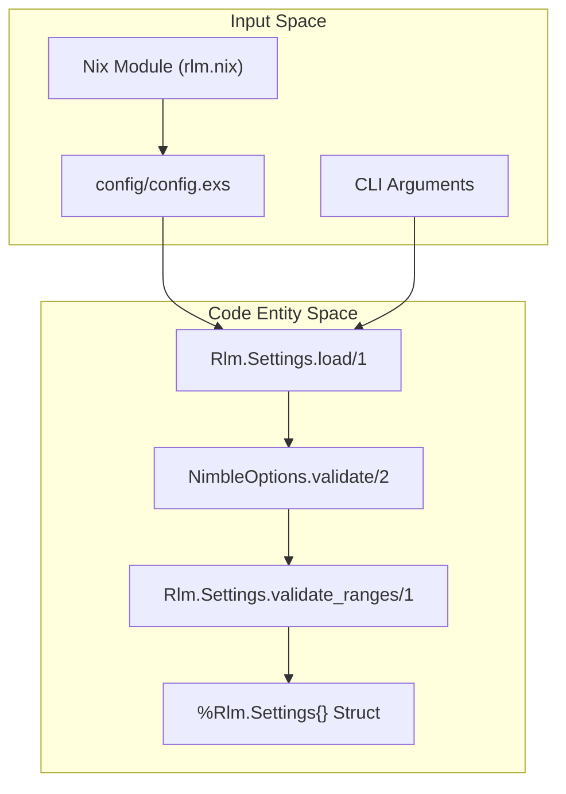
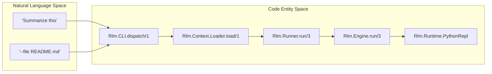

# Getting Started
Relevant source files
- [.gitignore](https://github.com/Cody-W-Tucker/rlm/blob/4bc8e1ba/.gitignore)
- [README.md](https://github.com/Cody-W-Tucker/rlm/blob/4bc8e1ba/README.md?plain=1)
- [config/config.exs](https://github.com/Cody-W-Tucker/rlm/blob/4bc8e1ba/config/config.exs)
- [flake.nix](https://github.com/Cody-W-Tucker/rlm/blob/4bc8e1ba/flake.nix)
- [lib/rlm/engine/runtime_outcome.ex](https://github.com/Cody-W-Tucker/rlm/blob/4bc8e1ba/lib/rlm/engine/runtime_outcome.ex)
- [lib/rlm/settings.ex](https://github.com/Cody-W-Tucker/rlm/blob/4bc8e1ba/lib/rlm/settings.ex)
- [nix/modules/rlm.nix](https://github.com/Cody-W-Tucker/rlm/blob/4bc8e1ba/nix/modules/rlm.nix)
- [nix/packages/rlm.nix](https://github.com/Cody-W-Tucker/rlm/blob/4bc8e1ba/nix/packages/rlm.nix)
- [test/rlm/cli/workflow_test.exs](https://github.com/Cody-W-Tucker/rlm/blob/4bc8e1ba/test/rlm/cli/workflow_test.exs)
- [test/rlm/settings_test.exs](https://github.com/Cody-W-Tucker/rlm/blob/4bc8e1ba/test/rlm/settings_test.exs)

The `rlm` system is a grounded, policy-based recursive language model (RLM) engine designed for reliable, inspectable investigation of data. This page covers the initial setup using Nix, manual configuration via Elixir's `config.exs`, and basic CLI usage.

## Setup and Installation

The supported installation path for `rlm` is Nix-first, providing a reproducible environment that includes the Elixir runtime, Python 3, and necessary dependencies.

### Nix-First Installation (Home Manager)

You can integrate `rlm` into your NixOS or Home Manager setup by adding it as a flake input. This allows you to manage your API keys and model settings declaratively.

```
{
  inputs.rlm.url = "github:Cody-W-Tucker/rlm";
 
  outputs = { self, nixpkgs, rlm, ... }: {
    # In your home-manager configuration:
    homeConfigurations."user" = home-manager.lib.homeManagerConfiguration {
      modules = [
        rlm.homeManagerModules.default
        {
          programs.rlm = {
            enable = true;
            model = "gpt-5.4-mini";
            apiKeyFile = "/path/to/your/openai-api-key";
            # Optional: custom storage for run traces
            storageDir = "/home/user/.rlm-traces";
          };
        }
      ];
    };
  };
}
```

### Manual Development Setup

If not using the Home Manager module, you can use the provided `devShell` to enter a pre-configured environment.

1. **Clone and Enter Shell**:

```
git clone https://github.com/Cody-W-Tucker/rlm.git
cd rlm
nix develop
```
2. **Initialize Dependencies**:

```
mix deps.get
mix compile
```

**Sources:**[README.md83-109](https://github.com/Cody-W-Tucker/rlm/blob/4bc8e1ba/README.md?plain=1#L83-L109)[flake.nix31-34](https://github.com/Cody-W-Tucker/rlm/blob/4bc8e1ba/flake.nix#L31-L34)[nix/modules/rlm.nix35-152](https://github.com/Cody-W-Tucker/rlm/blob/4bc8e1ba/nix/modules/rlm.nix#L35-L152)[flake.nix111-160](https://github.com/Cody-W-Tucker/rlm/blob/4bc8e1ba/flake.nix#L111-L160)

---

## Configuration

`rlm` uses `Rlm.Settings` to manage its operational parameters. These are resolved by merging application configuration (usually in `config/config.exs`) with any runtime overrides passed via the CLI.

### Key Settings Fields

| Field | Type | Default | Description |
| --- | --- | --- | --- |
| `provider` | `:openai` \| `:mock` | `:openai` | The LLM provider to use. |
| `model` | `string` | `"gpt-5.4-mini"` | The primary model for orchestration. |
| `api_key` | `string` | `""` | OpenAI API key (required for `:openai`). |
| `max_iterations` | `integer` | `12` | Maximum loops before the engine terminates. |
| `max_sub_queries` | `integer` | `24` | Budget for `llm_query` calls from Python. |
| `storage_dir` | `string` | `~/.local/state/rlm/runs` | Where JSON run traces are saved. |
| `truncate_length` | `integer` | `5000` | Max characters of stdout fed back to the LLM. |

### Configuration Data Flow

The following diagram illustrates how configuration is resolved from the environment into the validated `Rlm.Settings` struct.

**Data Flow: Settings Resolution**



**Sources:**[config/config.exs3-23](https://github.com/Cody-W-Tucker/rlm/blob/4bc8e1ba/config/config.exs#L3-L23)[lib/rlm/settings.ex4-64](https://github.com/Cody-W-Tucker/rlm/blob/4bc8e1ba/lib/rlm/settings.ex#L4-L64)[lib/rlm/settings.ex66-110](https://github.com/Cody-W-Tucker/rlm/blob/4bc8e1ba/lib/rlm/settings.ex#L66-L110)[nix/modules/rlm.nix25-32](https://github.com/Cody-W-Tucker/rlm/blob/4bc8e1ba/nix/modules/rlm.nix#L25-L32)

---

## CLI Usage

The primary interface is the `rlm` command (or `mix rlm` in development). It allows loading context from files, URLs, or standard input.

### Examples

- **Summarize a file**:
`rlm --file README.md "Summarize this file"`
- **Analyze codebase**:
`rlm --file lib/**/*.ex "Explain the runtime flow"`
- **Web context**:
`rlm --url https://example.com/data.txt "Extract the main idea"`
- **Piped input**:
`printf 'alpha\nbeta\n' | rlm --stdin "What is in stdin?"`

### Mapping CLI to Code Entities

When you run a command, the CLI parses arguments and initiates the `Rlm.Engine`.

**System Mapping: CLI to Engine**



**Sources:**[README.md110-117](https://github.com/Cody-W-Tucker/rlm/blob/4bc8e1ba/README.md?plain=1#L110-L117)[test/rlm/cli/workflow_test.exs9-24](https://github.com/Cody-W-Tucker/rlm/blob/4bc8e1ba/test/rlm/cli/workflow_test.exs#L9-L24)[lib/rlm/engine/runtime_outcome.ex1-22](https://github.com/Cody-W-Tucker/rlm/blob/4bc8e1ba/lib/rlm/engine/runtime_outcome.ex#L1-L22)[nix/packages/rlm.nix3-44](https://github.com/Cody-W-Tucker/rlm/blob/4bc8e1ba/nix/packages/rlm.nix#L3-L44)

---

## Runtime Environment

`rlm` operates by starting a persistent Python subprocess. This subprocess maintains state across iterations, allowing the model to build up a complex investigation.

1. **Process Start**: The Elixir `Rlm.Runtime.PythonRepl` (a GenServer) starts the command defined in `runtime_command` (defaulting to `python3`).
2. **Communication**: Elixir and Python communicate via a line-delimited JSON protocol over a port.
3. **Execution**: When the LLM generates code blocks, they are sent to the Python runtime. The results (stdout, variables, and grounding evidence) are returned to Elixir to be fed into the next iteration prompt.

**Sources:**[config/config.exs14](https://github.com/Cody-W-Tucker/rlm/blob/4bc8e1ba/config/config.exs#L14-L14)[lib/rlm/settings.ex218-226](https://github.com/Cody-W-Tucker/rlm/blob/4bc8e1ba/lib/rlm/settings.ex#L218-L226)[nix/packages/rlm.nix6](https://github.com/Cody-W-Tucker/rlm/blob/4bc8e1ba/nix/packages/rlm.nix#L6-L6)