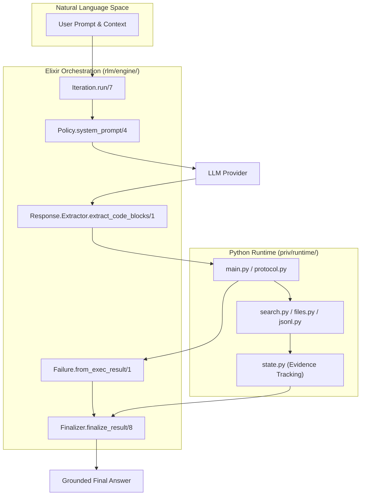
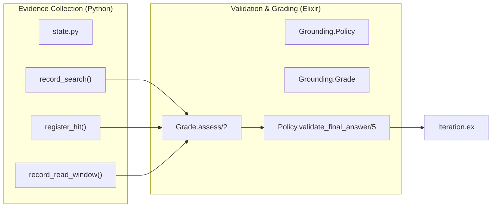

# Glossary
Relevant source files
- [README.md](https://github.com/Cody-W-Tucker/rlm/blob/4bc8e1ba/README.md?plain=1)
- [lib/rlm/engine/failure.ex](https://github.com/Cody-W-Tucker/rlm/blob/4bc8e1ba/lib/rlm/engine/failure.ex)
- [lib/rlm/engine/finalizer.ex](https://github.com/Cody-W-Tucker/rlm/blob/4bc8e1ba/lib/rlm/engine/finalizer.ex)
- [lib/rlm/engine/grounding/grade.ex](https://github.com/Cody-W-Tucker/rlm/blob/4bc8e1ba/lib/rlm/engine/grounding/grade.ex)
- [lib/rlm/engine/grounding/policy.ex](https://github.com/Cody-W-Tucker/rlm/blob/4bc8e1ba/lib/rlm/engine/grounding/policy.ex)
- [lib/rlm/engine/iteration.ex](https://github.com/Cody-W-Tucker/rlm/blob/4bc8e1ba/lib/rlm/engine/iteration.ex)
- [lib/rlm/engine/prompt/base.ex](https://github.com/Cody-W-Tucker/rlm/blob/4bc8e1ba/lib/rlm/engine/prompt/base.ex)
- [lib/rlm/engine/recovery/strategy.ex](https://github.com/Cody-W-Tucker/rlm/blob/4bc8e1ba/lib/rlm/engine/recovery/strategy.ex)
- [lib/rlm/post_mortem.ex](https://github.com/Cody-W-Tucker/rlm/blob/4bc8e1ba/lib/rlm/post_mortem.ex)
- [lib/rlm/settings.ex](https://github.com/Cody-W-Tucker/rlm/blob/4bc8e1ba/lib/rlm/settings.ex)
- [priv/runtime/protocol.py](https://github.com/Cody-W-Tucker/rlm/blob/4bc8e1ba/priv/runtime/protocol.py)
- [priv/runtime/state.py](https://github.com/Cody-W-Tucker/rlm/blob/4bc8e1ba/priv/runtime/state.py)
- [test/rlm/cli/workflow_test.exs](https://github.com/Cody-W-Tucker/rlm/blob/4bc8e1ba/test/rlm/cli/workflow_test.exs)
- [test/rlm/engine/core_runtime_test.exs](https://github.com/Cody-W-Tucker/rlm/blob/4bc8e1ba/test/rlm/engine/core_runtime_test.exs)
- [test/rlm/engine/fixture_recovery_test.exs](https://github.com/Cody-W-Tucker/rlm/blob/4bc8e1ba/test/rlm/engine/fixture_recovery_test.exs)
- [test/rlm/engine/grounding/grade_test.exs](https://github.com/Cody-W-Tucker/rlm/blob/4bc8e1ba/test/rlm/engine/grounding/grade_test.exs)
- [test/rlm/engine/grounding/policy_test.exs](https://github.com/Cody-W-Tucker/rlm/blob/4bc8e1ba/test/rlm/engine/grounding/policy_test.exs)
- [test/rlm/engine/policy_test.exs](https://github.com/Cody-W-Tucker/rlm/blob/4bc8e1ba/test/rlm/engine/policy_test.exs)
- [test/rlm/post_mortem_test.exs](https://github.com/Cody-W-Tucker/rlm/blob/4bc8e1ba/test/rlm/post_mortem_test.exs)
- [test/support/postmortem_test_providers.ex](https://github.com/Cody-W-Tucker/rlm/blob/4bc8e1ba/test/support/postmortem_test_providers.ex)

This page defines codebase-specific terms, domain concepts, and technical jargon used within the `rlm` system. It provides a bridge between the conceptual "Natural Language Space" and the concrete "Code Entity Space."

## Core Concepts

### RLM (Recursive Language Model)

The fundamental architectural pattern where an LLM is given a persistent execution environment (Python REPL) and a budget of multiple turns to investigate a corpus before finalizing an answer. Unlike standard RAG, the RLM can "decide" to search again, read deeper, or parallelize work via sub-queries based on intermediate results [README.md5-15](https://github.com/Cody-W-Tucker/rlm/blob/4bc8e1ba/README.md?plain=1#L5-L15)

### Grounding

The process of verifying that an LLM's claims are backed by direct evidence from the input corpus. `rlm` operationalizes grounding by tracking "evidence" (searches, hits, and reads) within the Python runtime [priv/runtime/state.py11-19](https://github.com/Cody-W-Tucker/rlm/blob/4bc8e1ba/priv/runtime/state.py#L11-L19) and grading it in Elixir [lib/rlm/engine/grounding/grade.ex6-22](https://github.com/Cody-W-Tucker/rlm/blob/4bc8e1ba/lib/rlm/engine/grounding/grade.ex#L6-L22)

### Compass

A structured knowledge map stored and retrieved during a run via `SET_COMPASS` and `GET_COMPASS`[lib/rlm/engine/prompt/base.ex57](https://github.com/Cody-W-Tucker/rlm/blob/4bc8e1ba/lib/rlm/engine/prompt/base.ex#L57-L57) It is used for "Compass" judgment styles to ensure the model explores multiple "directions" (e.g., North, South, East, West) of a problem space before finalizing [lib/rlm/engine/grounding/policy.ex129-138](https://github.com/Cody-W-Tucker/rlm/blob/4bc8e1ba/lib/rlm/engine/grounding/policy.ex#L129-L138)

## Technical Terminology

| Term | Definition | Code Pointer |
| --- | --- | --- |
| **Iteration** | A single loop of the engine: Prompt -> LLM -> Code Extraction -> Python Exec -> Result Classification. | [lib/rlm/engine/iteration.ex78-128](https://github.com/Cody-W-Tucker/rlm/blob/4bc8e1ba/lib/rlm/engine/iteration.ex#L78-L128) |
| **Sub-query** | A text-only LLM call made *from within* the Python REPL to process a specific chunk of text. | [lib/rlm/engine/iteration.ex35-52](https://github.com/Cody-W-Tucker/rlm/blob/4bc8e1ba/lib/rlm/engine/iteration.ex#L35-L52) |
| **Context Bundle** | A struct containing all input data (files, URLs, inline text) and metadata used to initialize a run. | [test/rlm/engine/policy_test.exs10-21](https://github.com/Cody-W-Tucker/rlm/blob/4bc8e1ba/test/rlm/engine/policy_test.exs#L10-L21) |
| **Salvage** | Heuristics used to extract executable Python from malformed or "chatty" LLM responses. | [test/rlm/engine/core_runtime_test.exs114-160](https://github.com/Cody-W-Tucker/rlm/blob/4bc8e1ba/test/rlm/engine/core_runtime_test.exs#L114-L160) |
| **Grounding Grade** | A structural assessment (A-F) of how deeply the model inspected the corpus. | [lib/rlm/engine/grounding/grade.ex101-105](https://github.com/Cody-W-Tucker/rlm/blob/4bc8e1ba/lib/rlm/engine/grounding/grade.ex#L101-L105) |
| **Semantic Level** | A qualitative assessment of the *kind* of search performed (e.g., searching for counterexamples). | [lib/rlm/engine/grounding/grade.ex133-174](https://github.com/Cody-W-Tucker/rlm/blob/4bc8e1ba/lib/rlm/engine/grounding/grade.ex#L133-L174) |

## Data Flow: From Prompt to Grounded Answer

The following diagram maps the conceptual flow of a run to the specific code entities that handle each stage.

**System Data Flow and Code Mapping**

Sources: [lib/rlm/engine/iteration.ex16-33](https://github.com/Cody-W-Tucker/rlm/blob/4bc8e1ba/lib/rlm/engine/iteration.ex#L16-L33)[lib/rlm/engine/prompt/base.ex4-27](https://github.com/Cody-W-Tucker/rlm/blob/4bc8e1ba/lib/rlm/engine/prompt/base.ex#L4-L27)[lib/rlm/engine/failure.ex29-50](https://github.com/Cody-W-Tucker/rlm/blob/4bc8e1ba/lib/rlm/engine/failure.ex#L29-L50)[priv/runtime/state.py124-134](https://github.com/Cody-W-Tucker/rlm/blob/4bc8e1ba/priv/runtime/state.py#L124-L134)[lib/rlm/engine/finalizer.ex1-20](https://github.com/Cody-W-Tucker/rlm/blob/4bc8e1ba/lib/rlm/engine/finalizer.ex#L1-L20)

## Grounding Concepts

### Evidence Tracking

The system distinguishes between "scouting" (searching/listing) and "reading" (direct inspection).

- **Hit**: A match found by `grep_files` or `grep_open`.
- **Read Window**: A specific range of lines requested via `read_file` or `read_jsonl`.
- **Follow-up**: A "Read Window" that happens to encompass the line of a previously registered "Hit" [priv/runtime/state.py210-237](https://github.com/Cody-W-Tucker/rlm/blob/4bc8e1ba/priv/runtime/state.py#L210-L237)

### Search Classifications

The system categorizes search patterns to determine the "Semantic Level" of grounding [priv/runtime/state.py165-179](https://github.com/Cody-W-Tucker/rlm/blob/4bc8e1ba/priv/runtime/state.py#L165-L179):

- **Behavioral**: Neutral searches for patterns or markers.
- **Counterexample**: Active attempts to find contradictory evidence (e.g., "however", "unexpected").
- **Theory Loaded**: Abstract or theoretical searches (e.g., "iterative", "mvp").

**Grounding Logic Code Mapping**

Sources: [priv/runtime/state.py180-237](https://github.com/Cody-W-Tucker/rlm/blob/4bc8e1ba/priv/runtime/state.py#L180-L237)[lib/rlm/engine/grounding/grade.ex6-22](https://github.com/Cody-W-Tucker/rlm/blob/4bc8e1ba/lib/rlm/engine/grounding/grade.ex#L6-L22)[lib/rlm/engine/grounding/policy.ex22-38](https://github.com/Cody-W-Tucker/rlm/blob/4bc8e1ba/lib/rlm/engine/grounding/policy.ex#L22-L38)

## Failure Classification

Failures are categorized into structured classes to drive the **Recovery Strategy**[lib/rlm/engine/recovery/strategy.ex6-46](https://github.com/Cody-W-Tucker/rlm/blob/4bc8e1ba/lib/rlm/engine/recovery/strategy.ex#L6-L46)

| Failure Class | Meaning | Recovery Instruction |
| --- | --- | --- |
| `:insufficient_grounding` | Model tried to finalize without enough reads. | "Promote hits to read_file() windows." [lib/rlm/engine/recovery/strategy.ex80-82](https://github.com/Cody-W-Tucker/rlm/blob/4bc8e1ba/lib/rlm/engine/recovery/strategy.ex#L80-L82) |
| `:ungrounded_final_answer` | Model cited files it never actually read. | "Inspect specific missing files or remove claims." [lib/rlm/engine/recovery/strategy.ex76-78](https://github.com/Cody-W-Tucker/rlm/blob/4bc8e1ba/lib/rlm/engine/recovery/strategy.ex#L76-L78) |
| `:unpresentable_final_answer` | Model dumped raw JSON/logs as the answer. | "Synthesize concise prose; do not dump raw data." [lib/rlm/engine/recovery/strategy.ex84-86](https://github.com/Cody-W-Tucker/rlm/blob/4bc8e1ba/lib/rlm/engine/recovery/strategy.ex#L84-L86) |
| `:async_failed` | Parallel sub-queries crashed or timed out. | "Do not use async again; use sequential queries." [lib/rlm/engine/recovery/strategy.ex64-66](https://github.com/Cody-W-Tucker/rlm/blob/4bc8e1ba/lib/rlm/engine/recovery/strategy.ex#L64-L66) |
| `:provider_timeout` | The LLM failed to respond in time. | "Use a narrower question or simpler strategy." [lib/rlm/engine/recovery/strategy.ex48-50](https://github.com/Cody-W-Tucker/rlm/blob/4bc8e1ba/lib/rlm/engine/recovery/strategy.ex#L48-L50) |

Sources: [lib/rlm/engine/failure.ex127-191](https://github.com/Cody-W-Tucker/rlm/blob/4bc8e1ba/lib/rlm/engine/failure.ex#L127-L191)[lib/rlm/engine/recovery/strategy.ex48-91](https://github.com/Cody-W-Tucker/rlm/blob/4bc8e1ba/lib/rlm/engine/recovery/strategy.ex#L48-L91)