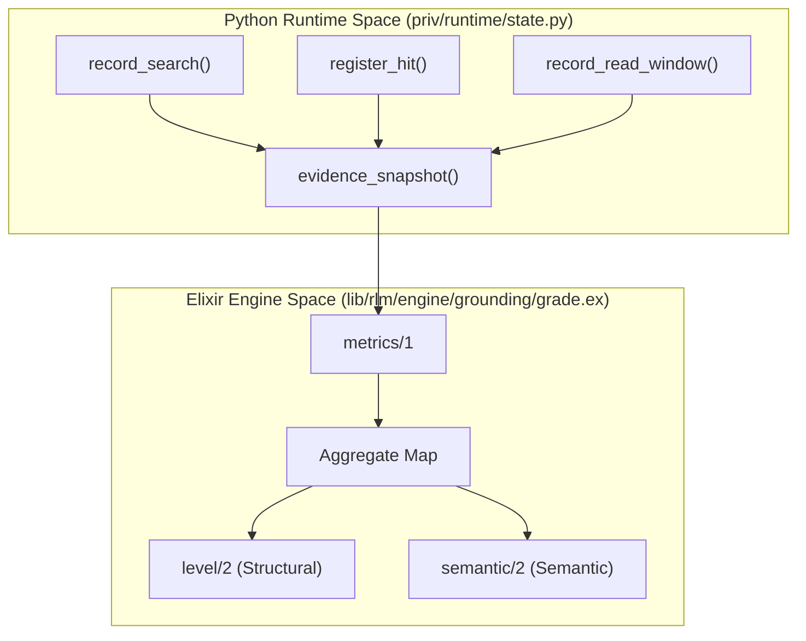
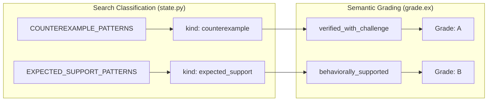

# Grounding Grade Assessment
Relevant source files
- [lib/rlm/engine/grounding/grade.ex](https://github.com/Cody-W-Tucker/rlm/blob/4bc8e1ba/lib/rlm/engine/grounding/grade.ex)
- [priv/runtime/state.py](https://github.com/Cody-W-Tucker/rlm/blob/4bc8e1ba/priv/runtime/state.py)
- [test/rlm/engine/grounding/grade_test.exs](https://github.com/Cody-W-Tucker/rlm/blob/4bc8e1ba/test/rlm/engine/grounding/grade_test.exs)

The Grounding Grade Assessment system is responsible for evaluating the "structural" and "semantic" quality of a model's interaction with the provided corpus. It aggregates evidence collected during the [Generate-Execute-Verify](https://github.com/Cody-W-Tucker/rlm/blob/4bc8e1ba/Generate-Execute-Verify) loop and assigns a multi-dimensional grade (A–F) based on how deeply the model inspected the data before providing a final answer.

## Overview of Grading Logic

The assessment is performed by `Rlm.Engine.Grounding.Grade`[lib/rlm/engine/grounding/grade.ex1-6](https://github.com/Cody-W-Tucker/rlm/blob/4bc8e1ba/lib/rlm/engine/grounding/grade.ex#L1-L6) at the end of a run. It takes the `context_bundle` (the files provided to the engine) and the list of `iteration_records` (the history of what the model did each turn).

The grading process follows a specific data flow:

1. **Metric Aggregation**: Evidence from every iteration is merged into a single set of metrics.
2. **Structural Assessment**: Determines the "Physical" depth of grounding (did it read files, or just search?).
3. **Semantic Assessment**: Determines the "Intentional" depth of grounding (did it follow up on specific hits, or look for counterexamples?).

### Structural vs. Semantic

- **Structural Grade**: Focuses on the mechanics of data access (searches, previews, reads).
- **Semantic Level**: Focuses on the relationship between search intent and subsequent reading (follow-ups).

Sources: [lib/rlm/engine/grounding/grade.ex6-22](https://github.com/Cody-W-Tucker/rlm/blob/4bc8e1ba/lib/rlm/engine/grounding/grade.ex#L6-L22)[test/rlm/engine/grounding/grade_test.ex6-52](https://github.com/Cody-W-Tucker/rlm/blob/4bc8e1ba/test/rlm/engine/grounding/grade_test.ex#L6-L52)

---

## Evidence Aggregation and Metrics

The engine first reduces all iteration records into a consolidated `metrics` map. This involves merging `MapSet` objects containing paths, windows, and search queries.

### Metric Calculation Data Flow

This diagram shows how the Elixir engine aggregates evidence produced by the Python runtime.

**Evidence Pipeline: Runtime to Grade**

Sources: [priv/runtime/state.py124-134](https://github.com/Cody-W-Tucker/rlm/blob/4bc8e1ba/priv/runtime/state.py#L124-L134)[lib/rlm/engine/grounding/grade.ex24-71](https://github.com/Cody-W-Tucker/rlm/blob/4bc8e1ba/lib/rlm/engine/grounding/grade.ex#L24-L71)

---

## Structural Grounding Grades

The structural grade represents the highest level of data access achieved during the run. The engine calculates "read units" via `Policy.read_units/2` to determine if a run is sufficiently backed by evidence.

| Grade | Level | Description | Criteria |
| --- | --- | --- | --- |
| **A** | `read_backed_multi` | Strong grounding | 3+ Read Units (files read or targeted windows) |
| **B** | `read_backed` | Limited grounding | 1-2 Read Units |
| **C** | `scout_only` | Surface inspection | 1+ files previewed, but 0 reads |
| **D** | `search_only` | Search without inspection | 1+ searches, but 0 previews/reads |
| **F** | `ungrounded` | No data access | 0 searches or reads recorded |

### Read Units for Line-Delimited Data

For standard files, a "Read Unit" is a single file read. However, for large line-delimited files (like `.jsonl`), the system counts individual `read_windows` as units to reward precise inspection of specific records [test/rlm/engine/grounding/grade_test.ex58-81](https://github.com/Cody-W-Tucker/rlm/blob/4bc8e1ba/test/rlm/engine/grounding/grade_test.ex#L58-L81)

Sources: [lib/rlm/engine/grounding/grade.ex91-105](https://github.com/Cody-W-Tucker/rlm/blob/4bc8e1ba/lib/rlm/engine/grounding/grade.ex#L91-L105)[test/rlm/engine/grounding/grade_test.ex6-52](https://github.com/Cody-W-Tucker/rlm/blob/4bc8e1ba/test/rlm/engine/grounding/grade_test.ex#L6-L52)

---

## Semantic Level Assessment

The semantic level evaluates *why* the model read certain files. It relies on the `read_followups` metric, which tracks if a `read_file` or `read_window` call overlapped with a previous search hit.

### Search Intent Classification

The Python runtime classifies every search into one of four categories based on the regex patterns in `state.py`:

- **Behavioral**: Standard exploration.
- **Counterexample**: Looking for contradictions (e.g., "however", "unexpected", "if this were false").
- **Expected Support**: Looking for specific confirmation (e.g., "start with", "next step").
- **Theory Loaded**: High-level strategy searches (e.g., "iterative", "mvp").

Sources: [priv/runtime/state.py25-69](https://github.com/Cody-W-Tucker/rlm/blob/4bc8e1ba/priv/runtime/state.py#L25-L69)[priv/runtime/state.py165-178](https://github.com/Cody-W-Tucker/rlm/blob/4bc8e1ba/priv/runtime/state.py#L165-L178)

### Semantic Levels

The semantic grade is calculated by checking the intersection of search `kind` and `read_followups`.

| Level | Grade | Requirement |
| --- | --- | --- |
| `verified_with_challenge` | **A** | At least one **Counterexample** follow-up AND one **Behavioral/Support** follow-up. |
| `behaviorally_supported` | **B** | At least one **Behavioral/Support** follow-up. |
| `structural_only` | **D** | Files were read, but no read overlapped with a search hit. |
| `unverified` | **F** | No follow-ups recorded. |

**Code Entity to Logic Mapping**

Sources: [lib/rlm/engine/grounding/grade.ex144-180](https://github.com/Cody-W-Tucker/rlm/blob/4bc8e1ba/lib/rlm/engine/grounding/grade.ex#L144-L180)[test/rlm/engine/grounding/grade_test.ex83-136](https://github.com/Cody-W-Tucker/rlm/blob/4bc8e1ba/test/rlm/engine/grounding/grade_test.ex#L83-L136)

---

## Key Functions

### `assess/2`

The entry point for grading. It first checks `Policy.file_backed?/1` to ensure the run actually involved external data before attempting to grade [lib/rlm/engine/grounding/grade.ex6-22](https://github.com/Cody-W-Tucker/rlm/blob/4bc8e1ba/lib/rlm/engine/grounding/grade.ex#L6-L22)

### `metrics/1`

Reduces the list of `iteration_records`. It uses `Policy.evidence/1` to extract the `evidence` map from the `details` field of each record [lib/rlm/engine/grounding/grade.ex24-49](https://github.com/Cody-W-Tucker/rlm/blob/4bc8e1ba/lib/rlm/engine/grounding/grade.ex#L24-L49)

### `semantic_level/2`

Implements the conditional logic for semantic grading. It prioritizes "challenges" (counterexamples) as the highest form of verification [lib/rlm/engine/grounding/grade.ex144-174](https://github.com/Cody-W-Tucker/rlm/blob/4bc8e1ba/lib/rlm/engine/grounding/grade.ex#L144-L174)

Sources: [lib/rlm/engine/grounding/grade.ex1-180](https://github.com/Cody-W-Tucker/rlm/blob/4bc8e1ba/lib/rlm/engine/grounding/grade.ex#L1-L180)