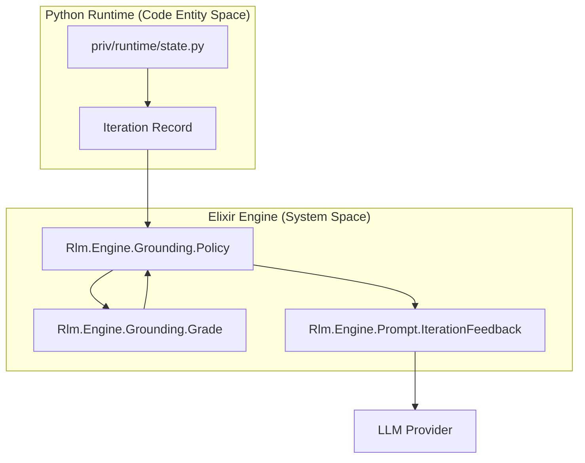
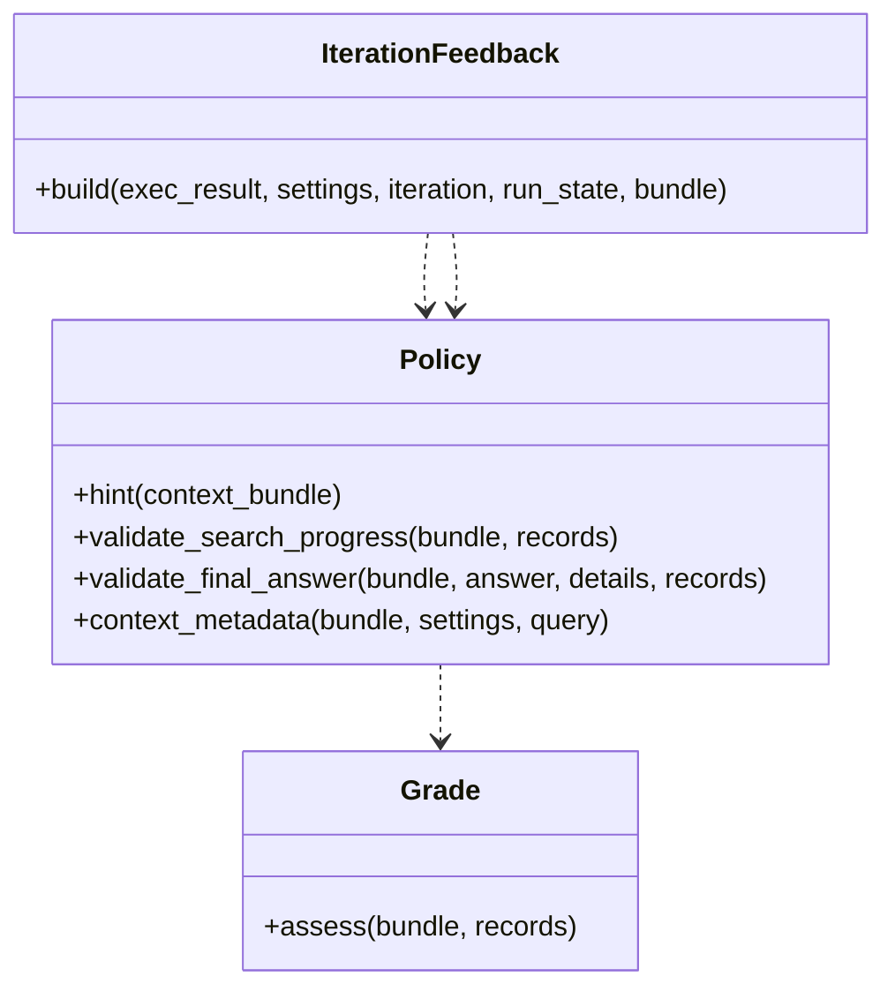

# Grounding Policy Enforcement
Relevant source files
- [lib/rlm/engine/grounding/policy.ex](https://github.com/Cody-W-Tucker/rlm/blob/4bc8e1ba/lib/rlm/engine/grounding/policy.ex)
- [lib/rlm/engine/prompt/iteration_feedback.ex](https://github.com/Cody-W-Tucker/rlm/blob/4bc8e1ba/lib/rlm/engine/prompt/iteration_feedback.ex)
- [test/rlm/engine/grounding/policy_test.exs](https://github.com/Cody-W-Tucker/rlm/blob/4bc8e1ba/test/rlm/engine/grounding/policy_test.exs)
- [test/rlm/engine/policy_test.exs](https://github.com/Cody-W-Tucker/rlm/blob/4bc8e1ba/test/rlm/engine/policy_test.exs)

The **Grounding Policy** subsystem ensures that the model's search process and final conclusions are strictly derived from evidence found within the provided corpus. It acts as a validator that prevents "hallucinated" search success and ensures that the model transitions from broad scouting to deep inspection before finalizing an answer.

## Overview and Purpose

`Rlm.Engine.Grounding.Policy` enforces structural and semantic constraints on how the model interacts with files. It primarily addresses:

1. **Search Progress**: Ensuring the model doesn't scout indefinitely without reading files [lib/rlm/engine/grounding/policy.ex40-64](https://github.com/Cody-W-Tucker/rlm/blob/4bc8e1ba/lib/rlm/engine/grounding/policy.ex#L40-L64)
2. **Final Answer Integrity**: Validating that the final response is backed by a sufficient "Grounding Grade" and contains valid citations [lib/rlm/engine/grounding/policy.ex22-38](https://github.com/Cody-W-Tucker/rlm/blob/4bc8e1ba/lib/rlm/engine/grounding/policy.ex#L22-L38)
3. **Compass Compliance**: If configured, ensuring the model's internal knowledge map (Compass) meets specific density and evidence requirements [lib/rlm/engine/grounding/policy.ex129-138](https://github.com/Cody-W-Tucker/rlm/blob/4bc8e1ba/lib/rlm/engine/grounding/policy.ex#L129-L138)

### Data Flow: Execution to Validation

**Sources:**[lib/rlm/engine/grounding/policy.ex41-43](https://github.com/Cody-W-Tucker/rlm/blob/4bc8e1ba/lib/rlm/engine/grounding/policy.ex#L41-L43)[lib/rlm/engine/prompt/iteration_feedback.ex101-129](https://github.com/Cody-W-Tucker/rlm/blob/4bc8e1ba/lib/rlm/engine/prompt/iteration_feedback.ex#L101-L129)[priv/runtime/state.py166-180](https://github.com/Cody-W-Tucker/rlm/blob/4bc8e1ba/priv/runtime/state.py#L166-L180)

---

## Search Progress Validation

The policy monitors the ratio of "scouting" (grepping, listing files) to "reading" (targeted inspection). If the model performs too many search rounds without promoting hits to `read_file()` or `read_jsonl()` windows, the policy triggers a validation error that forces the model to stop scouting [lib/rlm/engine/grounding/policy.ex47-56](https://github.com/Cody-W-Tucker/rlm/blob/4bc8e1ba/lib/rlm/engine/grounding/policy.ex#L47-L56)

### Thresholds and Targets

The system uses hardcoded thresholds to determine when search expansion must stop:

- **Early Threshold**: 3 search rounds [lib/rlm/engine/grounding/policy.ex8](https://github.com/Cody-W-Tucker/rlm/blob/4bc8e1ba/lib/rlm/engine/grounding/policy.ex#L8-L8)
- **Late Threshold**: 6 search rounds [lib/rlm/engine/grounding/policy.ex9](https://github.com/Cody-W-Tucker/rlm/blob/4bc8e1ba/lib/rlm/engine/grounding/policy.ex#L9-L9)
- **Minimum Multi-file Reads**: 3 promoted windows [lib/rlm/engine/grounding/policy.ex6-7](https://github.com/Cody-W-Tucker/rlm/blob/4bc8e1ba/lib/rlm/engine/grounding/policy.ex#L6-L7)

### Line-Delimited Handling

For corpora consisting of JSONL, logs, or CSV files, the policy treats targeted `read_window` operations as equivalent to full `read_file` operations, acknowledging that reading a multi-gigabyte log file in its entirety is often impossible [lib/rlm/engine/grounding/policy.ex102-108](https://github.com/Cody-W-Tucker/rlm/blob/4bc8e1ba/lib/rlm/engine/grounding/policy.ex#L102-L108)

| Corpus Type | Promoted Read Unit | Logic |
| --- | --- | --- |
| **Standard Files** | `read_files` | Requires full file inspection for grounding. |
| **Line-Delimited** | `max(read_files, read_windows)` | Allows targeted line ranges to count as grounding. |

**Sources:**[lib/rlm/engine/grounding/policy.ex102-116](https://github.com/Cody-W-Tucker/rlm/blob/4bc8e1ba/lib/rlm/engine/grounding/policy.ex#L102-L116)[test/rlm/engine/grounding/policy_test.exs141-192](https://github.com/Cody-W-Tucker/rlm/blob/4bc8e1ba/test/rlm/engine/grounding/policy_test.exs#L141-L192)

---

## Final Answer Validation

When the model calls `FINAL()`, the policy performs a multi-step check before allowing the run to terminate successfully [lib/rlm/engine/grounding/policy.ex22-38](https://github.com/Cody-W-Tucker/rlm/blob/4bc8e1ba/lib/rlm/engine/grounding/policy.ex#L22-L38)

1. **Path Citation Check**: Extracts backticked paths (e.g., ``/tmp/data.txt``) from the answer text and ensures they exist in the evidence hit list [lib/rlm/engine/grounding/policy.ex118-122](https://github.com/Cody-W-Tucker/rlm/blob/4bc8e1ba/lib/rlm/engine/grounding/policy.ex#L118-L122)
2. **Grade Validation**: Invokes `Rlm.Engine.Grounding.Grade` to ensure the structural grade is sufficient for the corpus size. For example, multi-file corpora require a grade that reflects reads across multiple sources [lib/rlm/engine/grounding/policy.ex32](https://github.com/Cody-W-Tucker/rlm/blob/4bc8e1ba/lib/rlm/engine/grounding/policy.ex#L32-L32)
3. **Judgment Style (Compass)**: If `judgment_style` is set to `:compass`, it validates the internal "Compass" map [lib/rlm/engine/grounding/policy.ex129-138](https://github.com/Cody-W-Tucker/rlm/blob/4bc8e1ba/lib/rlm/engine/grounding/policy.ex#L129-L138)

### Compass Judgment Style

The Compass protocol requires the model to maintain a four-quadrant knowledge map (North, South, East, West). The policy validates:

- **Quadrant Presence**: All four directions must be populated [lib/rlm/engine/grounding/policy.ex172](https://github.com/Cody-W-Tucker/rlm/blob/4bc8e1ba/lib/rlm/engine/grounding/policy.ex#L172-L172)
- **Evidence Backing**: At least some entries in the map must be explicitly linked to evidence found during the run [lib/rlm/engine/grounding/policy.ex175-183](https://github.com/Cody-W-Tucker/rlm/blob/4bc8e1ba/lib/rlm/engine/grounding/policy.ex#L175-L183)
- **Density**: Quadrants with insufficient detail are flagged as "weak" [lib/rlm/engine/grounding/policy.ex173](https://github.com/Cody-W-Tucker/rlm/blob/4bc8e1ba/lib/rlm/engine/grounding/policy.ex#L173-L173)

**Sources:**[lib/rlm/engine/grounding/policy.ex129-185](https://github.com/Cody-W-Tucker/rlm/blob/4bc8e1ba/lib/rlm/engine/grounding/policy.ex#L129-L185)[test/rlm/engine/policy_test.exs170-180](https://github.com/Cody-W-Tucker/rlm/blob/4bc8e1ba/test/rlm/engine/policy_test.exs#L170-L180)

---

## Context and Prompt Hints

The policy generates dynamic hints injected into the system prompt and iteration feedback to guide the model toward better grounding.

### Input Shape Analysis

`Policy.context_metadata/3` analyzes the `context_bundle` to provide the model with "Structure hints" [test/rlm/engine/policy_test.exs7-30](https://github.com/Cody-W-Tucker/rlm/blob/4bc8e1ba/test/rlm/engine/policy_test.exs#L7-L30):

- **Weekly/Dated**: Detects patterns like `Week-09-2025.md` to suggest chronological search [test/rlm/engine/policy_test.exs25-26](https://github.com/Cody-W-Tucker/rlm/blob/4bc8e1ba/test/rlm/engine/policy_test.exs#L25-L26)
- **JSONL/Logs**: Detects large line-delimited files and suggests `sample_jsonl()` or `grep_jsonl_fields()` instead of full reads [test/rlm/engine/policy_test.exs60-66](https://github.com/Cody-W-Tucker/rlm/blob/4bc8e1ba/test/rlm/engine/policy_test.exs#L60-L66)
- **Directory Expansion**: Identifies when the input was a recursive directory crawl [test/rlm/engine/policy_test.exs87](https://github.com/Cody-W-Tucker/rlm/blob/4bc8e1ba/test/rlm/engine/policy_test.exs#L87-L87)

### System Prompt Enforcement

The system prompt, generated via `Policy.system_prompt/3`, explicitly instructs the model on evidence gathering [test/rlm/engine/policy_test.exs104-169](https://github.com/Cody-W-Tucker/rlm/blob/4bc8e1ba/test/rlm/engine/policy_test.exs#L104-L169):

- **Scouting First**: "Always start with a scouting pass" [test/rlm/engine/policy_test.exs104](https://github.com/Cody-W-Tucker/rlm/blob/4bc8e1ba/test/rlm/engine/policy_test.exs#L104-L104)
- **Attribute Access**: Encourages `hit.path` over `hit['path']` or `hit[0]`[test/rlm/engine/policy_test.exs147-155](https://github.com/Cody-W-Tucker/rlm/blob/4bc8e1ba/test/rlm/engine/policy_test.exs#L147-L155)
- **Neutral Retrieval**: Advises running neutral passes before forming a "working claim" to avoid confirmation bias [test/rlm/engine/policy_test.exs162-167](https://github.com/Cody-W-Tucker/rlm/blob/4bc8e1ba/test/rlm/engine/policy_test.exs#L162-L167)

**Sources:**[lib/rlm/engine/grounding/policy.ex4-5](https://github.com/Cody-W-Tucker/rlm/blob/4bc8e1ba/lib/rlm/engine/grounding/policy.ex#L4-L5)[lib/rlm/engine/prompt/iteration_feedback.ex4-5](https://github.com/Cody-W-Tucker/rlm/blob/4bc8e1ba/lib/rlm/engine/prompt/iteration_feedback.ex#L4-L5)[test/rlm/engine/policy_test.exs4-5](https://github.com/Cody-W-Tucker/rlm/blob/4bc8e1ba/test/rlm/engine/policy_test.exs#L4-L5)