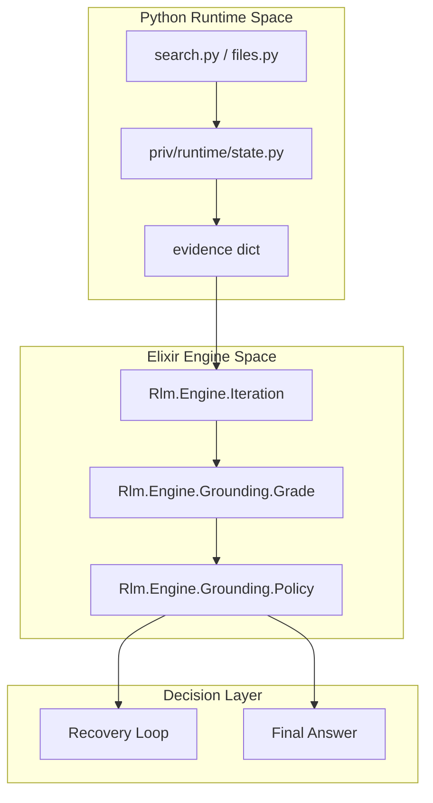
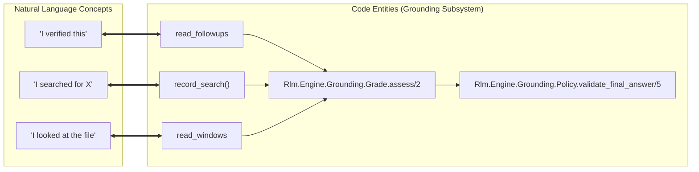

# Grounding System
Relevant source files
- [lib/rlm/engine/grounding/grade.ex](https://github.com/Cody-W-Tucker/rlm/blob/4bc8e1ba/lib/rlm/engine/grounding/grade.ex)
- [lib/rlm/engine/grounding/policy.ex](https://github.com/Cody-W-Tucker/rlm/blob/4bc8e1ba/lib/rlm/engine/grounding/policy.ex)
- [priv/runtime/state.py](https://github.com/Cody-W-Tucker/rlm/blob/4bc8e1ba/priv/runtime/state.py)
- [test/rlm/engine/grounding/grade_test.exs](https://github.com/Cody-W-Tucker/rlm/blob/4bc8e1ba/test/rlm/engine/grounding/grade_test.exs)
- [test/rlm/engine/grounding/policy_test.exs](https://github.com/Cody-W-Tucker/rlm/blob/4bc8e1ba/test/rlm/engine/grounding/policy_test.exs)

The Grounding System is a multi-layered validation framework designed to ensure that the model's claims are backed by empirical evidence gathered from the corpus. It bridges the gap between the **Natural Language Space** (the model's assertions) and the **Code Entity Space** (the specific file reads, searches, and hit windows recorded during execution).

By tracking every search pattern and file inspection in the Python runtime, the system can mathematically grade the "honesty" of a response based on whether the model actually looked at the data it claims to describe.

### Grounding Architecture

The system operates across the Elixir-Python boundary, moving from raw execution telemetry to high-level policy enforcement.

**Grounding Data Flow**

Sources: [priv/runtime/state.py11-19](https://github.com/Cody-W-Tucker/rlm/blob/4bc8e1ba/priv/runtime/state.py#L11-L19)[lib/rlm/engine/grounding/grade.ex6-18](https://github.com/Cody-W-Tucker/rlm/blob/4bc8e1ba/lib/rlm/engine/grounding/grade.ex#L6-L18)[lib/rlm/engine/grounding/policy.ex22-38](https://github.com/Cody-W-Tucker/rlm/blob/4bc8e1ba/lib/rlm/engine/grounding/policy.ex#L22-L38)

---

## 4.1 Evidence Tracking (Python Runtime State)

The foundation of grounding is the `evidence` dictionary maintained in the persistent Python namespace. As the model executes code (e.g., `grep_files` or `read_file`), the runtime automatically registers these actions as evidence.

Key tracking mechanisms include:

- **Search Classification**: Every search pattern is classified by `classify_search_kind` into categories like `behavioral`, `counterexample`, or `theory_loaded` based on regex matches.
- **Hit Correlation**: The `hit_registry` stores specific lines found during searches. If a subsequent `read_file` or `read_windows` call overlaps with these lines, it is promoted to a `read_followup`, proving the model followed a specific lead.

For details, see [Evidence Tracking (Python Runtime State)](/Cody-W-Tucker/rlm/4.1-evidence-tracking-(python-runtime-state)).

Sources: [priv/runtime/state.py124-134](https://github.com/Cody-W-Tucker/rlm/blob/4bc8e1ba/priv/runtime/state.py#L124-L134)[priv/runtime/state.py165-179](https://github.com/Cody-W-Tucker/rlm/blob/4bc8e1ba/priv/runtime/state.py#L165-L179)[priv/runtime/state.py210-237](https://github.com/Cody-W-Tucker/rlm/blob/4bc8e1ba/priv/runtime/state.py#L210-L237)

---

## 4.2 Grounding Grade Assessment

The `Rlm.Engine.Grounding.Grade` module aggregates evidence across all iterations of a run to produce two distinct metrics:

### Structural Grade (A–F)

Measures the *breadth* of inspection. It transitions from `ungrounded` (F) to `read_backed_multi` (A) based on the number of "read units" (files or windows) consumed.

| Grade | Level | Requirement |
| --- | --- | --- |
| **A** | `read_backed_multi` | 3+ read units [lib/rlm/engine/grounding/grade.ex91-92](https://github.com/Cody-W-Tucker/rlm/blob/4bc8e1ba/lib/rlm/engine/grounding/grade.ex#L91-L92) |
| **B** | `read_backed` | 1+ read units [lib/rlm/engine/grounding/grade.ex94-95](https://github.com/Cody-W-Tucker/rlm/blob/4bc8e1ba/lib/rlm/engine/grounding/grade.ex#L94-L95) |
| **C** | `scout_only` | 1+ file previews/hits, 0 reads [lib/rlm/engine/grounding/grade.ex97](https://github.com/Cody-W-Tucker/rlm/blob/4bc8e1ba/lib/rlm/engine/grounding/grade.ex#L97-L97) |
| **D** | `search_only` | Searches performed, no previews [lib/rlm/engine/grounding/grade.ex98](https://github.com/Cody-W-Tucker/rlm/blob/4bc8e1ba/lib/rlm/engine/grounding/grade.ex#L98-L98) |
| **F** | `ungrounded` | No evidence recorded [lib/rlm/engine/grounding/grade.ex99](https://github.com/Cody-W-Tucker/rlm/blob/4bc8e1ba/lib/rlm/engine/grounding/grade.ex#L99-L99) |

### Semantic Level

Measures the *depth* and *intent* of inspection. A run earns `verified_with_challenge` if it records both behavioral support and a `counterexample` read-followup, indicating the model actively looked for evidence that might contradict its theory.

For details, see [Grounding Grade Assessment](/Cody-W-Tucker/rlm/4.2-grounding-grade-assessment).

Sources: [lib/rlm/engine/grounding/grade.ex101-111](https://github.com/Cody-W-Tucker/rlm/blob/4bc8e1ba/lib/rlm/engine/grounding/grade.ex#L101-L111)[lib/rlm/engine/grounding/grade.ex144-175](https://github.com/Cody-W-Tucker/rlm/blob/4bc8e1ba/lib/rlm/engine/grounding/grade.ex#L144-L175)

---

## 4.3 Grounding Policy Enforcement

The `Rlm.Engine.Grounding.Policy` module acts as the gatekeeper for the engine. It enforces constraints at two points:

1. **Search Progress**: Prevents "infinite searching" without reading. If the model has performed many searches but hasn't promoted hits to `read_file` windows, the policy triggers a recovery error.
2. **Final Answer Validation**: Before a run is allowed to finalize, the policy checks:

- **Path Citations**: Ensures all paths cited in backticks (e.g., `/path/to/file`) were actually inspected.
- **Grade Minimums**: Rejects answers that don't meet the required grounding threshold for the corpus type (e.g., requiring targeted windows for `.jsonl` files).
- **Compass Style**: If enabled, validates that the `compass_map` has entries for all four quadrants (North, South, East, West).

For details, see [Grounding Policy Enforcement](/Cody-W-Tucker/rlm/4.3-grounding-policy-enforcement).

Sources: [lib/rlm/engine/grounding/policy.ex40-64](https://github.com/Cody-W-Tucker/rlm/blob/4bc8e1ba/lib/rlm/engine/grounding/policy.ex#L40-L64)[lib/rlm/engine/grounding/policy.ex118-122](https://github.com/Cody-W-Tucker/rlm/blob/4bc8e1ba/lib/rlm/engine/grounding/policy.ex#L118-L122)[lib/rlm/engine/grounding/policy.ex129-138](https://github.com/Cody-W-Tucker/rlm/blob/4bc8e1ba/lib/rlm/engine/grounding/policy.ex#L129-L138)

---

## Grounding Entity Mapping

This diagram maps the high-level grounding concepts to the specific code entities that implement them.

Sources: [priv/runtime/state.py180-194](https://github.com/Cody-W-Tucker/rlm/blob/4bc8e1ba/priv/runtime/state.py#L180-L194)[priv/runtime/state.py210-213](https://github.com/Cody-W-Tucker/rlm/blob/4bc8e1ba/priv/runtime/state.py#L210-L213)[lib/rlm/engine/grounding/grade.ex6-18](https://github.com/Cody-W-Tucker/rlm/blob/4bc8e1ba/lib/rlm/engine/grounding/grade.ex#L6-L18)[lib/rlm/engine/grounding/policy.ex22-38](https://github.com/Cody-W-Tucker/rlm/blob/4bc8e1ba/lib/rlm/engine/grounding/policy.ex#L22-L38)