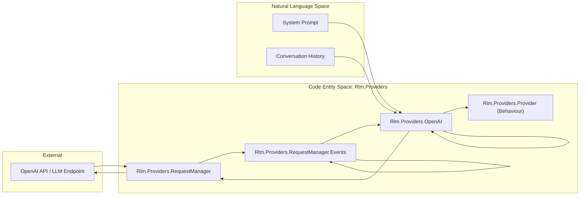
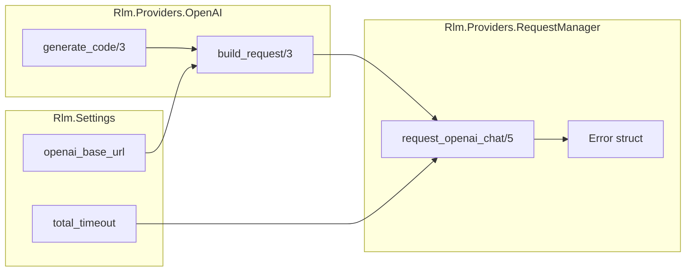

# LLM Providers
Relevant source files
- [lib/rlm/providers.ex](https://github.com/Cody-W-Tucker/rlm/blob/4bc8e1ba/lib/rlm/providers.ex)
- [lib/rlm/providers/openai.ex](https://github.com/Cody-W-Tucker/rlm/blob/4bc8e1ba/lib/rlm/providers/openai.ex)
- [lib/rlm/providers/provider.ex](https://github.com/Cody-W-Tucker/rlm/blob/4bc8e1ba/lib/rlm/providers/provider.ex)
- [lib/rlm/providers/request_manager/events.ex](https://github.com/Cody-W-Tucker/rlm/blob/4bc8e1ba/lib/rlm/providers/request_manager/events.ex)
- [test/rlm/providers/request_manager_test.exs](https://github.com/Cody-W-Tucker/rlm/blob/4bc8e1ba/test/rlm/providers/request_manager_test.exs)

The LLM Provider layer acts as the interface between the core `Rlm.Engine` and external Large Language Models. It abstracts the complexities of API communication, payload formatting, and response streaming behind a unified behavior. This allows the engine to remain agnostic of whether it is communicating with OpenAI's Chat Completions API, a specialized Responses API, or a mock provider for testing.

### Provider Abstraction

All providers must implement the `Rlm.Providers.Provider` behavior [lib/rlm/providers/provider.ex1-17](https://github.com/Cody-W-Tucker/rlm/blob/4bc8e1ba/lib/rlm/providers/provider.ex#L1-L17) This behavior defines two primary entry points:

1. **`generate_code/3`**: Used by the engine's main iteration loop to produce Python code blocks based on the conversation history and system prompt [lib/rlm/providers/provider.ex13-14](https://github.com/Cody-W-Tucker/rlm/blob/4bc8e1ba/lib/rlm/providers/provider.ex#L13-L14)
2. **`complete_subquery/3`**: Used when the Python runtime requests a natural language answer based on a specific context (sub-query) [lib/rlm/providers/provider.ex15-16](https://github.com/Cody-W-Tucker/rlm/blob/4bc8e1ba/lib/rlm/providers/provider.ex#L15-L16)

The engine selects the appropriate implementation at runtime via the `Rlm.Providers.for/1` helper [lib/rlm/providers.ex7-11](https://github.com/Cody-W-Tucker/rlm/blob/4bc8e1ba/lib/rlm/providers.ex#L7-L11) which maps configuration keys (like `:openai` or `:mock`) to specific modules.

### Available Implementations

| Provider | Module | Description |
| --- | --- | --- |
| **OpenAI** | `Rlm.Providers.OpenAI` | Supports standard Chat Completions and the specialized Responses API. Handles token budgeting and model routing. |
| **Mock** | `Rlm.Providers.Mock` | Used in test suites to simulate deterministic LLM responses, timeouts, and malformed outputs. |

#### OpenAI Provider

The OpenAI implementation handles the transformation of `Rlm.Settings` and history into JSON payloads. It automatically detects the correct endpoint (Chat vs. Responses) based on the configured `openai_base_url`[lib/rlm/providers/openai.ex45-53](https://github.com/Cody-W-Tucker/rlm/blob/4bc8e1ba/lib/rlm/providers/openai.ex#L45-L53) For details on payload construction and API branching, see **[OpenAI Provider](/Cody-W-Tucker/rlm/5.1-openai-provider)**.

### Request Management and Streaming

The `Rlm.Providers.RequestManager` serves as the heavy-lifting network layer for the OpenAI provider [lib/rlm/providers/openai.ex42](https://github.com/Cody-W-Tucker/rlm/blob/4bc8e1ba/lib/rlm/providers/openai.ex#L42-L42) It manages the HTTP lifecycle using the `Req` library, specifically focusing on Server-Sent Events (SSE) to provide real-time streaming of model outputs.

A critical feature of the Request Manager is its **multi-layered timeout strategy**, which ensures the engine does not hang indefinitely. It tracks:

- **Connect Timeout**: Time to establish the TCP connection.
- **First Byte Timeout**: Time until the first chunk of data is received [test/rlm/providers/request_manager_test.exs56-71](https://github.com/Cody-W-Tucker/rlm/blob/4bc8e1ba/test/rlm/providers/request_manager_test.exs#L56-L71)
- **Idle Timeout**: Maximum gap between consecutive data chunks [test/rlm/providers/request_manager_test.exs73-97](https://github.com/Cody-W-Tucker/rlm/blob/4bc8e1ba/test/rlm/providers/request_manager_test.exs#L73-L97)
- **Total Timeout**: Hard deadline for the entire request [test/rlm/providers/request_manager_test.exs99-134](https://github.com/Cody-W-Tucker/rlm/blob/4bc8e1ba/test/rlm/providers/request_manager_test.exs#L99-L134)

If a timeout occurs after partial data has been received, the system attempts to "salvage" the text received so far, allowing the engine to potentially recover from an interrupted generation. For details on streaming logic and error handling, see **[Request Manager and Streaming](/Cody-W-Tucker/rlm/5.2-request-manager-and-streaming)**.

### Data Flow Architecture

The following diagram illustrates how a request flows from the Engine through the Provider layer to the external API.

**Provider Request Pipeline**

**Sources:**[lib/rlm/providers/provider.ex1-17](https://github.com/Cody-W-Tucker/rlm/blob/4bc8e1ba/lib/rlm/providers/provider.ex#L1-L17)[lib/rlm/providers/openai.ex10-43](https://github.com/Cody-W-Tucker/rlm/blob/4bc8e1ba/lib/rlm/providers/openai.ex#L10-L43)[lib/rlm/providers/request_manager/events.ex6-9](https://github.com/Cody-W-Tucker/rlm/blob/4bc8e1ba/lib/rlm/providers/request_manager/events.ex#L6-L9)

### Event Parsing

As data arrives from the LLM, the `Rlm.Providers.RequestManager.Events` module parses the SSE stream. It is designed to handle multiple JSON formats, including the standard OpenAI `choices` array and the newer `response.output_text.delta` format [lib/rlm/providers/request_manager/events.ex66-102](https://github.com/Cody-W-Tucker/rlm/blob/4bc8e1ba/lib/rlm/providers/request_manager/events.ex#L66-L102)

**Entity Mapping: Provider to Network**

**Sources:**[lib/rlm/providers/openai.ex45-53](https://github.com/Cody-W-Tucker/rlm/blob/4bc8e1ba/lib/rlm/providers/openai.ex#L45-L53)[lib/rlm/providers/request_manager/events.ex47-53](https://github.com/Cody-W-Tucker/rlm/blob/4bc8e1ba/lib/rlm/providers/request_manager/events.ex#L47-L53)[test/rlm/providers/request_manager_test.exs10-19](https://github.com/Cody-W-Tucker/rlm/blob/4bc8e1ba/test/rlm/providers/request_manager_test.exs#L10-L19)

---

### Child Pages

- **[OpenAI Provider](/Cody-W-Tucker/rlm/5.1-openai-provider)**: Implementation details for Chat and Responses APIs.
- **[Request Manager and Streaming](/Cody-W-Tucker/rlm/5.2-request-manager-and-streaming)**: SSE parsing, timeouts, and partial text recovery.