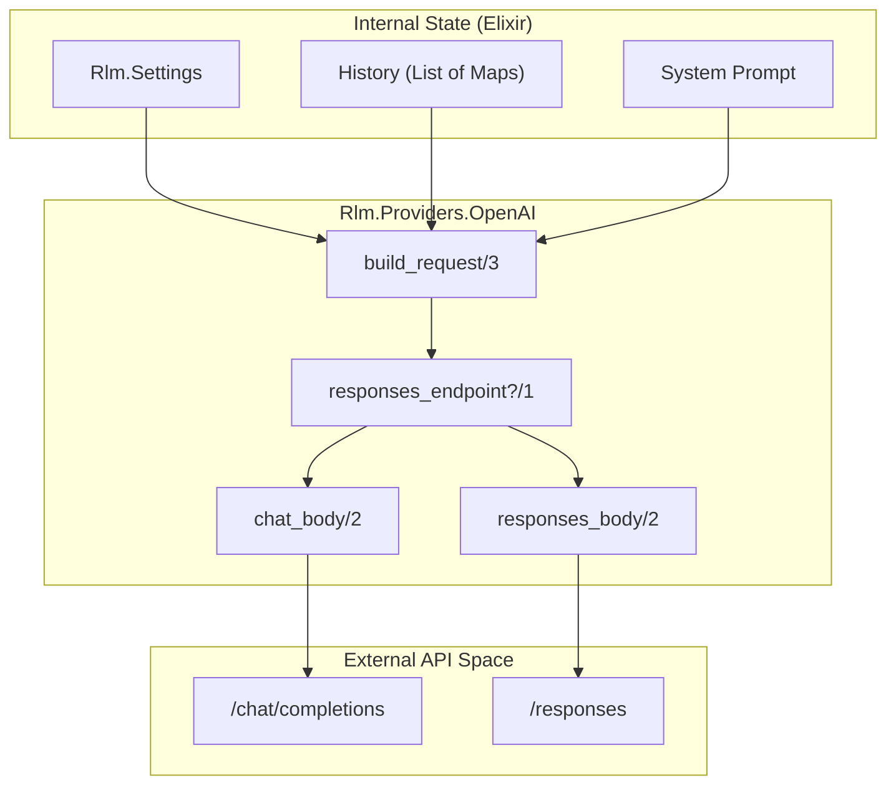
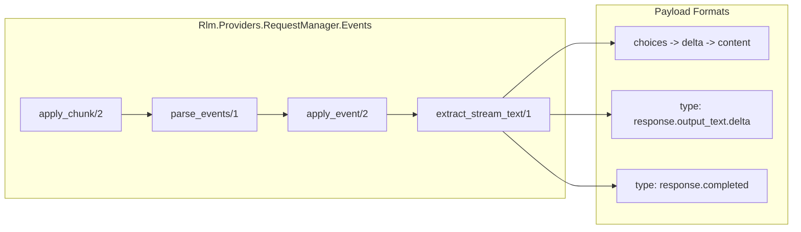

# OpenAI Provider
Relevant source files
- [lib/rlm/providers/openai.ex](https://github.com/Cody-W-Tucker/rlm/blob/4bc8e1ba/lib/rlm/providers/openai.ex)
- [lib/rlm/providers/request_manager.ex](https://github.com/Cody-W-Tucker/rlm/blob/4bc8e1ba/lib/rlm/providers/request_manager.ex)
- [lib/rlm/providers/request_manager/events.ex](https://github.com/Cody-W-Tucker/rlm/blob/4bc8e1ba/lib/rlm/providers/request_manager/events.ex)
- [test/rlm/providers/request_manager_test.exs](https://github.com/Cody-W-Tucker/rlm/blob/4bc8e1ba/test/rlm/providers/request_manager_test.exs)

The `Rlm.Providers.OpenAI` module implements the `Rlm.Providers.Provider` behavior to facilitate communication between the RLM engine and OpenAI-compatible Large Language Model (LLM) APIs. It manages two primary interaction patterns: code generation for the main iteration loop and natural language sub-query completion for the Python runtime.

## Implementation Overview

The provider serves as a translation layer that converts internal RLM history and settings into HTTP request payloads. It distinguishes between the standard **Chat Completions API** (common for GPT-4, etc.) and the **Responses API** (often used in specialized inference endpoints).

### Key Functions

- `generate_code/3`: Assembles the system prompt and conversation history into a request payload to generate Python code blocks [lib/rlm/providers/openai.ex10-13](https://github.com/Cody-W-Tucker/rlm/blob/4bc8e1ba/lib/rlm/providers/openai.ex#L10-L13)
- `complete_subquery/3`: Formats a specific instruction and context bundle into a natural language query. It defaults to using a `sub_model` if configured in `Rlm.Settings`[lib/rlm/providers/openai.ex16-32](https://github.com/Cody-W-Tucker/rlm/blob/4bc8e1ba/lib/rlm/providers/openai.ex#L16-L32)
- `build_request/3`: Determines the correct endpoint URL and payload structure based on the `openai_base_url`[lib/rlm/providers/openai.ex45-53](https://github.com/Cody-W-Tucker/rlm/blob/4bc8e1ba/lib/rlm/providers/openai.ex#L45-L53)

### Data Flow: Request Construction

The following diagram illustrates how internal Elixir structures are mapped to the OpenAI protocol.

**Mapping Internal Space to OpenAI Protocol**

Sources: [lib/rlm/providers/openai.ex10-13](https://github.com/Cody-W-Tucker/rlm/blob/4bc8e1ba/lib/rlm/providers/openai.ex#L10-L13)[lib/rlm/providers/openai.ex45-53](https://github.com/Cody-W-Tucker/rlm/blob/4bc8e1ba/lib/rlm/providers/openai.ex#L45-L53)[lib/rlm/providers/openai.ex83-85](https://github.com/Cody-W-Tucker/rlm/blob/4bc8e1ba/lib/rlm/providers/openai.ex#L83-L85)

---

## API Branching Logic

The provider detects the target API type by inspecting the `openai_base_url`[lib/rlm/providers/openai.ex83-85](https://github.com/Cody-W-Tucker/rlm/blob/4bc8e1ba/lib/rlm/providers/openai.ex#L83-L85)

### 1. Chat Completions API

Used when the base URL does not contain `/responses`. The payload uses the standard `messages` array [lib/rlm/providers/openai.ex55-61](https://github.com/Cody-W-Tucker/rlm/blob/4bc8e1ba/lib/rlm/providers/openai.ex#L55-L61)

- **Endpoint**: Appends `/chat/completions` if not present [lib/rlm/providers/openai.ex89-95](https://github.com/Cody-W-Tucker/rlm/blob/4bc8e1ba/lib/rlm/providers/openai.ex#L89-L95)
- **Payload**: Includes `model`, `temperature`, and the full `messages` list.

### 2. Responses API

Used when the base URL ends with or contains `/responses`[lib/rlm/providers/openai.ex83-85](https://github.com/Cody-W-Tucker/rlm/blob/4bc8e1ba/lib/rlm/providers/openai.ex#L83-L85)

- **Payload Transformation**: The `system` message is extracted from the history and moved to a top-level `instructions` field [lib/rlm/providers/openai.ex64-72](https://github.com/Cody-W-Tucker/rlm/blob/4bc8e1ba/lib/rlm/providers/openai.ex#L64-L72)
- **Payload Structure**: Includes `model`, `temperature`, `instructions`, and an `input` field containing the remaining conversation history [lib/rlm/providers/openai.ex63-72](https://github.com/Cody-W-Tucker/rlm/blob/4bc8e1ba/lib/rlm/providers/openai.ex#L63-L72)

| Feature | Chat Completions | Responses API |
| --- | --- | --- |
| **Detection** | Default | URL contains `/responses` |
| **System Role** | Part of `messages` | `instructions` field |
| **User/Assistant Role** | Part of `messages` | `input` field |
| **Streaming** | Forced `true` in `RequestManager` | Forced `true` in `RequestManager` |

Sources: [lib/rlm/providers/openai.ex45-81](https://github.com/Cody-W-Tucker/rlm/blob/4bc8e1ba/lib/rlm/providers/openai.ex#L45-L81)[lib/rlm/providers/request_manager.ex24](https://github.com/Cody-W-Tucker/rlm/blob/4bc8e1ba/lib/rlm/providers/request_manager.ex#L24-L24)

---

## Request Management and Streaming

The `Rlm.Providers.RequestManager` handles the low-level HTTP concerns, specifically streaming and timeout management. It uses `Req` to perform asynchronous requests via a `Task`[lib/rlm/providers/request_manager.ex15-34](https://github.com/Cody-W-Tucker/rlm/blob/4bc8e1ba/lib/rlm/providers/request_manager.ex#L15-L34)

### Timeout Architecture

The manager enforces multi-layered timeouts to ensure the system doesn't hang on slow or stalled model responses:

- **Connect Timeout**: Time allowed to establish the TCP connection [lib/rlm/providers/request_manager.ex28](https://github.com/Cody-W-Tucker/rlm/blob/4bc8e1ba/lib/rlm/providers/request_manager.ex#L28-L28)
- **First Byte Timeout**: Maximum wait time for the initial response chunk [test/rlm/providers/request_manager_test.exs56-71](https://github.com/Cody-W-Tucker/rlm/blob/4bc8e1ba/test/rlm/providers/request_manager_test.exs#L56-L71)
- **Idle Timeout**: Maximum time allowed between consecutive chunks [test/rlm/providers/request_manager_test.exs73-97](https://github.com/Cody-W-Tucker/rlm/blob/4bc8e1ba/test/rlm/providers/request_manager_test.exs#L73-L97)
- **Total Timeout**: Hard deadline for the entire request, regardless of activity [test/rlm/providers/request_manager_test.exs99-134](https://github.com/Cody-W-Tucker/rlm/blob/4bc8e1ba/test/rlm/providers/request_manager_test.exs#L99-L134)

### Stream Parsing

`Rlm.Providers.RequestManager.Events` parses Server-Sent Events (SSE). It is resilient to different JSON payload formats from various OpenAI-compatible providers.

**Stream Parsing Logic**

Sources: [lib/rlm/providers/request_manager/events.ex6-9](https://github.com/Cody-W-Tucker/rlm/blob/4bc8e1ba/lib/rlm/providers/request_manager/events.ex#L6-L9)[lib/rlm/providers/request_manager/events.ex66-102](https://github.com/Cody-W-Tucker/rlm/blob/4bc8e1ba/lib/rlm/providers/request_manager/events.ex#L66-L102)

### Partial Output Retention

If a timeout occurs after some data has been received, the `RequestManager` returns an `{:error, %Error{}}` struct containing the `partial_text`[lib/rlm/providers/request_manager.ex7-13](https://github.com/Cody-W-Tucker/rlm/blob/4bc8e1ba/lib/rlm/providers/request_manager.ex#L7-L13) This allows the `Rlm.Engine` to potentially salvage code from an incomplete response [lib/rlm/providers/request_manager.ex43-52](https://github.com/Cody-W-Tucker/rlm/blob/4bc8e1ba/lib/rlm/providers/request_manager.ex#L43-L52)

Sources: [lib/rlm/providers/request_manager.ex15-41](https://github.com/Cody-W-Tucker/rlm/blob/4bc8e1ba/lib/rlm/providers/request_manager.ex#L15-L41)[lib/rlm/providers/request_manager/events.ex42-53](https://github.com/Cody-W-Tucker/rlm/blob/4bc8e1ba/lib/rlm/providers/request_manager/events.ex#L42-L53)[test/rlm/providers/request_manager_test.exs73-97](https://github.com/Cody-W-Tucker/rlm/blob/4bc8e1ba/test/rlm/providers/request_manager_test.exs#L73-L97)