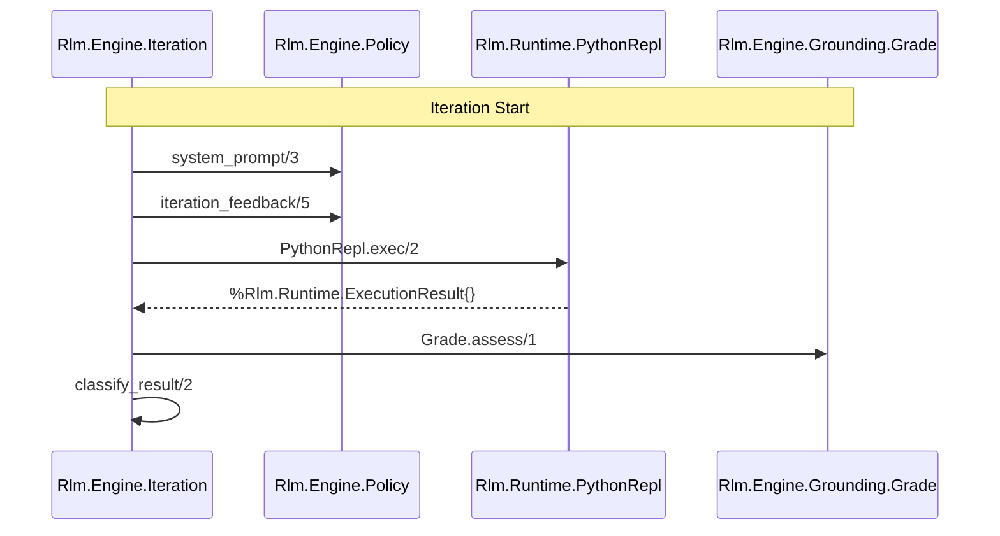

# Overview
Relevant source files
- [CURRENT_STATE.md](https://github.com/Cody-W-Tucker/rlm/blob/4bc8e1ba/CURRENT_STATE.md?plain=1)
- [IDEAL_STATE.md](https://github.com/Cody-W-Tucker/rlm/blob/4bc8e1ba/IDEAL_STATE.md?plain=1)
- [README.md](https://github.com/Cody-W-Tucker/rlm/blob/4bc8e1ba/README.md?plain=1)
- [config/config.exs](https://github.com/Cody-W-Tucker/rlm/blob/4bc8e1ba/config/config.exs)
- [lib/rlm/engine.ex](https://github.com/Cody-W-Tucker/rlm/blob/4bc8e1ba/lib/rlm/engine.ex)
- [lib/rlm/engine/policy.ex](https://github.com/Cody-W-Tucker/rlm/blob/4bc8e1ba/lib/rlm/engine/policy.ex)
- [lib/rlm/engine/prompt.ex](https://github.com/Cody-W-Tucker/rlm/blob/4bc8e1ba/lib/rlm/engine/prompt.ex)
- [priv/runtime.py](https://github.com/Cody-W-Tucker/rlm/blob/4bc8e1ba/priv/runtime.py)

`rlm` is a recursive agent runtime built in Elixir that orchestrates a persistent Python REPL to solve complex tasks. Unlike standard LLM agents that may drift into hallucination or unconstrained loops, `rlm` is engineered around **grounding**, **structured recovery**, and **inspectability**.

The system does not ask the model for a direct answer. Instead, it prompts the model to generate Python code, executes that code in a persistent environment, and uses an Elixir-based engine to decide whether to continue, recover from failure, or finalize the result based on evidence.

### Why rlm?

- **Grounded Policy**: Enforces that models "earn" their conclusions by tracking direct reads vs. mere searches [README.md28-40](https://github.com/Cody-W-Tucker/rlm/blob/4bc8e1ba/README.md?plain=1#L28-L40)
- **Persistent Runtime**: A stateful Python subprocess allows work to accumulate across multiple iterations [README.md49](https://github.com/Cody-W-Tucker/rlm/blob/4bc8e1ba/README.md?plain=1#L49-L49)[priv/runtime.py1-6](https://github.com/Cody-W-Tucker/rlm/blob/4bc8e1ba/priv/runtime.py#L1-L6)
- **Structured Recovery**: Instead of blind retries, failures are classified into specific families (runtime, reliability, grounding) with targeted feedback [README.md55-70](https://github.com/Cody-W-Tucker/rlm/blob/4bc8e1ba/README.md?plain=1#L55-L70)[CURRENT_STATE.md49-65](https://github.com/Cody-W-Tucker/rlm/blob/4bc8e1ba/CURRENT_STATE.md?plain=1#L49-L65)
- **Orchestration Quality**: Leverages Elixir’s supervision trees and process isolation to manage long-lived, recursive runs safely [README.md72-82](https://github.com/Cody-W-Tucker/rlm/blob/4bc8e1ba/README.md?plain=1#L72-L82)

For a quick start on installation and usage, see [Getting Started](/Cody-W-Tucker/rlm/1.1-getting-started).
To understand the philosophy behind the system, see [Core Concepts and Terminology](/Cody-W-Tucker/rlm/1.2-core-concepts-and-terminology).

---

### High-Level System Architecture

The following diagram illustrates the relationship between the Elixir orchestration layer and the Python execution environment.

**Diagram: System Component Interaction**

```

```

Sources: [lib/rlm/engine.ex1-31](https://github.com/Cody-W-Tucker/rlm/blob/4bc8e1ba/lib/rlm/engine.ex#L1-L31)[lib/rlm/engine/iteration.ex1-20](https://github.com/Cody-W-Tucker/rlm/blob/4bc8e1ba/lib/rlm/engine/iteration.ex#L1-L20)[CURRENT_STATE.md7-21](https://github.com/Cody-W-Tucker/rlm/blob/4bc8e1ba/CURRENT_STATE.md?plain=1#L7-L21)[priv/runtime.py1-32](https://github.com/Cody-W-Tucker/rlm/blob/4bc8e1ba/priv/runtime.py#L1-L32)

---

### Major Subsystems

#### 1. The Engine Loop (`Rlm.Engine`)

The engine coordinates the lifecycle of a run. It starts the `Rlm.Runtime.PythonRepl`, manages the `Rlm.Engine.RunState`, and drives the recursive `Iteration` loop. It is responsible for assembling the prompt, extracting code from LLM responses, and determining when a run has met the grounding requirements to finish.

- **Details**: See [Engine Architecture](/Cody-W-Tucker/rlm/2-engine-architecture) and [Iteration Loop and Finalization](/Cody-W-Tucker/rlm/2.1-iteration-loop-and-finalization).

#### 2. Python Runtime (`Rlm.Runtime`)

A persistent Python process serves as the model's "hands." It maintains a namespace that persists across iterations, allowing the model to define functions or variables in step 1 and use them in step 5. It includes built-in tools for file searching, JSONL processing, and evidence tracking.

- **Details**: See [Python Runtime](/Cody-W-Tucker/rlm/3-python-runtime) and [REPL Lifecycle and Protocol](/Cody-W-Tucker/rlm/3.1-repl-lifecycle-and-protocol).

#### 3. Grounding and Policy (`Rlm.Engine.Grounding`)

This is the "trust" layer. As the model executes Python code, the runtime tracks exactly which files were searched and which specific lines were read. The Elixir engine then grades this activity (e.g., `read_backed`, `scout_only`). If a model tries to finalize without sufficient evidence, the engine blocks the answer and provides feedback.

- **Details**: See [Grounding System](/Cody-W-Tucker/rlm/4-grounding-system) and [Grounding Grade Assessment](/Cody-W-Tucker/rlm/4.2-grounding-grade-assessment).

#### 4. Providers and Request Management (`Rlm.Providers`)

The provider layer abstracts the LLM (e.g., OpenAI). It handles the complexities of streaming responses and multi-layered timeouts (`connect`, `first_byte`, `idle`, and `total`).

- **Details**: See [LLM Providers](/Cody-W-Tucker/rlm/5-llm-providers) and [Request Manager and Streaming](/Cody-W-Tucker/rlm/5.2-request-manager-and-streaming).

#### 5. Storage and Analysis (`Rlm.Storage` / `Rlm.PostMortem`)

Every run is persisted as a detailed JSON artifact. The post-mortem system analyzes these traces to identify systemic issues like "weak read coverage" or "runtime misuse," generating regression candidates for future testing.

- **Details**: See [Storage and Post-Mortem Analysis](/Cody-W-Tucker/rlm/7-storage-and-post-mortem-analysis).

---

### Entity Mapping: Natural Language to Code

This diagram maps conceptual stages of the "Generate-Execute-Verify" loop to the specific code entities responsible for them.

**Diagram: Logical Flow to Code Entity Mapping**



Sources: [lib/rlm/engine/iteration.ex1-20](https://github.com/Cody-W-Tucker/rlm/blob/4bc8e1ba/lib/rlm/engine/iteration.ex#L1-L20)[lib/rlm/engine/policy.ex1-14](https://github.com/Cody-W-Tucker/rlm/blob/4bc8e1ba/lib/rlm/engine/policy.ex#L1-L14)[lib/rlm/engine/prompt.ex1-21](https://github.com/Cody-W-Tucker/rlm/blob/4bc8e1ba/lib/rlm/engine/prompt.ex#L1-L21)[CURRENT_STATE.md59-65](https://github.com/Cody-W-Tucker/rlm/blob/4bc8e1ba/CURRENT_STATE.md?plain=1#L59-L65)

### Core Configuration

The system is configured via `Rlm.Settings`, typically defined in `config/config.exs`. Key constraints include:

| Setting | Default | Purpose |
| --- | --- | --- |
| `max_iterations` | `12` | Maximum steps before the engine forced-terminates. |
| `max_sub_queries` | `24` | Budget for recursive model-triggered sub-calls. |
| `max_context_bytes` | `50MB` | Limit for pre-loaded context in the REPL. |
| `storage_dir` | `~/.local/...` | Where run traces are persisted for post-mortem. |

Sources: [config/config.exs3-23](https://github.com/Cody-W-Tucker/rlm/blob/4bc8e1ba/config/config.exs#L3-L23)[lib/rlm/settings.ex1-20](https://github.com/Cody-W-Tucker/rlm/blob/4bc8e1ba/lib/rlm/settings.ex#L1-L20)