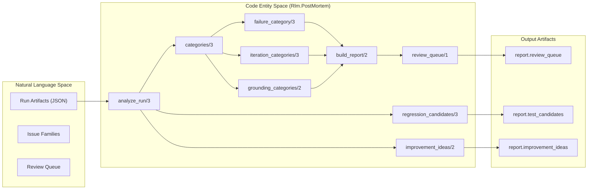
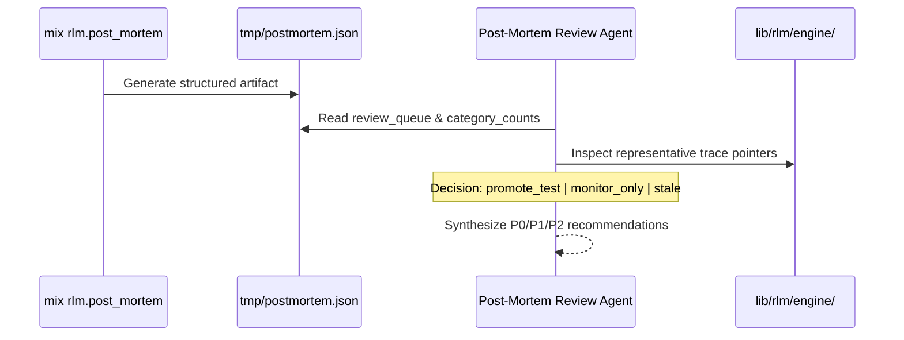

# Post-Mortem Analysis
Relevant source files
- [.agents/skills/postmortem-review/SKILL.md](https://github.com/Cody-W-Tucker/rlm/blob/4bc8e1ba/.agents/skills/postmortem-review/SKILL.md?plain=1)
- [bin/rlm-postmortem-json](https://github.com/Cody-W-Tucker/rlm/blob/4bc8e1ba/bin/rlm-postmortem-json)
- [lib/mix/tasks/rlm.post_mortem.ex](https://github.com/Cody-W-Tucker/rlm/blob/4bc8e1ba/lib/mix/tasks/rlm.post_mortem.ex)
- [lib/rlm/post_mortem.ex](https://github.com/Cody-W-Tucker/rlm/blob/4bc8e1ba/lib/rlm/post_mortem.ex)
- [lib/rlm/post_mortem/state.ex](https://github.com/Cody-W-Tucker/rlm/blob/4bc8e1ba/lib/rlm/post_mortem/state.ex)
- [test/rlm/cli/post_mortem_task_test.exs](https://github.com/Cody-W-Tucker/rlm/blob/4bc8e1ba/test/rlm/cli/post_mortem_task_test.exs)
- [test/rlm/engine/fixture_recovery_test.exs](https://github.com/Cody-W-Tucker/rlm/blob/4bc8e1ba/test/rlm/engine/fixture_recovery_test.exs)
- [test/rlm/post_mortem_state_test.exs](https://github.com/Cody-W-Tucker/rlm/blob/4bc8e1ba/test/rlm/post_mortem_state_test.exs)
- [test/rlm/post_mortem_test.exs](https://github.com/Cody-W-Tucker/rlm/blob/4bc8e1ba/test/rlm/post_mortem_test.exs)
- [test/support/postmortem_test_providers.ex](https://github.com/Cody-W-Tucker/rlm/blob/4bc8e1ba/test/support/postmortem_test_providers.ex)

The `Rlm.PostMortem` system is a diagnostic pipeline designed to analyze persisted run traces and transform raw telemetry into actionable engineering insights. It categorizes failures, suggests regression tests, identifies improvement opportunities, and ranks issues by their impact on answer trustworthiness and system reliability.

### Implementation Overview

The analysis is driven by `Rlm.PostMortem.analyze_path/1`, which loads JSON artifacts from the `RunStore` and passes them through a series of heuristic evaluators [lib/rlm/post_mortem.ex9-14](https://github.com/Cody-W-Tucker/rlm/blob/4bc8e1ba/lib/rlm/post_mortem.ex#L9-L14)

#### Data Flow and Code Entity Mapping

The following diagram illustrates how a persisted run JSON is transformed into a structured post-mortem report, mapping Natural Language concepts to the specific Elixir functions that handle them.

**Post-Mortem Diagnostic Pipeline**

**Sources:**[lib/rlm/post_mortem.ex1-160](https://github.com/Cody-W-Tucker/rlm/blob/4bc8e1ba/lib/rlm/post_mortem.ex#L1-L160)

---

### Issue Families

`Rlm.PostMortem` classifies telemetry into four primary families to help maintainers distinguish between recoverable noise and critical failures.

| Family | Description | Code Pointer |
| --- | --- | --- |
| **Reliability** | Provider timeouts, request manager errors, and connectivity issues. | `reliability`[lib/rlm/post_mortem.ex221](https://github.com/Cody-W-Tucker/rlm/blob/4bc8e1ba/lib/rlm/post_mortem.ex#L221-L221) |
| **Runtime** | Python execution errors, malformed code blocks, and REPL crashes. | `runtime`[lib/rlm/post_mortem.ex253](https://github.com/Cody-W-Tucker/rlm/blob/4bc8e1ba/lib/rlm/post_mortem.ex#L253-L253) |
| **Grounding** | Weak read coverage, ungrounded citations, or missing evidence. | `grounding`[lib/rlm/post_mortem.ex345](https://github.com/Cody-W-Tucker/rlm/blob/4bc8e1ba/lib/rlm/post_mortem.ex#L345-L345) |
| **Strategy** | Iteration budget exhaustion or inefficient search patterns. | `strategy`[lib/rlm/post_mortem.ex418](https://github.com/Cody-W-Tucker/rlm/blob/4bc8e1ba/lib/rlm/post_mortem.ex#L418-L418) |

**Sources:**[lib/rlm/post_mortem.ex221-430](https://github.com/Cody-W-Tucker/rlm/blob/4bc8e1ba/lib/rlm/post_mortem.ex#L221-L430)

---

### Analysis Components

#### 1. Regression Candidate Generation

The system identifies specific runs that should be converted into permanent test fixtures. For example, if a run encountered a `python_exec_error`, the analyzer suggests a regression test to ensure future engine versions handle that specific error class [lib/rlm/post_mortem.ex432-440](https://github.com/Cody-W-Tucker/rlm/blob/4bc8e1ba/lib/rlm/post_mortem.ex#L432-L440)

#### 2. Improvement Ideas

Heuristics detect patterns that suggest architectural changes. Examples include:

- **`early_timeout_finalization`**: Suggested when a provider times out but a partial answer is available [lib/rlm/post_mortem.ex528-535](https://github.com/Cody-W-Tucker/rlm/blob/4bc8e1ba/lib/rlm/post_mortem.ex#L528-L535)
- **`force_read_promotion`**: Suggested when a model performs many searches but fails to read the resulting files [lib/rlm/post_mortem.ex558-566](https://github.com/Cody-W-Tucker/rlm/blob/4bc8e1ba/lib/rlm/post_mortem.ex#L558-L566)

#### 3. Review Queue and Priority Ranking

The `review_queue/1` function aggregates similar issues across multiple runs and ranks them by priority [lib/rlm/post_mortem.ex578-585](https://github.com/Cody-W-Tucker/rlm/blob/4bc8e1ba/lib/rlm/post_mortem.ex#L578-L585)

- **High Priority**: Grounding failures (trustworthiness risk) and repeated runtime crashes [lib/rlm/post_mortem.ex596-600](https://github.com/Cody-W-Tucker/rlm/blob/4bc8e1ba/lib/rlm/post_mortem.ex#L596-L600)
- **Medium Priority**: Recovered failures that indicate wasted work [lib/rlm/post_mortem.ex605-608](https://github.com/Cody-W-Tucker/rlm/blob/4bc8e1ba/lib/rlm/post_mortem.ex#L605-L608)

**Sources:**[lib/rlm/post_mortem.ex432-610](https://github.com/Cody-W-Tucker/rlm/blob/4bc8e1ba/lib/rlm/post_mortem.ex#L432-L610)

---

### Incremental Analysis and State

To handle large corpora of runs efficiently, the `mix rlm.post_mortem` task supports an `--incremental` mode [lib/mix/tasks/rlm.post_mortem.ex53-59](https://github.com/Cody-W-Tucker/rlm/blob/4bc8e1ba/lib/mix/tasks/rlm.post_mortem.ex#L53-L59)

- **State Tracking**: `Rlm.PostMortem.State` persists the `last_processed_run` in a `postmortem-state.json` file [lib/rlm/post_mortem/state.ex15-20](https://github.com/Cody-W-Tucker/rlm/blob/4bc8e1ba/lib/rlm/post_mortem/state.ex#L15-L20)
- **Version Safety**: The analyzer enforces a version match between the checkpoint and the current code. If the `postmortem_version` or `run_schema_version` changes, the user must `--reset-checkpoint` to ensure all runs are re-evaluated with the new logic [lib/rlm/post_mortem/state.ex59-74](https://github.com/Cody-W-Tucker/rlm/blob/4bc8e1ba/lib/rlm/post_mortem/state.ex#L59-L74)

**Sources:**[lib/rlm/post_mortem/state.ex1-88](https://github.com/Cody-W-Tucker/rlm/blob/4bc8e1ba/lib/rlm/post_mortem/state.ex#L1-L88)[lib/mix/tasks/rlm.post_mortem.ex61-79](https://github.com/Cody-W-Tucker/rlm/blob/4bc8e1ba/lib/mix/tasks/rlm.post_mortem.ex#L61-L79)

---

### Integration with Agentic Workflows

The post-mortem data is consumed by specialized agents (defined in `SKILL.md`) to automate the "Research -> Propose -> Fix" loop.

**Agentic Review Workflow**

**Sources:**[.agents/skills/postmortem-review/SKILL.md7-146](https://github.com/Cody-W-Tucker/rlm/blob/4bc8e1ba/.agents/skills/postmortem-review/SKILL.md?plain=1#L7-L146)

### CLI Usage

The system is accessed via the Mix task or a standalone shell script:

- **Text Report**: `mix rlm.post_mortem /path/to/runs`
- **JSON Export**: `bin/rlm-postmortem-json --incremental`[bin/rlm-postmortem-json1-6](https://github.com/Cody-W-Tucker/rlm/blob/4bc8e1ba/bin/rlm-postmortem-json#L1-L6)
- **Resetting State**: `mix rlm.post_mortem --reset-checkpoint --incremental`[lib/mix/tasks/rlm.post_mortem.ex42-51](https://github.com/Cody-W-Tucker/rlm/blob/4bc8e1ba/lib/mix/tasks/rlm.post_mortem.ex#L42-L51)

**Sources:**[lib/mix/tasks/rlm.post_mortem.ex11-24](https://github.com/Cody-W-Tucker/rlm/blob/4bc8e1ba/lib/mix/tasks/rlm.post_mortem.ex#L11-L24)[bin/rlm-postmortem-json1-6](https://github.com/Cody-W-Tucker/rlm/blob/4bc8e1ba/bin/rlm-postmortem-json#L1-L6)