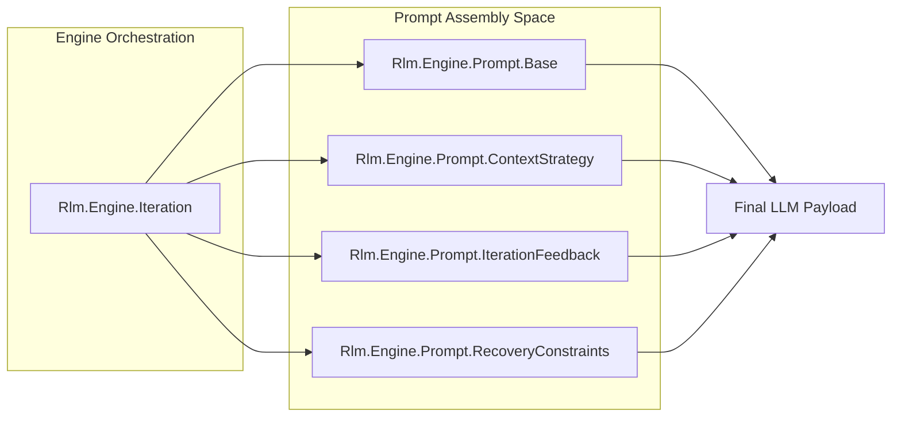
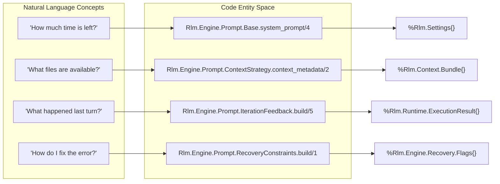

# Prompt Generation
Relevant source files
- [lib/rlm/engine/prompt/base.ex](https://github.com/Cody-W-Tucker/rlm/blob/4bc8e1ba/lib/rlm/engine/prompt/base.ex)
- [lib/rlm/engine/prompt/context_strategy.ex](https://github.com/Cody-W-Tucker/rlm/blob/4bc8e1ba/lib/rlm/engine/prompt/context_strategy.ex)
- [lib/rlm/engine/prompt/iteration_feedback.ex](https://github.com/Cody-W-Tucker/rlm/blob/4bc8e1ba/lib/rlm/engine/prompt/iteration_feedback.ex)
- [lib/rlm/engine/prompt/recovery_constraints.ex](https://github.com/Cody-W-Tucker/rlm/blob/4bc8e1ba/lib/rlm/engine/prompt/recovery_constraints.ex)
- [lib/rlm/engine/response/extractor.ex](https://github.com/Cody-W-Tucker/rlm/blob/4bc8e1ba/lib/rlm/engine/response/extractor.ex)
- [lib/rlm/engine/response/fenced_blocks.ex](https://github.com/Cody-W-Tucker/rlm/blob/4bc8e1ba/lib/rlm/engine/response/fenced_blocks.ex)
- [lib/rlm/engine/response/salvage.ex](https://github.com/Cody-W-Tucker/rlm/blob/4bc8e1ba/lib/rlm/engine/response/salvage.ex)
- [test/rlm/engine/policy_test.exs](https://github.com/Cody-W-Tucker/rlm/blob/4bc8e1ba/test/rlm/engine/policy_test.exs)

The Prompt Generation subsystem is responsible for assembling the complete context sent to the LLM at each iteration of the **Generate-Execute-Verify** loop. It bridges the gap between the static input data (files, text, URLs) and the dynamic execution state (REPL outputs, grounding grades, and recovery status).

The system uses a "budget-aware" templating approach, where the prompt adapts based on how many iterations remain and the quality of evidence gathered so far.

## Architecture and Data Flow

The assembly process is orchestrated by the engine, which pulls data from four specialized modules to construct the final message payload.

### Prompt Assembly Diagram

This diagram shows how `Rlm.Engine.Iteration` coordinates the assembly of the prompt by calling into the specialized prompt modules.

Sources: [lib/rlm/engine/prompt/base.ex4-27](https://github.com/Cody-W-Tucker/rlm/blob/4bc8e1ba/lib/rlm/engine/prompt/base.ex#L4-L27)[lib/rlm/engine/prompt/context_strategy.ex6-66](https://github.com/Cody-W-Tucker/rlm/blob/4bc8e1ba/lib/rlm/engine/prompt/context_strategy.ex#L6-L66)[lib/rlm/engine/prompt/iteration_feedback.ex7-70](https://github.com/Cody-W-Tucker/rlm/blob/4bc8e1ba/lib/rlm/engine/prompt/iteration_feedback.ex#L7-L70)

## System Prompt Template (`Base`)

`Rlm.Engine.Prompt.Base` defines the core identity of the agent. It enforces the "Python-only" response constraint and provides the documentation for the REPL tools available in the Python runtime.

### Key Features:

- **Tool Documentation**: Lists all 22+ REPL functions (e.g., `list_files`, `grep_open`, `assess_evidence`) that the model can use [lib/rlm/engine/prompt/base.ex35-58](https://github.com/Cody-W-Tucker/rlm/blob/4bc8e1ba/lib/rlm/engine/prompt/base.ex#L35-L58)
- **Budget Tracking**: Injects the number of remaining iterations and sub-queries directly into the system prompt to influence the model's urgency [lib/rlm/engine/prompt/base.ex30-34](https://github.com/Cody-W-Tucker/rlm/blob/4bc8e1ba/lib/rlm/engine/prompt/base.ex#L30-L34)
- **Endgame Logic**: Automatically appends "FINAL ITERATION" or "ENDGAME" warnings when the iteration budget is nearly exhausted, instructing the model to stop searching and start synthesizing [lib/rlm/engine/prompt/base.ex13-23](https://github.com/Cody-W-Tucker/rlm/blob/4bc8e1ba/lib/rlm/engine/prompt/base.ex#L13-L23)

Sources: [lib/rlm/engine/prompt/base.ex1-100](https://github.com/Cody-W-Tucker/rlm/blob/4bc8e1ba/lib/rlm/engine/prompt/base.ex#L1-L100)

## Context Metadata and Budgeting (`ContextStrategy`)

`Rlm.Engine.Prompt.ContextStrategy` generates the "Context Header." This section tells the model what kind of data it is looking at without dumping the entire file contents into the prompt, which would exhaust the token window.

### Metadata Components:

- **Input Shape**: Detects if the input is a single file, an expanded directory, a glob, or a URL [lib/rlm/engine/prompt/context_strategy.ex92-130](https://github.com/Cody-W-Tucker/rlm/blob/4bc8e1ba/lib/rlm/engine/prompt/context_strategy.ex#L92-L130)
- **Structure Hints**: Uses regex to guess the nature of the data (e.g., "Likely weekly or dated notes" or "JSONL/chat history") to suggest the best retrieval tools [lib/rlm/engine/prompt/context_strategy.ex68-90](https://github.com/Cody-W-Tucker/rlm/blob/4bc8e1ba/lib/rlm/engine/prompt/context_strategy.ex#L68-L90)
- **Strategy Hints**: Provides high-level advice based on corpus size. For example, if the corpus is large and file-backed, it advises: "First decide whether filename or path structure is informative" [lib/rlm/engine/prompt/context_strategy.ex43-48](https://github.com/Cody-W-Tucker/rlm/blob/4bc8e1ba/lib/rlm/engine/prompt/context_strategy.ex#L43-L48)

| Feature | Logic | Source |
| --- | --- | --- |
| **Weekly Detection** | `Regex.match?(~r/week.../i, filename)` | [lib/rlm/engine/prompt/context_strategy.ex132-135](https://github.com/Cody-W-Tucker/rlm/blob/4bc8e1ba/lib/rlm/engine/prompt/context_strategy.ex#L132-L135) |
| **JSONL Detection** | `String.ends_with?(path, ".jsonl")` | [lib/rlm/engine/prompt/context_strategy.ex137-140](https://github.com/Cody-W-Tucker/rlm/blob/4bc8e1ba/lib/rlm/engine/prompt/context_strategy.ex#L137-L140) |
| **Access Hints** | Switches between `context` string and `list_files()` advice | [lib/rlm/engine/prompt/context_strategy.ex23-33](https://github.com/Cody-W-Tucker/rlm/blob/4bc8e1ba/lib/rlm/engine/prompt/context_strategy.ex#L23-L33) |

Sources: [lib/rlm/engine/prompt/context_strategy.ex1-141](https://github.com/Cody-W-Tucker/rlm/blob/4bc8e1ba/lib/rlm/engine/prompt/context_strategy.ex#L1-L141)[test/rlm/engine/policy_test.exs7-88](https://github.com/Cody-W-Tucker/rlm/blob/4bc8e1ba/test/rlm/engine/policy_test.exs#L7-L88)

## Iteration Feedback (`IterationFeedback`)

After the first turn, the engine uses `Rlm.Engine.Prompt.IterationFeedback` to provide the model with the results of its previous code execution. This module is critical for the "Verify" part of the loop.

### Feedback Elements:

1. **STDOUT/STDERR**: The actual output from the Python REPL, truncated to the `truncate_length` setting [lib/rlm/engine/prompt/iteration_feedback.ex11-20](https://github.com/Cody-W-Tucker/rlm/blob/4bc8e1ba/lib/rlm/engine/prompt/iteration_feedback.ex#L11-L20)
2. **Grounding Grade**: Injects a real-time assessment (e.g., "Current grounding grade: C (search-only)") and specific instructions on how to improve it (e.g., "read at least 2 relevant files before finalizing") [lib/rlm/engine/prompt/iteration_feedback.ex101-129](https://github.com/Cody-W-Tucker/rlm/blob/4bc8e1ba/lib/rlm/engine/prompt/iteration_feedback.ex#L101-L129)
3. **Consolidation Notes**: If the model has searched many times but hasn't read any files, this module triggers a warning: "Stop searching. Pick the strongest hit-backed passages and inspect them directly" [lib/rlm/engine/prompt/iteration_feedback.ex81-99](https://github.com/Cody-W-Tucker/rlm/blob/4bc8e1ba/lib/rlm/engine/prompt/iteration_feedback.ex#L81-L99)
4. **Best Answer Recovery**: If a sub-query succeeded but the main code failed to print it, the engine surfaces the "Best answer so far" to prevent lost progress [lib/rlm/engine/prompt/iteration_feedback.ex27-50](https://github.com/Cody-W-Tucker/rlm/blob/4bc8e1ba/lib/rlm/engine/prompt/iteration_feedback.ex#L27-L50)

Sources: [lib/rlm/engine/prompt/iteration_feedback.ex7-140](https://github.com/Cody-W-Tucker/rlm/blob/4bc8e1ba/lib/rlm/engine/prompt/iteration_feedback.ex#L7-L140)

## Recovery Constraints (`RecoveryConstraints`)

When the engine detects a failure (e.g., a Python syntax error or a timeout), it enters a recovery state. `Rlm.Engine.Prompt.RecoveryConstraints` appends specific behavioral limitations to the prompt to prevent the model from repeating the same mistake.

- **Recovery Mode**: Forces the model to use `assess_evidence()` to find a safer path [lib/rlm/engine/prompt/recovery_constraints.ex6-10](https://github.com/Cody-W-Tucker/rlm/blob/4bc8e1ba/lib/rlm/engine/prompt/recovery_constraints.ex#L6-L10)
- **Async Disabled**: If parallel `async_llm_query` calls caused a failure, the model is instructed to use sequential calls [lib/rlm/engine/prompt/recovery_constraints.ex11-14](https://github.com/Cody-W-Tucker/rlm/blob/4bc8e1ba/lib/rlm/engine/prompt/recovery_constraints.ex#L11-L14)
- **Broad Sub-queries Disabled**: If the model was fanning out across too many chunks, it is told to "prefer one narrow direct step" [lib/rlm/engine/prompt/recovery_constraints.ex15-19](https://github.com/Cody-W-Tucker/rlm/blob/4bc8e1ba/lib/rlm/engine/prompt/recovery_constraints.ex#L15-L19)

Sources: [lib/rlm/engine/prompt/recovery_constraints.ex1-25](https://github.com/Cody-W-Tucker/rlm/blob/4bc8e1ba/lib/rlm/engine/prompt/recovery_constraints.ex#L1-L25)

## Entity Mapping: Logic to Code

This diagram maps the natural language concepts of "Prompt Generation" to the specific Elixir modules and data structures used in the codebase.

Sources: [lib/rlm/engine/prompt/base.ex4](https://github.com/Cody-W-Tucker/rlm/blob/4bc8e1ba/lib/rlm/engine/prompt/base.ex#L4-L4)[lib/rlm/engine/prompt/context_strategy.ex6](https://github.com/Cody-W-Tucker/rlm/blob/4bc8e1ba/lib/rlm/engine/prompt/context_strategy.ex#L6-L6)[lib/rlm/engine/prompt/iteration_feedback.ex7](https://github.com/Cody-W-Tucker/rlm/blob/4bc8e1ba/lib/rlm/engine/prompt/iteration_feedback.ex#L7-L7)[lib/rlm/engine/prompt/recovery_constraints.ex4](https://github.com/Cody-W-Tucker/rlm/blob/4bc8e1ba/lib/rlm/engine/prompt/recovery_constraints.ex#L4-L4)