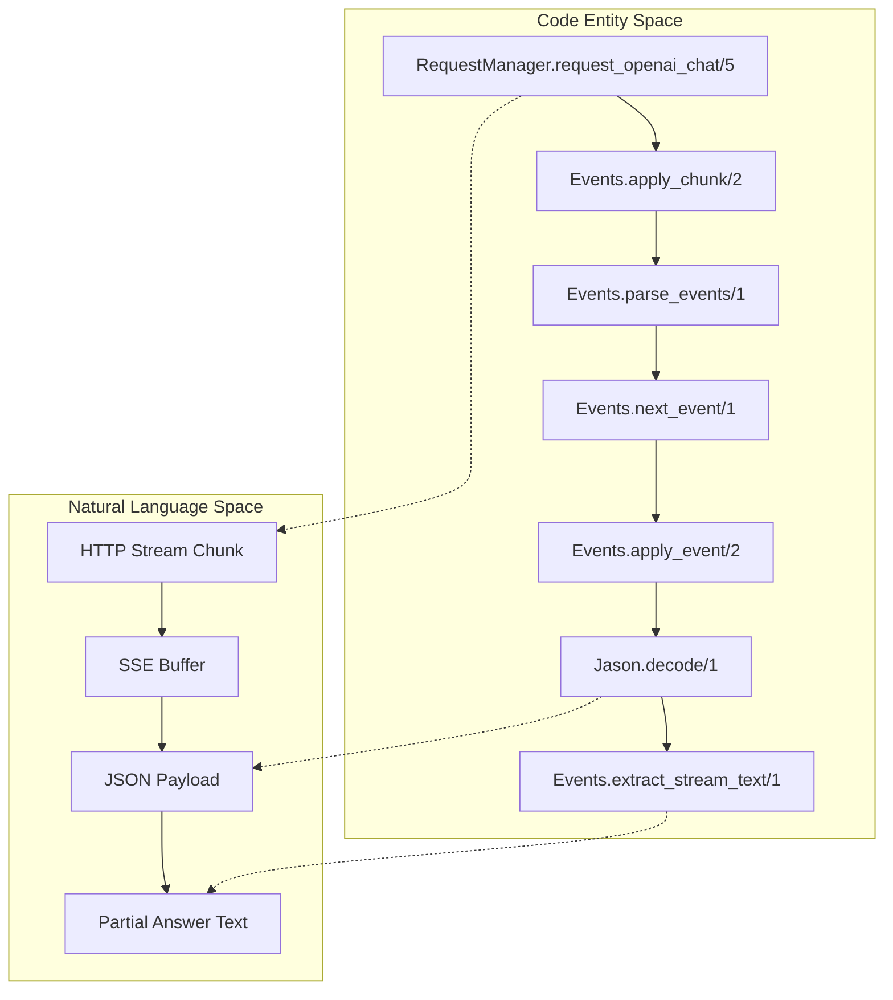
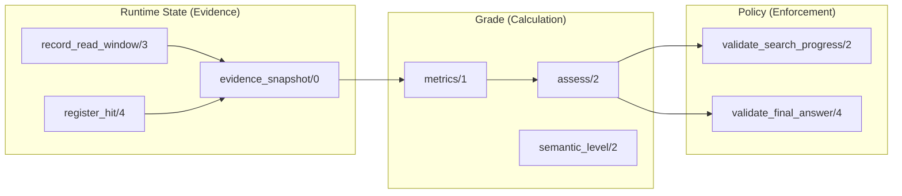

# Provider and Runtime Tests
Relevant source files
- [lib/rlm/engine/grounding/grade.ex](https://github.com/Cody-W-Tucker/rlm/blob/4bc8e1ba/lib/rlm/engine/grounding/grade.ex)
- [lib/rlm/engine/grounding/policy.ex](https://github.com/Cody-W-Tucker/rlm/blob/4bc8e1ba/lib/rlm/engine/grounding/policy.ex)
- [lib/rlm/providers/openai.ex](https://github.com/Cody-W-Tucker/rlm/blob/4bc8e1ba/lib/rlm/providers/openai.ex)
- [lib/rlm/providers/request_manager/events.ex](https://github.com/Cody-W-Tucker/rlm/blob/4bc8e1ba/lib/rlm/providers/request_manager/events.ex)
- [priv/runtime/evidence.py](https://github.com/Cody-W-Tucker/rlm/blob/4bc8e1ba/priv/runtime/evidence.py)
- [priv/runtime/state.py](https://github.com/Cody-W-Tucker/rlm/blob/4bc8e1ba/priv/runtime/state.py)
- [test/rlm/engine/failure_test.exs](https://github.com/Cody-W-Tucker/rlm/blob/4bc8e1ba/test/rlm/engine/failure_test.exs)
- [test/rlm/engine/grounding/grade_test.exs](https://github.com/Cody-W-Tucker/rlm/blob/4bc8e1ba/test/rlm/engine/grounding/grade_test.exs)
- [test/rlm/engine/grounding/policy_test.exs](https://github.com/Cody-W-Tucker/rlm/blob/4bc8e1ba/test/rlm/engine/grounding/policy_test.exs)
- [test/rlm/engine/recovery_strategy_test.exs](https://github.com/Cody-W-Tucker/rlm/blob/4bc8e1ba/test/rlm/engine/recovery_strategy_test.exs)
- [test/rlm/providers/request_manager_test.exs](https://github.com/Cody-W-Tucker/rlm/blob/4bc8e1ba/test/rlm/providers/request_manager_test.exs)
- [test/rlm/settings_test.exs](https://github.com/Cody-W-Tucker/rlm/blob/4bc8e1ba/test/rlm/settings_test.exs)

This section details the testing infrastructure for the lower-level subsystems of the RLM engine, specifically focusing on the LLM provider communication layer, the grounding validation logic, and the recovery strategies triggered by runtime failures.

## Overview

The provider and runtime tests ensure the reliability of the "Generate-Execute-Verify" loop by validating that:

1. **Request Management**: Streaming HTTP connections to LLM providers handle timeouts and partial responses gracefully [lib/rlm/providers/request_manager.ex1-42](https://github.com/Cody-W-Tucker/rlm/blob/4bc8e1ba/lib/rlm/providers/request_manager.ex#L1-L42)
2. **Grounding Enforcement**: The system correctly grades evidence (A–F) and enforces policies like minimum read requirements [lib/rlm/engine/grounding/policy.ex1-38](https://github.com/Cody-W-Tucker/rlm/blob/4bc8e1ba/lib/rlm/engine/grounding/policy.ex#L1-L38)
3. **Recovery Logic**: Failure classifications result in actionable instructions for the LLM to self-correct [lib/rlm/engine/recovery/strategy.ex1-53](https://github.com/Cody-W-Tucker/rlm/blob/4bc8e1ba/lib/rlm/engine/recovery/strategy.ex#L1-L53)
4. **Settings Validation**: Configuration is correctly merged and validated before a run begins [lib/rlm/settings.ex1-91](https://github.com/Cody-W-Tucker/rlm/blob/4bc8e1ba/lib/rlm/settings.ex#L1-L91)

## Provider and Streaming Tests

The `Rlm.Providers.RequestManagerTest` validates the streaming SSE (Server-Sent Events) implementation used by the `OpenAI` provider. It simulates various network conditions using a mock function to ensure the `RequestManager` can recover partial text even when a connection fails or times out.

### Streaming and Timeouts

The system implements three distinct timeout layers: `first_byte_timeout`, `idle_timeout`, and `total_timeout`[test/rlm/providers/request_manager_test.ex15-18](https://github.com/Cody-W-Tucker/rlm/blob/4bc8e1ba/test/rlm/providers/request_manager_test.ex#L15-L18)

| Test Case | Behavior Verified | Source |
| --- | --- | --- |
| **Accumulate Stream** | Successfully joins multiple `data:` chunks into a single coherent string. | [test/rlm/providers/request_manager_test.ex24-54](https://github.com/Cody-W-Tucker/rlm/blob/4bc8e1ba/test/rlm/providers/request_manager_test.ex#L24-L54) |
| **First-Byte Timeout** | Triggers an error if the provider accepts the connection but sends no data within the limit. | [test/rlm/providers/request_manager_test.ex56-71](https://github.com/Cody-W-Tucker/rlm/blob/4bc8e1ba/test/rlm/providers/request_manager_test.ex#L56-L71) |
| **Idle Timeout** | Captures "Promising partial" text if the stream stalls mid-response. | [test/rlm/providers/request_manager_test.ex73-97](https://github.com/Cody-W-Tucker/rlm/blob/4bc8e1ba/test/rlm/providers/request_manager_test.ex#L73-L97) |
| **Total Timeout** | Forces termination of long-running active streams to respect the iteration budget. | [test/rlm/providers/request_manager_test.ex99-134](https://github.com/Cody-W-Tucker/rlm/blob/4bc8e1ba/test/rlm/providers/request_manager_test.ex#L99-L134) |

### Data Flow: Provider Response Parsing

The following diagram illustrates how raw chunks from `Req` are processed by `RequestManager.Events`.

**Provider Event Pipeline**

Sources: [lib/rlm/providers/request_manager/events.ex6-55](https://github.com/Cody-W-Tucker/rlm/blob/4bc8e1ba/lib/rlm/providers/request_manager/events.ex#L6-L55)[test/rlm/providers/request_manager_test.ex136-160](https://github.com/Cody-W-Tucker/rlm/blob/4bc8e1ba/test/rlm/providers/request_manager_test.ex#L136-L160)

## Grounding Grade and Policy Tests

The grounding tests ensure that the LLM is actually reading the files it claims to be using. This is verified through two modules: `Grade` (which calculates the score) and `Policy` (which enforces the score).

### Grade Assessment

`Rlm.Engine.Grounding.Grade` aggregates evidence from `iteration_records`[lib/rlm/engine/grounding/grade.ex6-22](https://github.com/Cody-W-Tucker/rlm/blob/4bc8e1ba/lib/rlm/engine/grounding/grade.ex#L6-L22)

- **Structural Grade**: Based on `read_units` (files or windows read). An "A" grade typically requires 3+ reads [test/rlm/engine/grounding/grade_test.ex6-52](https://github.com/Cody-W-Tucker/rlm/blob/4bc8e1ba/test/rlm/engine/grounding/grade_test.ex#L6-L52)
- **Semantic Grade**: Improves only when `read_followups` match specific search patterns (e.g., `behavioral` or `counterexample`) [test/rlm/engine/grounding/grade_test.ex83-109](https://github.com/Cody-W-Tucker/rlm/blob/4bc8e1ba/test/rlm/engine/grounding/grade_test.ex#L83-L109)

### Policy Enforcement

`Rlm.Engine.Grounding.Policy` uses the grade to block or allow progress.

- **Search Progress**: Prevents the model from "scouting" indefinitely without promoting hits to `read_file()` calls [test/rlm/engine/grounding/policy_test.ex28-50](https://github.com/Cody-W-Tucker/rlm/blob/4bc8e1ba/test/rlm/engine/grounding/policy_test.ex#L28-L50)
- **Line-Delimited Support**: Validates that for `.jsonl` or `.log` files, the model uses `read_windows` and correlates them with search hits [test/rlm/engine/grounding/policy_test.ex141-192](https://github.com/Cody-W-Tucker/rlm/blob/4bc8e1ba/test/rlm/engine/grounding/policy_test.ex#L141-L192)

**Grounding Logic Association**

Sources: [lib/rlm/engine/grounding/policy.ex40-64](https://github.com/Cody-W-Tucker/rlm/blob/4bc8e1ba/lib/rlm/engine/grounding/policy.ex#L40-L64)[lib/rlm/engine/grounding/grade.ex24-71](https://github.com/Cody-W-Tucker/rlm/blob/4bc8e1ba/lib/rlm/engine/grounding/grade.ex#L24-L71)[priv/runtime/state.py124-134](https://github.com/Cody-W-Tucker/rlm/blob/4bc8e1ba/priv/runtime/state.py#L124-L134)

## Recovery Strategy Tests

Recovery tests verify that the system generates the correct `Failure` struct and subsequent `Strategy` instructions when things go wrong.

### Failure Classification

`Rlm.Engine.Failure` classifies errors to provide specific advice:

- **Async Syntax Errors**: Specifically identifies malformed Python blocks that fail the async wrapper [test/rlm/engine/failure_test.ex6-21](https://github.com/Cody-W-Tucker/rlm/blob/4bc8e1ba/test/rlm/engine/failure_test.ex#L6-L21)
- **Runtime API Misuse**: Catches common LLM mistakes, such as treating the string return of `read_file()` as a list of dictionaries [test/rlm/engine/failure_test.ex23-40](https://github.com/Cody-W-Tucker/rlm/blob/4bc8e1ba/test/rlm/engine/failure_test.ex#L23-L40)

### Recovery Instructions

`Rlm.Engine.Recovery.Strategy` maps these failures to flags and text instructions:

- **Timeout Recovery**: Instructs the model to "finalize from the best partial answer" [test/rlm/engine/recovery_strategy_test.ex34-43](https://github.com/Cody-W-Tucker/rlm/blob/4bc8e1ba/test/rlm/engine/recovery_strategy_test.ex#L34-L43)
- **Grounding Recovery**: Directs the model to use `assess_evidence()` to find gaps in its current research [test/rlm/engine/recovery_strategy_test.ex45-52](https://github.com/Cody-W-Tucker/rlm/blob/4bc8e1ba/test/rlm/engine/recovery_strategy_test.ex#L45-L52)

Sources: [test/rlm/engine/failure_test.ex1-41](https://github.com/Cody-W-Tucker/rlm/blob/4bc8e1ba/test/rlm/engine/failure_test.ex#L1-L41)[test/rlm/engine/recovery_strategy_test.ex1-53](https://github.com/Cody-W-Tucker/rlm/blob/4bc8e1ba/test/rlm/engine/recovery_strategy_test.ex#L1-L53)

## Settings Validation Tests

The `Rlm.SettingsTest` ensures that the system fails fast if the environment is misconfigured.

- **Priority**: Verifies that CLI overrides take precedence over `config.exs`[test/rlm/settings_test.ex16-47](https://github.com/Cody-W-Tucker/rlm/blob/4bc8e1ba/test/rlm/settings_test.ex#L16-L47)
- **Credential Checks**: Ensures the system will not start if the `api_key` is missing for the OpenAI provider [test/rlm/settings_test.ex49-75](https://github.com/Cody-W-Tucker/rlm/blob/4bc8e1ba/test/rlm/settings_test.ex#L49-L75)
- **Type Safety**: Validates numeric ranges for fields like `max_iterations` and `max_lazy_file_bytes`[test/rlm/settings_test.ex77-85](https://github.com/Cody-W-Tucker/rlm/blob/4bc8e1ba/test/rlm/settings_test.ex#L77-L85)

Sources: [test/rlm/settings_test.ex1-91](https://github.com/Cody-W-Tucker/rlm/blob/4bc8e1ba/test/rlm/settings_test.ex#L1-L91)