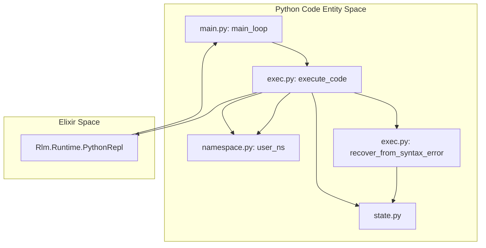
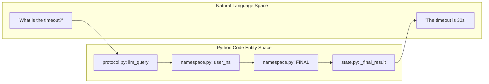

# Python Namespace and Execution
Relevant source files
- [lib/rlm/cli.ex](https://github.com/Cody-W-Tucker/rlm/blob/4bc8e1ba/lib/rlm/cli.ex)
- [lib/rlm/runtime/primitives.ex](https://github.com/Cody-W-Tucker/rlm/blob/4bc8e1ba/lib/rlm/runtime/primitives.ex)
- [priv/runtime/__init__.py](https://github.com/Cody-W-Tucker/rlm/blob/4bc8e1ba/priv/runtime/__init__.py)
- [priv/runtime/exec.py](https://github.com/Cody-W-Tucker/rlm/blob/4bc8e1ba/priv/runtime/exec.py)
- [priv/runtime/main.py](https://github.com/Cody-W-Tucker/rlm/blob/4bc8e1ba/priv/runtime/main.py)
- [priv/runtime/namespace.py](https://github.com/Cody-W-Tucker/rlm/blob/4bc8e1ba/priv/runtime/namespace.py)

The Python execution environment in `rlm` is a persistent subprocess that maintains state across multiple iterations of a single run. This design allows an LLM to author code that builds upon variables, imported modules, and search results established in previous turns. The environment is partitioned into a controlled API surface (the namespace) and a robust execution engine capable of handling malformed code and asynchronous operations.

## Execution Lifecycle

The execution flow begins in `main.py`, which manages the event loop and coordinates between the Elixir-to-Python protocol and the execution logic.

### Main Loop and Message Handling

The `main_loop` function in `priv/runtime/main.py`[priv/runtime/main.py8-29](https://github.com/Cody-W-Tucker/rlm/blob/4bc8e1ba/priv/runtime/main.py#L8-L29) listens for commands on a queue populated by the `stdin_reader_loop`[priv/runtime/main.py33-34](https://github.com/Cody-W-Tucker/rlm/blob/4bc8e1ba/priv/runtime/main.py#L33-L34) It dispatches four primary message types:

1. **`set_context`**: Updates the global context string available to the model [priv/runtime/main.py19-21](https://github.com/Cody-W-Tucker/rlm/blob/4bc8e1ba/priv/runtime/main.py#L19-L21)
2. **`set_file_sources`**: Configures the list of paths available for search and retrieval [priv/runtime/main.py22-24](https://github.com/Cody-W-Tucker/rlm/blob/4bc8e1ba/priv/runtime/main.py#L22-L24)
3. **`reset_final`**: Clears the final result and grounding evidence tracking for a fresh start [priv/runtime/main.py25-28](https://github.com/Cody-W-Tucker/rlm/blob/4bc8e1ba/priv/runtime/main.py#L25-L28)
4. **`exec`**: Triggers the execution of model-authored code via `runtime_exec.execute_code`[priv/runtime/main.py17-18](https://github.com/Cody-W-Tucker/rlm/blob/4bc8e1ba/priv/runtime/main.py#L17-L18)

### The Execution Pipeline

The `execute_code` function in `priv/runtime/exec.py`[priv/runtime/exec.py171-207](https://github.com/Cody-W-Tucker/rlm/blob/4bc8e1ba/priv/runtime/exec.py#L171-L207) implements a multi-stage execution strategy:

1. **Namespace Refresh**: Injects the standard library of tools into `user_ns`[priv/runtime/namespace.py29-60](https://github.com/Cody-W-Tucker/rlm/blob/4bc8e1ba/priv/runtime/namespace.py#L29-L60)
2. **Direct Execution**: Attempts to compile and run the code using standard `exec()`[priv/runtime/exec.py96-112](https://github.com/Cody-W-Tucker/rlm/blob/4bc8e1ba/priv/runtime/exec.py#L96-L112)
3. **Recovery Heuristics**: If a syntax error occurs, specifically an unterminated triple-quote (common in LLM output), it attempts to salvage the content [priv/runtime/exec.py184-199](https://github.com/Cody-W-Tucker/rlm/blob/4bc8e1ba/priv/runtime/exec.py#L184-L199)
4. **Async Fallback**: If the code requires an event loop (e.g., using `await` or `async_llm_query`), it wraps the code in an `async` function and executes it via `asyncio.run`[priv/runtime/exec.py114-149](https://github.com/Cody-W-Tucker/rlm/blob/4bc8e1ba/priv/runtime/exec.py#L114-L149)

**Execution Data Flow**

Sources: [priv/runtime/main.py8-30](https://github.com/Cody-W-Tucker/rlm/blob/4bc8e1ba/priv/runtime/main.py#L8-L30)[priv/runtime/exec.py171-207](https://github.com/Cody-W-Tucker/rlm/blob/4bc8e1ba/priv/runtime/exec.py#L171-L207)[priv/runtime/namespace.py29-60](https://github.com/Cody-W-Tucker/rlm/blob/4bc8e1ba/priv/runtime/namespace.py#L29-L60)

## Persistent Namespace (`namespace.py`)

The `user_ns` dictionary [priv/runtime/namespace.py10](https://github.com/Cody-W-Tucker/rlm/blob/4bc8e1ba/priv/runtime/namespace.py#L10-L10) is the persistent container for all variables defined by the LLM. It is updated every iteration via `refresh_user_ns`[priv/runtime/namespace.py29-59](https://github.com/Cody-W-Tucker/rlm/blob/4bc8e1ba/priv/runtime/namespace.py#L29-L59) to ensure all core API functions are available, even if the model has overwritten them in previous steps.

### Exposed API Surface

The following functions are injected into the model's global scope:

| Function | Source | Description |
| --- | --- | --- |
| `FINAL(value)` | `namespace.py:13` | Sets the final answer and signals the end of the run. |
| `FINAL_VAR(v)` | `namespace.py:17` | Helper to set final result while handling `None`. |
| `SET_COMPASS(m)` | `namespace.py:21` | Sets a structured map for Compass-style finalization. |
| `llm_query(...)` | `protocol.py` | Synchronous sub-query back to Elixir. |
| `async_llm_query` | `protocol.py` | Asynchronous sub-query for parallel execution. |
| `read_file(p)` | `files.py` | Reads file content and records grounding evidence. |
| `grep_files(q)` | `search.py` | Performs regex search across the corpus. |

Sources: [priv/runtime/namespace.py29-60](https://github.com/Cody-W-Tucker/rlm/blob/4bc8e1ba/priv/runtime/namespace.py#L29-L60)

## Error Recovery and Async Handling

The runtime is designed to be resilient to common LLM authoring mistakes.

### Syntax Salvaging

Models frequently fail to close triple-quoted strings when calling `FINAL()`. `exec.py` contains a specific recovery function `recover_unterminated_final`[priv/runtime/exec.py46-68](https://github.com/Cody-W-Tucker/rlm/blob/4bc8e1ba/priv/runtime/exec.py#L46-L68) that looks for `FINAL("""` or `FINAL('''` markers. If found in a `SyntaxError` context, it extracts the raw string content and treats it as a successful finalization [priv/runtime/exec.py71-87](https://github.com/Cody-W-Tucker/rlm/blob/4bc8e1ba/priv/runtime/exec.py#L71-L87)

### Async Wrapper

To support `async_llm_query`, the runtime provides `try_async_wrapper_exec`[priv/runtime/exec.py114-149](https://github.com/Cody-W-Tucker/rlm/blob/4bc8e1ba/priv/runtime/exec.py#L114-L149) It transforms the model's code into an async function:

1. Wraps lines in `async def __async_exec__():`[priv/runtime/exec.py126-129](https://github.com/Cody-W-Tucker/rlm/blob/4bc8e1ba/priv/runtime/exec.py#L126-L129)
2. Captures local variables at the end of execution [priv/runtime/exec.py131](https://github.com/Cody-W-Tucker/rlm/blob/4bc8e1ba/priv/runtime/exec.py#L131-L131)
3. Executes the wrapper using `asyncio.run()`[priv/runtime/exec.py133](https://github.com/Cody-W-Tucker/rlm/blob/4bc8e1ba/priv/runtime/exec.py#L133-L133)
4. Merges the resulting locals back into the global `user_ns`, protecting core system functions from being overwritten [priv/runtime/exec.py134-136](https://github.com/Cody-W-Tucker/rlm/blob/4bc8e1ba/priv/runtime/exec.py#L134-L136)

**Namespace and State Mapping**

Sources: [priv/runtime/namespace.py13-15](https://github.com/Cody-W-Tucker/rlm/blob/4bc8e1ba/priv/runtime/namespace.py#L13-L15)[priv/runtime/protocol.py51-52](https://github.com/Cody-W-Tucker/rlm/blob/4bc8e1ba/priv/runtime/protocol.py#L51-L52)[priv/runtime/state.py14](https://github.com/Cody-W-Tucker/rlm/blob/4bc8e1ba/priv/runtime/state.py#L14-L14)

## Execution Results (`build_exec_result`)

Every execution turn returns a structured JSON object back to the Elixir `Rlm.Runtime.PythonRepl`. The `build_exec_result` function [priv/runtime/exec.py152-168](https://github.com/Cody-W-Tucker/rlm/blob/4bc8e1ba/priv/runtime/exec.py#L152-L168) aggregates:

- **Output**: Standard output and standard error [priv/runtime/exec.py160-161](https://github.com/Cody-W-Tucker/rlm/blob/4bc8e1ba/priv/runtime/exec.py#L160-L161)
- **Finalization**: Whether `FINAL()` was called and what the value was [priv/runtime/exec.py162-163](https://github.com/Cody-W-Tucker/rlm/blob/4bc8e1ba/priv/runtime/exec.py#L162-L163)
- **Grounding**: A snapshot of all evidence (reads, searches) gathered during this specific execution turn [priv/runtime/exec.py154](https://github.com/Cody-W-Tucker/rlm/blob/4bc8e1ba/priv/runtime/exec.py#L154-L154)
- **Metadata**: Information about the compilation stage (direct vs. async) and any error classifications [priv/runtime/exec.py164-167](https://github.com/Cody-W-Tucker/rlm/blob/4bc8e1ba/priv/runtime/exec.py#L164-L167)

Sources: [priv/runtime/exec.py152-169](https://github.com/Cody-W-Tucker/rlm/blob/4bc8e1ba/priv/runtime/exec.py#L152-L169)