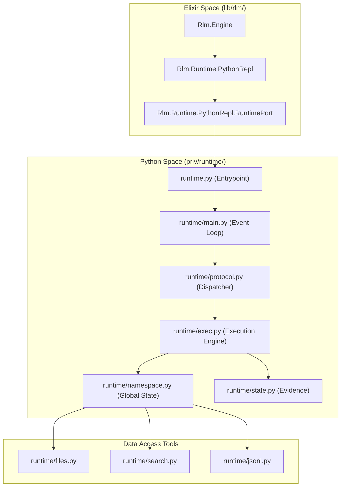
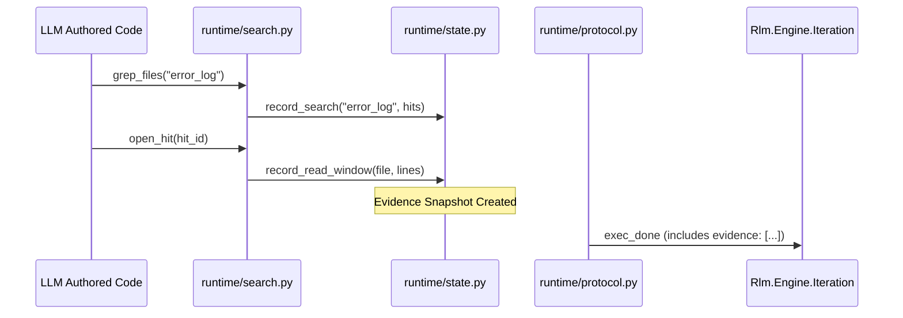

# Python Runtime
Relevant source files
- [lib/rlm/engine.ex](https://github.com/Cody-W-Tucker/rlm/blob/4bc8e1ba/lib/rlm/engine.ex)
- [lib/rlm/engine/policy.ex](https://github.com/Cody-W-Tucker/rlm/blob/4bc8e1ba/lib/rlm/engine/policy.ex)
- [lib/rlm/engine/prompt.ex](https://github.com/Cody-W-Tucker/rlm/blob/4bc8e1ba/lib/rlm/engine/prompt.ex)
- [lib/rlm/providers/mock.ex](https://github.com/Cody-W-Tucker/rlm/blob/4bc8e1ba/lib/rlm/providers/mock.ex)
- [lib/rlm/runtime/python_repl.ex](https://github.com/Cody-W-Tucker/rlm/blob/4bc8e1ba/lib/rlm/runtime/python_repl.ex)
- [priv/runtime.py](https://github.com/Cody-W-Tucker/rlm/blob/4bc8e1ba/priv/runtime.py)
- [priv/runtime/README.md](https://github.com/Cody-W-Tucker/rlm/blob/4bc8e1ba/priv/runtime/README.md?plain=1)

The Python Runtime is a persistent subprocess that executes model-authored code within a stateful REPL environment. Unlike stateless execution models, `rlm` maintains a single Python process across the entire lifecycle of a run, allowing the LLM to accumulate variables, define functions, and perform multi-step data analysis across multiple iterations.

The bridge between Elixir and Python is handled via line-delimited JSON messages over a Port, coordinated by the `Rlm.Runtime.PythonRepl` GenServer.

### System Architecture Overview

The following diagram illustrates the connection between the Elixir orchestration layer and the internal Python modules.

**Elixir-Python Bridge Architecture**

Sources: [priv/runtime.py1-33](https://github.com/Cody-W-Tucker/rlm/blob/4bc8e1ba/priv/runtime.py#L1-L33)[lib/rlm/runtime/python_repl.ex1-112](https://github.com/Cody-W-Tucker/rlm/blob/4bc8e1ba/lib/rlm/runtime/python_repl.ex#L1-L112)[priv/runtime/README.md1-30](https://github.com/Cody-W-Tucker/rlm/blob/4bc8e1ba/priv/runtime/README.md?plain=1#L1-L30)

---

## REPL Lifecycle and Protocol (#3.1)

The `Rlm.Runtime.PythonRepl` GenServer acts as the primary interface for the `Rlm.Engine` to interact with Python. It manages the `RuntimePort` and implements a request-response pattern over an asynchronous stream.

- **Initialization**: The runtime is bootstrapped by `priv/runtime.py`, which sets up the internal `runtime` package and starts the `main.py` event loop [priv/runtime.py13-32](https://github.com/Cody-W-Tucker/rlm/blob/4bc8e1ba/priv/runtime.py#L13-L32)
- **Message Types**: Communication uses a specific set of message types including `ready`, `exec`, `exec_done`, and `llm_query`[priv/runtime/README.md18-28](https://github.com/Cody-W-Tucker/rlm/blob/4bc8e1ba/priv/runtime/README.md?plain=1#L18-L28)
- **Sub-query Callbacks**: If Python code calls `llm_query()`, the runtime sends a message back to Elixir. The GenServer handles this via `SubqueryTasks`, allowing the LLM to "call back" into the provider during code execution [lib/rlm/runtime/python_repl.ex80-91](https://github.com/Cody-W-Tucker/rlm/blob/4bc8e1ba/lib/rlm/runtime/python_repl.ex#L80-L91)

For details on the message schema and process management, see **[REPL Lifecycle and Protocol](/Cody-W-Tucker/rlm/3.1-repl-lifecycle-and-protocol)**.

Sources: [lib/rlm/runtime/python_repl.ex39-60](https://github.com/Cody-W-Tucker/rlm/blob/4bc8e1ba/lib/rlm/runtime/python_repl.ex#L39-L60)[priv/runtime/README.md7-14](https://github.com/Cody-W-Tucker/rlm/blob/4bc8e1ba/priv/runtime/README.md?plain=1#L7-L14)

---

## Python Namespace and Execution (#3.2)

Code execution is handled by `runtime/exec.py`, which manages the transition of model-authored strings into live Python objects.

- **Persistent Namespace**: State is preserved in `runtime/namespace.py`. This means variables defined in Iteration 1 are available in Iteration 5 [priv/runtime/README.md11](https://github.com/Cody-W-Tucker/rlm/blob/4bc8e1ba/priv/runtime/README.md?plain=1#L11-L11)
- **Execution Wrappers**: The runtime attempts direct execution first, but can fallback to an `async` wrapper to support top-level `await` patterns often generated by LLMs [priv/runtime/README.md53-59](https://github.com/Cody-W-Tucker/rlm/blob/4bc8e1ba/priv/runtime/README.md?plain=1#L53-L59)
- **Final Value Recovery**: The system specifically looks for calls to the `FINAL()` function or assignments to `FINAL_VAR` to extract the model's ultimate answer from the execution environment [priv/runtime/README.md51](https://github.com/Cody-W-Tucker/rlm/blob/4bc8e1ba/priv/runtime/README.md?plain=1#L51-L51)

For details on how code is isolated and how state is maintained, see **[Python Namespace and Execution](/Cody-W-Tucker/rlm/3.2-python-namespace-and-execution)**.

Sources: [priv/runtime/README.md31-41](https://github.com/Cody-W-Tucker/rlm/blob/4bc8e1ba/priv/runtime/README.md?plain=1#L31-L41)[lib/rlm/engine.ex40-48](https://github.com/Cody-W-Tucker/rlm/blob/4bc8e1ba/lib/rlm/engine.ex#L40-L48)

---

## File Access, Search, and JSONL Tools (#3.3)

The runtime provides a curated API surface to the model, designed for "grounded" execution. These tools are not just for reading data; they are instrumented to track "evidence" (which lines were read, which files were searched) in `runtime/state.py`.

**Model-Exposed API Surface**

| Module | Primary Functions | Purpose |
| --- | --- | --- |
| `files.py` | `list_files`, `read_file`, `peek_file` | Basic filesystem navigation and content retrieval. |
| `search.py` | `grep_files`, `grep_open`, `open_hit` | High-performance searching across the context bundle. |
| `jsonl.py` | `read_jsonl`, `sample_jsonl`, `grep_jsonl_fields` | Specialized tools for line-delimited JSON datasets. |
| `namespace.py` | `llm_query`, `FINAL`, `context` | Core REPL control and sub-inference. |

For details on the available functions and the evidence tracking system, see **[File Access, Search, and JSONL Tools](/Cody-W-Tucker/rlm/3.3-file-access-search-and-jsonl-tools)**.

Sources: [priv/runtime/README.md43-52](https://github.com/Cody-W-Tucker/rlm/blob/4bc8e1ba/priv/runtime/README.md?plain=1#L43-L52)[lib/rlm/engine.ex34-48](https://github.com/Cody-W-Tucker/rlm/blob/4bc8e1ba/lib/rlm/engine.ex#L34-L48)

---

## Grounding and Evidence Flow

The Python runtime is responsible for generating the raw evidence that `Rlm.Engine` uses to verify the model's claims. Every time a model-authored script calls a search or read helper, the `runtime/state.py` module records the interaction.

**Evidence Propagation Path**

Sources: [priv/runtime/README.md58-59](https://github.com/Cody-W-Tucker/rlm/blob/4bc8e1ba/priv/runtime/README.md?plain=1#L58-L59)[lib/rlm/runtime/python_repl.ex39-41](https://github.com/Cody-W-Tucker/rlm/blob/4bc8e1ba/lib/rlm/runtime/python_repl.ex#L39-L41)