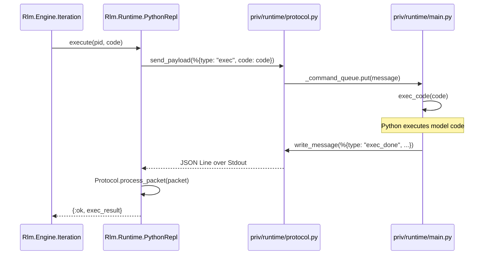
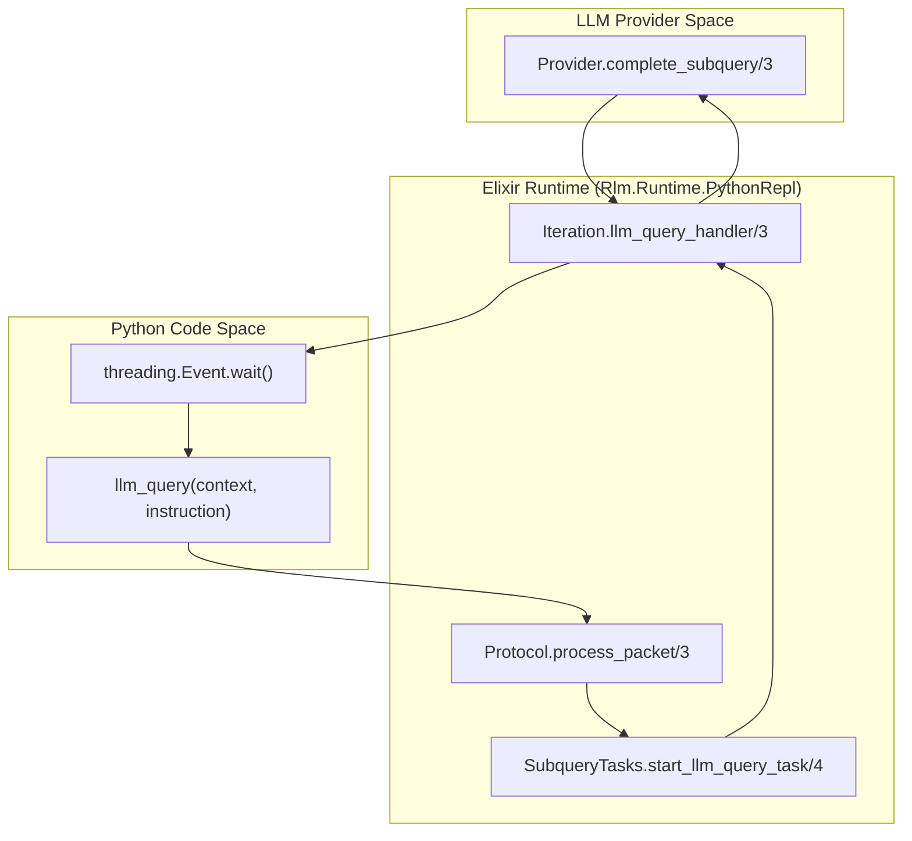

# REPL Lifecycle and Protocol
Relevant source files
- [lib/rlm/engine/finalizer.ex](https://github.com/Cody-W-Tucker/rlm/blob/4bc8e1ba/lib/rlm/engine/finalizer.ex)
- [lib/rlm/engine/iteration.ex](https://github.com/Cody-W-Tucker/rlm/blob/4bc8e1ba/lib/rlm/engine/iteration.ex)
- [lib/rlm/providers/mock.ex](https://github.com/Cody-W-Tucker/rlm/blob/4bc8e1ba/lib/rlm/providers/mock.ex)
- [lib/rlm/runtime/python_repl.ex](https://github.com/Cody-W-Tucker/rlm/blob/4bc8e1ba/lib/rlm/runtime/python_repl.ex)
- [lib/rlm/runtime/python_repl/protocol.ex](https://github.com/Cody-W-Tucker/rlm/blob/4bc8e1ba/lib/rlm/runtime/python_repl/protocol.ex)
- [lib/rlm/runtime/python_repl/runtime_port.ex](https://github.com/Cody-W-Tucker/rlm/blob/4bc8e1ba/lib/rlm/runtime/python_repl/runtime_port.ex)
- [lib/rlm/runtime/python_repl/state.ex](https://github.com/Cody-W-Tucker/rlm/blob/4bc8e1ba/lib/rlm/runtime/python_repl/state.ex)
- [lib/rlm/runtime/python_repl/subquery_tasks.ex](https://github.com/Cody-W-Tucker/rlm/blob/4bc8e1ba/lib/rlm/runtime/python_repl/subquery_tasks.ex)
- [priv/runtime/protocol.py](https://github.com/Cody-W-Tucker/rlm/blob/4bc8e1ba/priv/runtime/protocol.py)

The Python REPL is a persistent subprocess managed by Elixir to execute model-authored code. It maintains a stateful namespace across iterations, allowing the LLM to build upon previous computations, searches, and data analysis. Communication between Elixir and Python is handled via a line-delimited JSON protocol over standard I/O.

## Subprocess Lifecycle

The lifecycle is managed by `Rlm.Runtime.PythonRepl`, a `GenServer` that encapsulates the `Port` and handles asynchronous message multiplexing.

### 1. Initialization and Startup

When `Rlm.Runtime.PythonRepl.start/2` is called, it triggers the following sequence:

1. **Port Opening**: `Rlm.Runtime.PythonRepl.RuntimePort.open/2` spawns the Python executable (defined in `settings.runtime_command`) and points it to the entry script (typically `priv/runtime.py`) [lib/rlm/runtime/python_repl/runtime_port.ex4-22](https://github.com/Cody-W-Tucker/rlm/blob/4bc8e1ba/lib/rlm/runtime/python_repl/runtime_port.ex#L4-L22)
2. **Ready Signal**: The Python side initializes its environment and sends a `{"type": "ready"}` message [lib/rlm/runtime/python_repl.ex42](https://github.com/Cody-W-Tucker/rlm/blob/4bc8e1ba/lib/rlm/runtime/python_repl.ex#L42-L42)
3. **Namespace Setup**: The engine often calls `set_context/2` and `set_file_sources/2` to populate the Python global namespace with the initial data bundle [lib/rlm/runtime/python_repl.ex24-34](https://github.com/Cody-W-Tucker/rlm/blob/4bc8e1ba/lib/rlm/runtime/python_repl.ex#L24-L34)

### 2. Execution Loop

During an iteration, the engine extracts code blocks and sends them to the REPL:

1. **Command**: `Rlm.Runtime.PythonRepl.execute/2` sends an `exec` payload [lib/rlm/runtime/python_repl.ex39-40](https://github.com/Cody-W-Tucker/rlm/blob/4bc8e1ba/lib/rlm/runtime/python_repl.ex#L39-L40)
2. **Processing**: The Python side executes the code, capturing `stdout`, `stderr`, and any calls to the `FINAL()` grounding function.
3. **Completion**: Python returns an `exec_done` message containing the execution results and state metadata [lib/rlm/runtime/python_repl/protocol.ex48-60](https://github.com/Cody-W-Tucker/rlm/blob/4bc8e1ba/lib/rlm/runtime/python_repl/protocol.ex#L48-L60)

### 3. Shutdown

Shutdown occurs gracefully when the `GenServer` is stopped:

1. **Shutdown Message**: Elixir sends `{"type": "shutdown"}`[lib/rlm/runtime/python_repl.ex106](https://github.com/Cody-W-Tucker/rlm/blob/4bc8e1ba/lib/rlm/runtime/python_repl.ex#L106-L106)
2. **Cleanup**: The Python `stdin_reader_loop` receives the message, stops the command queue, and exits [priv/runtime/protocol.py70-72](https://github.com/Cody-W-Tucker/rlm/blob/4bc8e1ba/priv/runtime/protocol.py#L70-L72)
3. **Port Closure**: The Elixir `terminate/2` callback closes the port [lib/rlm/runtime/python_repl.ex107](https://github.com/Cody-W-Tucker/rlm/blob/4bc8e1ba/lib/rlm/runtime/python_repl.ex#L107-L107)

**Sources:**[lib/rlm/runtime/python_repl.ex11-59](https://github.com/Cody-W-Tucker/rlm/blob/4bc8e1ba/lib/rlm/runtime/python_repl.ex#L11-L59)[lib/rlm/runtime/python_repl/runtime_port.ex4-22](https://github.com/Cody-W-Tucker/rlm/blob/4bc8e1ba/lib/rlm/runtime/python_repl/runtime_port.ex#L4-L22)[priv/runtime/protocol.py46-75](https://github.com/Cody-W-Tucker/rlm/blob/4bc8e1ba/priv/runtime/protocol.py#L46-L75)

## Communication Protocol

The protocol uses line-delimited JSON over `stdin` and `stdout`. Each message must be a single JSON object followed by a newline.

### Protocol Message Types

| Message Type | Direction | Purpose |
| --- | --- | --- |
| `ready` | Py -> Ex | Indicates the Python subprocess is fully initialized. |
| `exec` | Ex -> Py | Contains a string of Python `code` to be executed in the persistent namespace. |
| `exec_done` | Py -> Ex | Returns `stdout`, `stderr`, and execution status (`ok`, `error`, `recovered`). |
| `llm_query` | Py -> Ex | A callback requested by Python code to ask the LLM a sub-question. |
| `llm_result` | Ex -> Py | The response to a previous `llm_query`, matched by a unique `id`. |
| `shutdown` | Ex -> Py | Commands the Python subprocess to exit. |

**Sources:**[lib/rlm/runtime/python_repl/protocol.ex43-60](https://github.com/Cody-W-Tucker/rlm/blob/4bc8e1ba/lib/rlm/runtime/python_repl/protocol.ex#L43-L60)[priv/runtime/protocol.py64-74](https://github.com/Cody-W-Tucker/rlm/blob/4bc8e1ba/priv/runtime/protocol.py#L64-L74)[priv/runtime/protocol.py92-99](https://github.com/Cody-W-Tucker/rlm/blob/4bc8e1ba/priv/runtime/protocol.py#L92-L99)

## Sub-query Callbacks (llm_query)

The REPL protocol supports "sub-queries," where Python code can call back into Elixir to request additional LLM reasoning without ending the current execution context.

### Data Flow for Sub-queries

1. **Request**: Python code calls `llm_query(sub_context, instruction)`. This sends an `llm_query` message with a unique `id` to Elixir [priv/runtime/protocol.py77-99](https://github.com/Cody-W-Tucker/rlm/blob/4bc8e1ba/priv/runtime/protocol.py#L77-L99)
2. **Delegation**: `Rlm.Runtime.PythonRepl` receives the message and dispatches a task via `Rlm.Runtime.PythonRepl.SubqueryTasks.start_llm_query_task/4`[lib/rlm/runtime/python_repl/subquery_tasks.ex51-87](https://github.com/Cody-W-Tucker/rlm/blob/4bc8e1ba/lib/rlm/runtime/python_repl/subquery_tasks.ex#L51-L87)
3. **LLM Call**: The `handler` (usually `Rlm.Engine.Iteration.llm_query_handler/3`) calls the LLM provider [lib/rlm/engine/iteration.ex35-52](https://github.com/Cody-W-Tucker/rlm/blob/4bc8e1ba/lib/rlm/engine/iteration.ex#L35-L52)
4. **Response**: Once the LLM responds, Elixir sends an `llm_result` message back to Python [lib/rlm/runtime/python_repl/subquery_tasks.ex7-18](https://github.com/Cody-W-Tucker/rlm/blob/4bc8e1ba/lib/rlm/runtime/python_repl/subquery_tasks.ex#L7-L18)
5. **Resume**: The Python thread waiting on the `threading.Event` for that `id` wakes up and returns the text to the calling Python code [priv/runtime/protocol.py101-114](https://github.com/Cody-W-Tucker/rlm/blob/4bc8e1ba/priv/runtime/protocol.py#L101-L114)

**Sources:**[priv/runtime/protocol.py77-114](https://github.com/Cody-W-Tucker/rlm/blob/4bc8e1ba/priv/runtime/protocol.py#L77-L114)[lib/rlm/runtime/python_repl/subquery_tasks.ex7-87](https://github.com/Cody-W-Tucker/rlm/blob/4bc8e1ba/lib/rlm/runtime/python_repl/subquery_tasks.ex#L7-L87)[lib/rlm/engine/iteration.ex35-52](https://github.com/Cody-W-Tucker/rlm/blob/4bc8e1ba/lib/rlm/engine/iteration.ex#L35-L52)

## Architectural Diagrams

### REPL Control Flow

This diagram maps the Elixir `GenServer` entities to the underlying Python `protocol.py` logic.

**Sources:**[lib/rlm/runtime/python_repl.ex39-41](https://github.com/Cody-W-Tucker/rlm/blob/4bc8e1ba/lib/rlm/runtime/python_repl.ex#L39-L41)[lib/rlm/runtime/python_repl/protocol.ex48-60](https://github.com/Cody-W-Tucker/rlm/blob/4bc8e1ba/lib/rlm/runtime/python_repl/protocol.ex#L48-L60)[priv/runtime/protocol.py40-44](https://github.com/Cody-W-Tucker/rlm/blob/4bc8e1ba/priv/runtime/protocol.py#L40-L44)[priv/runtime/protocol.py46-75](https://github.com/Cody-W-Tucker/rlm/blob/4bc8e1ba/priv/runtime/protocol.py#L46-L75)

### Sub-query Callback Protocol

This diagram bridges the "Natural Language Space" (LLM reasoning) with the "Code Entity Space" (Task management).

**Sources:**[priv/runtime/protocol.py77-114](https://github.com/Cody-W-Tucker/rlm/blob/4bc8e1ba/priv/runtime/protocol.py#L77-L114)[lib/rlm/runtime/python_repl/subquery_tasks.ex51-87](https://github.com/Cody-W-Tucker/rlm/blob/4bc8e1ba/lib/rlm/runtime/python_repl/subquery_tasks.ex#L51-L87)[lib/rlm/engine/iteration.ex35-52](https://github.com/Cody-W-Tucker/rlm/blob/4bc8e1ba/lib/rlm/engine/iteration.ex#L35-L52)[lib/rlm/runtime/python_repl/protocol.ex13-18](https://github.com/Cody-W-Tucker/rlm/blob/4bc8e1ba/lib/rlm/runtime/python_repl/protocol.ex#L13-L18)