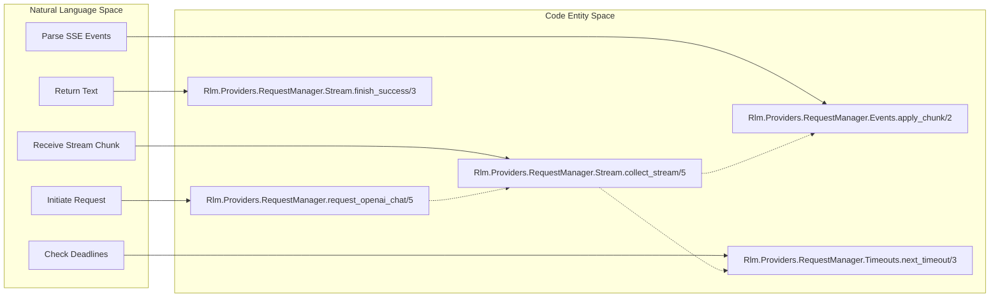
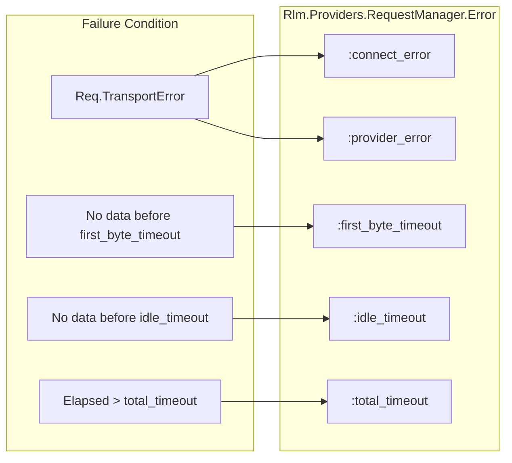

# Request Manager and Streaming
Relevant source files
- [lib/rlm/providers/openai.ex](https://github.com/Cody-W-Tucker/rlm/blob/4bc8e1ba/lib/rlm/providers/openai.ex)
- [lib/rlm/providers/request_manager.ex](https://github.com/Cody-W-Tucker/rlm/blob/4bc8e1ba/lib/rlm/providers/request_manager.ex)
- [lib/rlm/providers/request_manager/events.ex](https://github.com/Cody-W-Tucker/rlm/blob/4bc8e1ba/lib/rlm/providers/request_manager/events.ex)
- [lib/rlm/providers/request_manager/stream.ex](https://github.com/Cody-W-Tucker/rlm/blob/4bc8e1ba/lib/rlm/providers/request_manager/stream.ex)
- [lib/rlm/providers/request_manager/timeouts.ex](https://github.com/Cody-W-Tucker/rlm/blob/4bc8e1ba/lib/rlm/providers/request_manager/timeouts.ex)
- [test/rlm/providers/request_manager_test.exs](https://github.com/Cody-W-Tucker/rlm/blob/4bc8e1ba/test/rlm/providers/request_manager_test.exs)

The `Rlm.Providers.RequestManager` serves as the robust communication layer between the RLM engine and LLM providers. It is specifically designed to handle long-running, streamed HTTP requests with multi-layered timeout logic, ensuring that the system can recover partial responses even when a request fails or exceeds its time budget.

## Overview and Implementation

The `RequestManager` leverages Elixir's concurrency primitives to manage HTTP streaming. It wraps the `Req` library, executing requests within a `Task` supervised by `Rlm.TaskSupervisor`[lib/rlm/providers/request_manager.ex20-22](https://github.com/Cody-W-Tucker/rlm/blob/4bc8e1ba/lib/rlm/providers/request_manager.ex#L20-L22) This allows the manager to monitor the stream's liveness independently of the underlying HTTP client's internal timeouts.

### Data Flow and Streaming

When `request_openai_chat/5` is called, it initiates a POST request with `:stream` set to `true`[lib/rlm/providers/request_manager.ex24](https://github.com/Cody-W-Tucker/rlm/blob/4bc8e1ba/lib/rlm/providers/request_manager.ex#L24-L24) As chunks of data arrive, they are sent back to the parent process as `{:provider_stream_chunk, request_ref, data}`[lib/rlm/providers/request_manager.ex30](https://github.com/Cody-W-Tucker/rlm/blob/4bc8e1ba/lib/rlm/providers/request_manager.ex#L30-L30)

The `Rlm.Providers.RequestManager.Stream` module orchestrates the collection of these chunks using a recursive `receive` loop [lib/rlm/providers/request_manager/stream.ex11-72](https://github.com/Cody-W-Tucker/rlm/blob/4bc8e1ba/lib/rlm/providers/request_manager/stream.ex#L11-L72)

### Entity Mapping: Request Lifecycle

The following diagram maps the logical streaming phases to the specific Elixir modules and functions responsible for their execution.

**Request Manager Flow**



**Sources:**[lib/rlm/providers/request_manager.ex15-41](https://github.com/Cody-W-Tucker/rlm/blob/4bc8e1ba/lib/rlm/providers/request_manager.ex#L15-L41)[lib/rlm/providers/request_manager/stream.ex8-22](https://github.com/Cody-W-Tucker/rlm/blob/4bc8e1ba/lib/rlm/providers/request_manager/stream.ex#L8-L22)[lib/rlm/providers/request_manager/events.ex6-9](https://github.com/Cody-W-Tucker/rlm/blob/4bc8e1ba/lib/rlm/providers/request_manager/events.ex#L6-L9)[lib/rlm/providers/request_manager/timeouts.ex23-28](https://github.com/Cody-W-Tucker/rlm/blob/4bc8e1ba/lib/rlm/providers/request_manager/timeouts.ex#L23-L28)

## Multi-Layered Timeouts

Rlm implements four distinct timeout layers to ensure the engine never hangs indefinitely on a stalled provider. These are configured via the `Rlm.Settings` struct.

| Timeout Type | Code Symbol | Description |
| --- | --- | --- |
| **Connect** | `connect_timeout` | Time allowed to establish the TCP/TLS connection [lib/rlm/providers/request_manager.ex28](https://github.com/Cody-W-Tucker/rlm/blob/4bc8e1ba/lib/rlm/providers/request_manager.ex#L28-L28) |
| **First Byte** | `first_byte_timeout` | Time allowed from request start until the first chunk of data is received [lib/rlm/providers/request_manager/timeouts.ex41](https://github.com/Cody-W-Tucker/rlm/blob/4bc8e1ba/lib/rlm/providers/request_manager/timeouts.ex#L41-L41) |
| **Idle** | `idle_timeout` | Maximum gap allowed between two consecutive data chunks [lib/rlm/providers/request_manager/timeouts.ex41](https://github.com/Cody-W-Tucker/rlm/blob/4bc8e1ba/lib/rlm/providers/request_manager/timeouts.ex#L41-L41) |
| **Total** | `total_timeout` | Hard deadline for the entire request, regardless of stream activity [lib/rlm/providers/request_manager/timeouts.ex33-34](https://github.com/Cody-W-Tucker/rlm/blob/4bc8e1ba/lib/rlm/providers/request_manager/timeouts.ex#L33-L34) |

The `Timeouts.next_timeout/3` function dynamically calculates the next `receive` timeout by comparing the remaining `total_timeout` against the relevant liveness timeout (`first_byte` vs `idle`) [lib/rlm/providers/request_manager/timeouts.ex23-28](https://github.com/Cody-W-Tucker/rlm/blob/4bc8e1ba/lib/rlm/providers/request_manager/timeouts.ex#L23-L28)

**Sources:**[lib/rlm/providers/request_manager/timeouts.ex23-52](https://github.com/Cody-W-Tucker/rlm/blob/4bc8e1ba/lib/rlm/providers/request_manager/timeouts.ex#L23-L52)[test/rlm/providers/request_manager_test.exs15-18](https://github.com/Cody-W-Tucker/rlm/blob/4bc8e1ba/test/rlm/providers/request_manager_test.exs#L15-L18)

## SSE Event Parsing

The `Rlm.Providers.RequestManager.Events` module handles the parsing of Server-Sent Events (SSE). It buffers incoming binary chunks and splits them by double-newlines (`\n\n`) to isolate individual events [lib/rlm/providers/request_manager/events.ex57-64](https://github.com/Cody-W-Tucker/rlm/blob/4bc8e1ba/lib/rlm/providers/request_manager/events.ex#L57-L64)

### Extraction Logic

The system supports multiple OpenAI-compatible formats:

1. **Standard Chat Completions**: Extracts `choices[].delta.content`[lib/rlm/providers/request_manager/events.ex66-70](https://github.com/Cody-W-Tucker/rlm/blob/4bc8e1ba/lib/rlm/providers/request_manager/events.ex#L66-L70)
2. **Responses API**: Extracts `delta` from `response.output_text.delta` events [lib/rlm/providers/request_manager/events.ex85-87](https://github.com/Cody-W-Tucker/rlm/blob/4bc8e1ba/lib/rlm/providers/request_manager/events.ex#L85-L87)
3. **Complex Content**: Handles content provided as lists of text parts [lib/rlm/providers/request_manager/events.ex104-110](https://github.com/Cody-W-Tucker/rlm/blob/4bc8e1ba/lib/rlm/providers/request_manager/events.ex#L104-L110)

If a JSON chunk is malformed, the manager returns a `:provider_response_error` but preserves whatever text was successfully parsed up to that point [lib/rlm/providers/request_manager/events.ex46-53](https://github.com/Cody-W-Tucker/rlm/blob/4bc8e1ba/lib/rlm/providers/request_manager/events.ex#L46-L53)

**Sources:**[lib/rlm/providers/request_manager/events.ex6-55](https://github.com/Cody-W-Tucker/rlm/blob/4bc8e1ba/lib/rlm/providers/request_manager/events.ex#L6-L55)[lib/rlm/providers/request_manager/events.ex66-123](https://github.com/Cody-W-Tucker/rlm/blob/4bc8e1ba/lib/rlm/providers/request_manager/events.ex#L66-L123)

## Error Handling and Partial Capture

A critical feature of the `RequestManager` is its ability to salvage "partial text" during a failure. This is encapsulated in the `Rlm.Providers.RequestManager.Error` struct.

### The Error Struct

```
defstruct [:class, :message, partial_text: ""]
```

[lib/rlm/providers/request_manager.ex10](https://github.com/Cody-W-Tucker/rlm/blob/4bc8e1ba/lib/rlm/providers/request_manager.ex#L10-L10)

When a timeout or transport error occurs, the `Stream` module captures the current `state.text` and includes it in the error struct [lib/rlm/providers/request_manager/stream.ex69](https://github.com/Cody-W-Tucker/rlm/blob/4bc8e1ba/lib/rlm/providers/request_manager/stream.ex#L69-L69) This allows the `Rlm.Engine` to potentially use the truncated response (e.g., if the model had already finished writing a code block before the connection dropped).

### Error Classification

The following diagram shows how transport and liveness errors are mapped to specific error classes.

**Error Classification Logic**



**Sources:**[lib/rlm/providers/request_manager/timeouts.ex6-21](https://github.com/Cody-W-Tucker/rlm/blob/4bc8e1ba/lib/rlm/providers/request_manager/timeouts.ex#L6-L21)[lib/rlm/providers/request_manager/timeouts.ex30-38](https://github.com/Cody-W-Tucker/rlm/blob/4bc8e1ba/lib/rlm/providers/request_manager/timeouts.ex#L30-L38)[lib/rlm/providers/request_manager/stream.ex63-71](https://github.com/Cody-W-Tucker/rlm/blob/4bc8e1ba/lib/rlm/providers/request_manager/stream.ex#L63-L71)

### Formatting for Runtime

Errors are converted to human-readable strings for the engine's iteration feedback via `format_error_for_runtime/1`. If partial text exists, it appends a notification: *"Partial output was retained for recovery."*[lib/rlm/providers/request_manager.ex43-52](https://github.com/Cody-W-Tucker/rlm/blob/4bc8e1ba/lib/rlm/providers/request_manager.ex#L43-L52)

**Sources:**[lib/rlm/providers/request_manager.ex43-52](https://github.com/Cody-W-Tucker/rlm/blob/4bc8e1ba/lib/rlm/providers/request_manager.ex#L43-L52)[test/rlm/providers/request_manager_test.exs73-97](https://github.com/Cody-W-Tucker/rlm/blob/4bc8e1ba/test/rlm/providers/request_manager_test.exs#L73-L97)