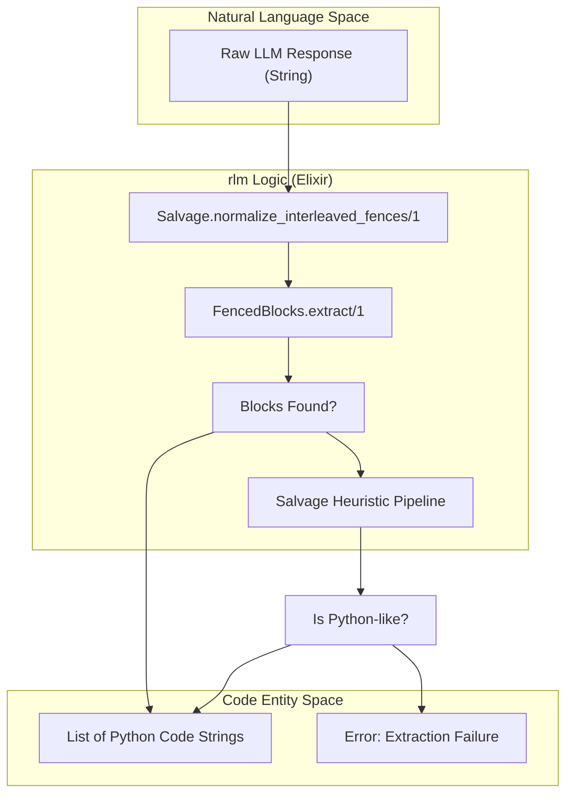
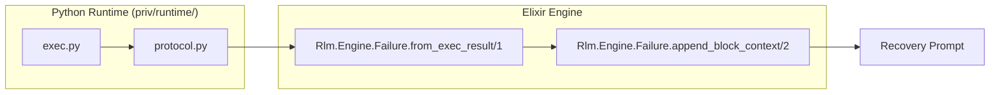

# Response Extraction and Salvage
Relevant source files
- [lib/rlm/engine/failure.ex](https://github.com/Cody-W-Tucker/rlm/blob/4bc8e1ba/lib/rlm/engine/failure.ex)
- [lib/rlm/engine/prompt/recovery_constraints.ex](https://github.com/Cody-W-Tucker/rlm/blob/4bc8e1ba/lib/rlm/engine/prompt/recovery_constraints.ex)
- [lib/rlm/engine/response/extractor.ex](https://github.com/Cody-W-Tucker/rlm/blob/4bc8e1ba/lib/rlm/engine/response/extractor.ex)
- [lib/rlm/engine/response/fenced_blocks.ex](https://github.com/Cody-W-Tucker/rlm/blob/4bc8e1ba/lib/rlm/engine/response/fenced_blocks.ex)
- [lib/rlm/engine/response/salvage.ex](https://github.com/Cody-W-Tucker/rlm/blob/4bc8e1ba/lib/rlm/engine/response/salvage.ex)
- [test/fixtures/provider_responses/malformed_interleaved_unclosed_tail.txt](https://github.com/Cody-W-Tucker/rlm/blob/4bc8e1ba/test/fixtures/provider_responses/malformed_interleaved_unclosed_tail.txt)
- [test/fixtures/provider_responses/typo_multiblock_runtime_error.txt](https://github.com/Cody-W-Tucker/rlm/blob/4bc8e1ba/test/fixtures/provider_responses/typo_multiblock_runtime_error.txt)
- [test/fixtures/provider_responses/wild_staged_plan.txt](https://github.com/Cody-W-Tucker/rlm/blob/4bc8e1ba/test/fixtures/provider_responses/wild_staged_plan.txt)
- [test/rlm/engine/core_runtime_test.exs](https://github.com/Cody-W-Tucker/rlm/blob/4bc8e1ba/test/rlm/engine/core_runtime_test.exs)

The **Response Extraction and Salvage** subsystem is responsible for transforming raw, unstructured text from an LLM provider into a sequence of executable Python code blocks. Because LLMs frequently deviate from strict Markdown formatting—producing unclosed fences, interleaved prose, or plain code without delimiters—`rlm` employs a multi-stage pipeline to recover valid logic from malformed responses.

## Extraction Pipeline

The extraction process is coordinated by `Rlm.Engine.Response.Extractor`[lib/rlm/engine/response/extractor.ex1-36](https://github.com/Cody-W-Tucker/rlm/blob/4bc8e1ba/lib/rlm/engine/response/extractor.ex#L1-L36) It attempts a standard parse first and falls back to a heuristic "salvage" mode if no valid fenced blocks are found.

### Data Flow: Raw Text to Python Blocks

The following diagram illustrates how the `Extractor` uses `FencedBlocks` and `Salvage` modules to process provider output.

**Figure 1: Extraction Logic Flow**



Sources: [lib/rlm/engine/response/extractor.ex7-35](https://github.com/Cody-W-Tucker/rlm/blob/4bc8e1ba/lib/rlm/engine/response/extractor.ex#L7-L35)[lib/rlm/engine/response/salvage.ex10-16](https://github.com/Cody-W-Tucker/rlm/blob/4bc8e1ba/lib/rlm/engine/response/salvage.ex#L10-L16)

## Standard Extraction (FencedBlocks)

The `Rlm.Engine.Response.FencedBlocks` module performs a linear scan of the response text to identify Markdown-style code blocks [lib/rlm/engine/response/fenced_blocks.ex6-44](https://github.com/Cody-W-Tucker/rlm/blob/4bc8e1ba/lib/rlm/engine/response/fenced_blocks.ex#L6-L44)

1. **Fence Detection**: It identifies blocks starting with ````` and an optional language identifier (e.g., `python`, `py`, `repl`) [lib/rlm/engine/response/fenced_blocks.ex11-13](https://github.com/Cody-W-Tucker/rlm/blob/4bc8e1ba/lib/rlm/engine/response/fenced_blocks.ex#L11-L13)
2. **Unclosed Tail Handling**: If the response ends before a closing ````` is found, the module still captures the final block [lib/rlm/engine/response/fenced_blocks.ex28-32](https://github.com/Cody-W-Tucker/rlm/blob/4bc8e1ba/lib/rlm/engine/response/fenced_blocks.ex#L28-L32)
3. **Validation**: Extracted blocks are only kept if they are explicitly marked as Python or if they "look like" Python based on the presence of `rlm`-specific functions like `FINAL()` or `llm_query()`[lib/rlm/engine/response/fenced_blocks.ex34-43](https://github.com/Cody-W-Tucker/rlm/blob/4bc8e1ba/lib/rlm/engine/response/fenced_blocks.ex#L34-L43)

## Salvage Heuristics

When the standard extractor fails, the `Salvage` module applies a pipeline of transformations to recover code hidden in prose [lib/rlm/engine/response/salvage.ex1-76](https://github.com/Cody-W-Tucker/rlm/blob/4bc8e1ba/lib/rlm/engine/response/salvage.ex#L1-L76)

| Function | Purpose |
| --- | --- |
| `normalize_interleaved_fences/1` | Fixes common LLM errors where multiple fences are nested or improperly stacked [lib/rlm/engine/response/salvage.ex10-16](https://github.com/Cody-W-Tucker/rlm/blob/4bc8e1ba/lib/rlm/engine/response/salvage.ex#L10-L16) |
| `first_likely_fenced_block/1` | Uses Regex to find any content between backticks, even if the language tag is missing [lib/rlm/engine/response/salvage.ex18-32](https://github.com/Cody-W-Tucker/rlm/blob/4bc8e1ba/lib/rlm/engine/response/salvage.ex#L18-L32) |
| `salvage_python_tail/1` | Identifies the first line that looks like Python and discards all preceding prose [lib/rlm/engine/response/salvage.ex34-41](https://github.com/Cody-W-Tucker/rlm/blob/4bc8e1ba/lib/rlm/engine/response/salvage.ex#L34-L41) |
| `sanitize_code_block/1` | Removes stray fence lines (e.g., ````python`) that may have been accidentally included inside the code body [lib/rlm/engine/response/salvage.ex43-49](https://github.com/Cody-W-Tucker/rlm/blob/4bc8e1ba/lib/rlm/engine/response/salvage.ex#L43-L49) |
| `looks_like_python?/1` | Heuristic check for Python keywords (`import`, `def`, `if`) or `rlm` primitives (`FINAL`, `read_file`) [lib/rlm/engine/response/salvage.ex51-63](https://github.com/Cody-W-Tucker/rlm/blob/4bc8e1ba/lib/rlm/engine/response/salvage.ex#L51-L63) |

Sources: [lib/rlm/engine/response/salvage.ex1-76](https://github.com/Cody-W-Tucker/rlm/blob/4bc8e1ba/lib/rlm/engine/response/salvage.ex#L1-L76)

## Failure Classification and Context

If extraction succeeds but the resulting code fails during execution in the Python REPL, `Rlm.Engine.Failure` classifies the error [lib/rlm/engine/failure.ex1-27](https://github.com/Cody-W-Tucker/rlm/blob/4bc8e1ba/lib/rlm/engine/failure.ex#L1-L27) If the error occurs in a response containing multiple blocks, the engine appends context to the failure message to help the LLM identify the specific failing block [lib/rlm/engine/failure.ex85-102](https://github.com/Cody-W-Tucker/rlm/blob/4bc8e1ba/lib/rlm/engine/failure.ex#L85-L102)

**Figure 2: Runtime Error Attribution**



Sources: [lib/rlm/engine/failure.ex29-50](https://github.com/Cody-W-Tucker/rlm/blob/4bc8e1ba/lib/rlm/engine/failure.ex#L29-L50)[lib/rlm/engine/failure.ex85-102](https://github.com/Cody-W-Tucker/rlm/blob/4bc8e1ba/lib/rlm/engine/failure.ex#L85-L102)

## Recovery Constraints Loop

When a response is malformed or execution fails, the engine triggers a recovery iteration. The `Rlm.Engine.Prompt.RecoveryConstraints` module generates specific instructions for the LLM to prevent repeated errors [lib/rlm/engine/prompt/recovery_constraints.ex4-23](https://github.com/Cody-W-Tucker/rlm/blob/4bc8e1ba/lib/rlm/engine/prompt/recovery_constraints.ex#L4-L23)

Common constraints include:

- **Recovery Mode**: Encourages direct reasoning and narrow sub-queries instead of broad exploration [lib/rlm/engine/prompt/recovery_constraints.ex6-9](https://github.com/Cody-W-Tucker/rlm/blob/4bc8e1ba/lib/rlm/engine/prompt/recovery_constraints.ex#L6-L9)
- **Async Disabled**: If a previous iteration failed due to `asyncio` syntax errors or race conditions, the model is instructed to use synchronous code [lib/rlm/engine/prompt/recovery_constraints.ex11-14](https://github.com/Cody-W-Tucker/rlm/blob/4bc8e1ba/lib/rlm/engine/prompt/recovery_constraints.ex#L11-L14)
- **Broad Sub-queries Disabled**: Prevents the model from attempting parallel "fan-out" strategies if they previously caused budget or context exhaustion [lib/rlm/engine/prompt/recovery_constraints.ex15-19](https://github.com/Cody-W-Tucker/rlm/blob/4bc8e1ba/lib/rlm/engine/prompt/recovery_constraints.ex#L15-L19)

Sources: [lib/rlm/engine/prompt/recovery_constraints.ex1-25](https://github.com/Cody-W-Tucker/rlm/blob/4bc8e1ba/lib/rlm/engine/prompt/recovery_constraints.ex#L1-L25)