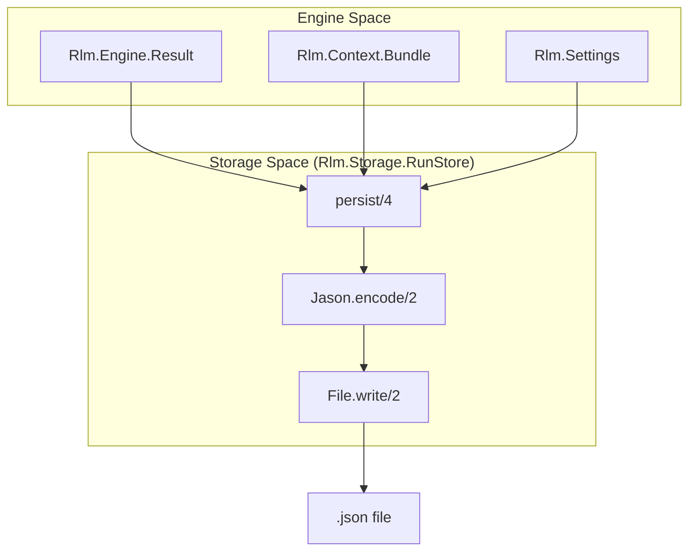
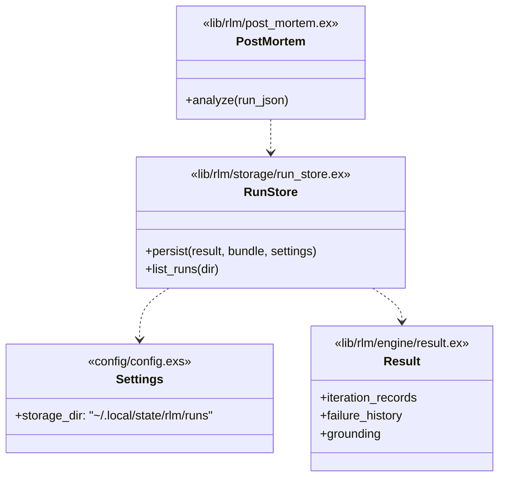

# Run Storage
Relevant source files
- [config/config.exs](https://github.com/Cody-W-Tucker/rlm/blob/4bc8e1ba/config/config.exs)
- [lib/rlm/storage/run_store.ex](https://github.com/Cody-W-Tucker/rlm/blob/4bc8e1ba/lib/rlm/storage/run_store.ex)
- [test/rlm/storage/run_store_test.exs](https://github.com/Cody-W-Tucker/rlm/blob/4bc8e1ba/test/rlm/storage/run_store_test.exs)

The `Rlm.Storage.RunStore` module provides a persistence layer for the `rlm` engine, ensuring that every execution—whether successful or failed—is captured as a structured JSON artifact. These artifacts serve as the primary data source for the post-mortem diagnostic pipeline and regression analysis.

## Overview

Run Storage is responsible for serializing the `Rlm.Engine.Result` struct and associated metadata into timestamped files on the local filesystem. By default, these files are stored in `~/.local/state/rlm/runs`[config/config.exs23](https://github.com/Cody-W-Tucker/rlm/blob/4bc8e1ba/config/config.exs#L23-L23)

The storage system captures not just the final answer, but the entire trace of the run, including every iteration's code execution, LLM responses, grounding grades, and failure recovery attempts.

### Data Flow: Persistence Pipeline

The following diagram illustrates how the `Rlm.Engine` output is transformed and persisted by `RunStore`.

**Run Persistence Flow**

**Sources:**[lib/rlm/storage/run_store.ex8-55](https://github.com/Cody-W-Tucker/rlm/blob/4bc8e1ba/lib/rlm/storage/run_store.ex#L8-L55)[test/rlm/storage/run_store_test.exs27-28](https://github.com/Cody-W-Tucker/rlm/blob/4bc8e1ba/test/rlm/storage/run_store_test.exs#L27-L28)

## Implementation Details

### File Naming Convention

Files are named using a combination of a UTC timestamp (ISO8601 format stripped of non-numeric characters) and a unique integer to prevent collisions during high-frequency execution [lib/rlm/storage/run_store.ex11-21](https://github.com/Cody-W-Tucker/rlm/blob/4bc8e1ba/lib/rlm/storage/run_store.ex#L11-L21)

- **Format:**`run-{YYYYMMDDTHHMMSS}-{unique_id}.json`

### The Storage Schema

The `RunStore` uses a versioned schema (currently version `1`) to allow for future migrations [lib/rlm/storage/run_store.ex4-6](https://github.com/Cody-W-Tucker/rlm/blob/4bc8e1ba/lib/rlm/storage/run_store.ex#L4-L6) The `persist/4` function constructs a map containing the following key fields:

| Field | Description | Source |
| --- | --- | --- |
| `run_schema_version` | Integer version of the JSON structure. | [lib/rlm/storage/run_store.ex24](https://github.com/Cody-W-Tucker/rlm/blob/4bc8e1ba/lib/rlm/storage/run_store.ex#L24-L24) |
| `prompt` | The original user input/question. | [lib/rlm/storage/run_store.ex25](https://github.com/Cody-W-Tucker/rlm/blob/4bc8e1ba/lib/rlm/storage/run_store.ex#L25-L25) |
| `status` | The final status (e.g., `:completed`, `:failed`). | [lib/rlm/storage/run_store.ex26](https://github.com/Cody-W-Tucker/rlm/blob/4bc8e1ba/lib/rlm/storage/run_store.ex#L26-L26) |
| `answer` | The final text response generated by the model. | [lib/rlm/storage/run_store.ex28](https://github.com/Cody-W-Tucker/rlm/blob/4bc8e1ba/lib/rlm/storage/run_store.ex#L28-L28) |
| `grounding` | The structural and semantic grounding grades. | [lib/rlm/storage/run_store.ex38](https://github.com/Cody-W-Tucker/rlm/blob/4bc8e1ba/lib/rlm/storage/run_store.ex#L38-L38) |
| `iteration_records` | Full trace of every iteration (code, stdout, events). | [lib/rlm/storage/run_store.ex48](https://github.com/Cody-W-Tucker/rlm/blob/4bc8e1ba/lib/rlm/storage/run_store.ex#L48-L48) |
| `failure_history` | Log of all `Rlm.Failure` structs encountered. | [lib/rlm/storage/run_store.ex40](https://github.com/Cody-W-Tucker/rlm/blob/4bc8e1ba/lib/rlm/storage/run_store.ex#L40-L40) |
| `compass` | The internal Compass judgment and reasoning. | [lib/rlm/storage/run_store.ex36](https://github.com/Cody-W-Tucker/rlm/blob/4bc8e1ba/lib/rlm/storage/run_store.ex#L36-L36) |
| `token_counts` | `input_tokens` and `output_tokens` for cost tracking. | [lib/rlm/storage/run_store.ex31-32](https://github.com/Cody-W-Tucker/rlm/blob/4bc8e1ba/lib/rlm/storage/run_store.ex#L31-L32) |
| `context_sources` | List of labels for all files/URLs in the context bundle. | [lib/rlm/storage/run_store.ex44](https://github.com/Cody-W-Tucker/rlm/blob/4bc8e1ba/lib/rlm/storage/run_store.ex#L44-L44) |

**Sources:**[lib/rlm/storage/run_store.ex23-49](https://github.com/Cody-W-Tucker/rlm/blob/4bc8e1ba/lib/rlm/storage/run_store.ex#L23-L49)[test/rlm/storage/run_store_test.exs31-38](https://github.com/Cody-W-Tucker/rlm/blob/4bc8e1ba/test/rlm/storage/run_store_test.exs#L31-L38)

## Key Functions

### `persist/4`

`persist(result, context_bundle, settings, opts \\ [])`[lib/rlm/storage/run_store.ex8](https://github.com/Cody-W-Tucker/rlm/blob/4bc8e1ba/lib/rlm/storage/run_store.ex#L8-L8)
This is the primary entry point. It:

1. Ensures the `storage_dir` exists via `File.mkdir_p/1`[lib/rlm/storage/run_store.ex9](https://github.com/Cody-W-Tucker/rlm/blob/4bc8e1ba/lib/rlm/storage/run_store.ex#L9-L9)
2. Aggregates data from the `Result`, `Bundle`, and `Settings` structs [lib/rlm/storage/run_store.ex23-49](https://github.com/Cody-W-Tucker/rlm/blob/4bc8e1ba/lib/rlm/storage/run_store.ex#L23-L49)
3. Serializes the map to a pretty-printed JSON string using `Jason`[lib/rlm/storage/run_store.ex51](https://github.com/Cody-W-Tucker/rlm/blob/4bc8e1ba/lib/rlm/storage/run_store.ex#L51-L51)
4. Writes the file to disk and returns `{:ok, path}`[lib/rlm/storage/run_store.ex52-53](https://github.com/Cody-W-Tucker/rlm/blob/4bc8e1ba/lib/rlm/storage/run_store.ex#L52-L53)

### `list_runs/1`

`list_runs(storage_dir)`[lib/rlm/storage/run_store.ex57](https://github.com/Cody-W-Tucker/rlm/blob/4bc8e1ba/lib/rlm/storage/run_store.ex#L57-L57)
Retrieves a list of all persisted run files in descending order (newest first).

1. Filters for files ending in `.json`[lib/rlm/storage/run_store.ex61](https://github.com/Cody-W-Tucker/rlm/blob/4bc8e1ba/lib/rlm/storage/run_store.ex#L61-L61)
2. Sorts by filename (which, due to the timestamp prefix, effectively sorts by time) [lib/rlm/storage/run_store.ex62](https://github.com/Cody-W-Tucker/rlm/blob/4bc8e1ba/lib/rlm/storage/run_store.ex#L62-L62)
3. Returns full system paths [lib/rlm/storage/run_store.ex63](https://github.com/Cody-W-Tucker/rlm/blob/4bc8e1ba/lib/rlm/storage/run_store.ex#L63-L63)

**Sources:**[lib/rlm/storage/run_store.ex8-68](https://github.com/Cody-W-Tucker/rlm/blob/4bc8e1ba/lib/rlm/storage/run_store.ex#L8-L68)

## Relationship to Code Entities

The following diagram maps the logical storage concepts to the specific Elixir modules and filesystem locations.

**Code Entity Mapping**

**Sources:**[lib/rlm/storage/run_store.ex1-69](https://github.com/Cody-W-Tucker/rlm/blob/4bc8e1ba/lib/rlm/storage/run_store.ex#L1-L69)[config/config.exs23](https://github.com/Cody-W-Tucker/rlm/blob/4bc8e1ba/config/config.exs#L23-L23)[test/rlm/storage/run_store_test.exs7-38](https://github.com/Cody-W-Tucker/rlm/blob/4bc8e1ba/test/rlm/storage/run_store_test.exs#L7-L38)