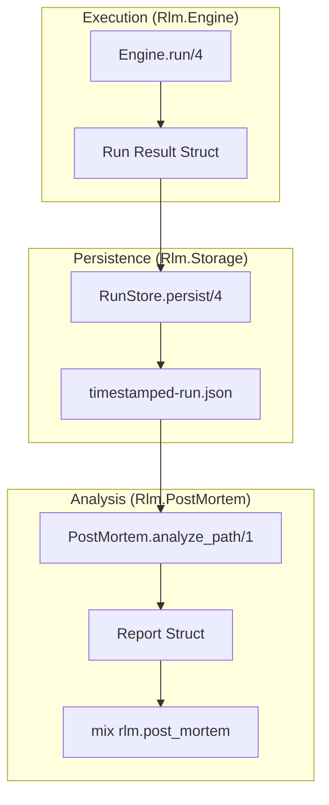
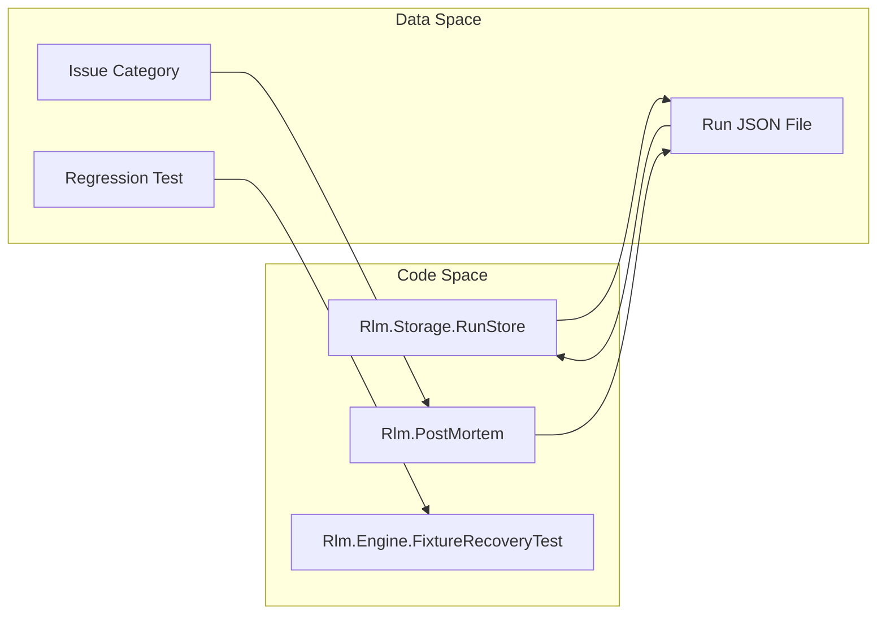

# Storage and Post-Mortem Analysis
Relevant source files
- [lib/rlm/post_mortem.ex](https://github.com/Cody-W-Tucker/rlm/blob/4bc8e1ba/lib/rlm/post_mortem.ex)
- [lib/rlm/storage/run_store.ex](https://github.com/Cody-W-Tucker/rlm/blob/4bc8e1ba/lib/rlm/storage/run_store.ex)
- [test/rlm/engine/fixture_recovery_test.exs](https://github.com/Cody-W-Tucker/rlm/blob/4bc8e1ba/test/rlm/engine/fixture_recovery_test.exs)
- [test/rlm/post_mortem_test.exs](https://github.com/Cody-W-Tucker/rlm/blob/4bc8e1ba/test/rlm/post_mortem_test.exs)
- [test/rlm/storage/run_store_test.exs](https://github.com/Cody-W-Tucker/rlm/blob/4bc8e1ba/test/rlm/storage/run_store_test.exs)
- [test/support/postmortem_test_providers.ex](https://github.com/Cody-W-Tucker/rlm/blob/4bc8e1ba/test/support/postmortem_test_providers.ex)

This section covers how `rlm` persists the results of its Generate-Execute-Verify loops and how those results are analyzed to identify system regressions, grounding failures, and improvement opportunities. The system transitions from a live execution state to a structured JSON trace, which then feeds into a diagnostic pipeline.

## Overview

The `rlm` storage and analysis pipeline ensures that every model interaction, code execution, and grounding decision is auditable. When a run completes (or fails), the `Rlm.Engine` results are handed to the storage layer to be serialized. Subsequently, the post-mortem system scans these persisted traces to categorize issues and suggest improvements to the engine's prompts or recovery strategies.

### Diagnostic Flow

The following diagram illustrates the lifecycle of a run from execution to diagnostic report:

**Run Persistence and Analysis Pipeline**

**Sources:**[lib/rlm/storage/run_store.ex8-55](https://github.com/Cody-W-Tucker/rlm/blob/4bc8e1ba/lib/rlm/storage/run_store.ex#L8-L55)[lib/rlm/post_mortem.ex9-14](https://github.com/Cody-W-Tucker/rlm/blob/4bc8e1ba/lib/rlm/post_mortem.ex#L9-L14)

---

## Run Storage

The `Rlm.Storage.RunStore` module is responsible for taking the final output of an engine execution and writing it to a local filesystem. Runs are stored as pretty-printed JSON files in a directory defined by the `storage_dir` setting [lib/rlm/storage/run_store.ex8-21](https://github.com/Cody-W-Tucker/rlm/blob/4bc8e1ba/lib/rlm/storage/run_store.ex#L8-L21)

### Stored Metadata

Each JSON file contains a comprehensive trace of the run, including:

- **Execution Trace**: All `iteration_records` (stdout, stderr, status) and the `failure_history`[lib/rlm/storage/run_store.ex40-48](https://github.com/Cody-W-Tucker/rlm/blob/4bc8e1ba/lib/rlm/storage/run_store.ex#L40-L48)
- **Grounding Data**: The final `grounding` grade and metrics [lib/rlm/storage/run_store.ex38](https://github.com/Cody-W-Tucker/rlm/blob/4bc8e1ba/lib/rlm/storage/run_store.ex#L38-L38)
- **Context Snapshot**: Labels and byte counts of the sources provided to the model [lib/rlm/storage/run_store.ex44-46](https://github.com/Cody-W-Tucker/rlm/blob/4bc8e1ba/lib/rlm/storage/run_store.ex#L44-L46)
- **Model Output**: The final `answer`, `compass` judgment, and token usage [lib/rlm/storage/run_store.ex28-36](https://github.com/Cody-W-Tucker/rlm/blob/4bc8e1ba/lib/rlm/storage/run_store.ex#L28-L36)

For details on the JSON schema and retrieval methods, see [Run Storage](/Cody-W-Tucker/rlm/7.1-run-storage).

**Sources:**[lib/rlm/storage/run_store.ex23-49](https://github.com/Cody-W-Tucker/rlm/blob/4bc8e1ba/lib/rlm/storage/run_store.ex#L23-L49)[test/rlm/storage/run_store_test.exs7-38](https://github.com/Cody-W-Tucker/rlm/blob/4bc8e1ba/test/rlm/storage/run_store_test.exs#L7-L38)

---

## Post-Mortem Analysis

The `Rlm.PostMortem` module provides a diagnostic layer that scans stored runs to identify patterns of failure or inefficiency. It categorizes runs into four primary "issue families": **Reliability**, **Runtime**, **Grounding**, and **Strategy**[lib/rlm/post_mortem.ex1-5](https://github.com/Cody-W-Tucker/rlm/blob/4bc8e1ba/lib/rlm/post_mortem.ex#L1-L5)

### Core Capabilities

- **Issue Categorization**: Detects specific problems like `provider_timeout`, `python_exec_error`, or `weak_read_coverage`[test/rlm/post_mortem_test.exs57-61](https://github.com/Cody-W-Tucker/rlm/blob/4bc8e1ba/test/rlm/post_mortem_test.exs#L57-L61)
- **Regression Candidates**: Automatically generates test cases based on failures (e.g., creating a fixture for a specific Python typo) [lib/rlm/post_mortem.ex159](https://github.com/Cody-W-Tucker/rlm/blob/4bc8e1ba/lib/rlm/post_mortem.ex#L159-L159)
- **Improvement Ideas**: Suggests engine-level changes, such as `force_read_promotion` when grounding is insufficient [test/rlm/post_mortem_test.exs68-70](https://github.com/Cody-W-Tucker/rlm/blob/4bc8e1ba/test/rlm/post_mortem_test.exs#L68-L70)
- **Review Queue**: Ranks runs by priority to help developers focus on the most impactful failures [lib/rlm/post_mortem.ex104](https://github.com/Cody-W-Tucker/rlm/blob/4bc8e1ba/lib/rlm/post_mortem.ex#L104-L104)

For details on the analysis logic and the `mix rlm.post_mortem` task, see [Post-Mortem Analysis](/Cody-W-Tucker/rlm/7.2-post-mortem-analysis).

**Sources:**[lib/rlm/post_mortem.ex83-129](https://github.com/Cody-W-Tucker/rlm/blob/4bc8e1ba/lib/rlm/post_mortem.ex#L83-L129)[test/rlm/post_mortem_test.exs7-87](https://github.com/Cody-W-Tucker/rlm/blob/4bc8e1ba/test/rlm/post_mortem_test.exs#L7-L87)

---

## System Mapping: Data to Code Entities

This section bridges the conceptual storage of "runs" to the specific Elixir modules and data structures used in the codebase.

**Storage Entity Mapping**

**Sources:**[lib/rlm/storage/run_store.ex1-2](https://github.com/Cody-W-Tucker/rlm/blob/4bc8e1ba/lib/rlm/storage/run_store.ex#L1-L2)[lib/rlm/post_mortem.ex1-2](https://github.com/Cody-W-Tucker/rlm/blob/4bc8e1ba/lib/rlm/post_mortem.ex#L1-L2)[test/rlm/engine/fixture_recovery_test.exs1-5](https://github.com/Cody-W-Tucker/rlm/blob/4bc8e1ba/test/rlm/engine/fixture_recovery_test.exs#L1-L5)

### Key Module Responsibilities

| Module | Role | Key Function |
| --- | --- | --- |
| `Rlm.Storage.RunStore` | Filesystem I/O for traces | `persist/4`[lib/rlm/storage/run_store.ex8](https://github.com/Cody-W-Tucker/rlm/blob/4bc8e1ba/lib/rlm/storage/run_store.ex#L8-L8) |
| `Rlm.PostMortem` | Diagnostic logic & reporting | `analyze_path/1`[lib/rlm/post_mortem.ex9](https://github.com/Cody-W-Tucker/rlm/blob/4bc8e1ba/lib/rlm/post_mortem.ex#L9-L9) |
| `Rlm.PostMortem.Report` | Data structure for summaries | `build_report/2`[lib/rlm/post_mortem.ex83](https://github.com/Cody-W-Tucker/rlm/blob/4bc8e1ba/lib/rlm/post_mortem.ex#L83-L83) |
| `Rlm.TestFixtureProvider` | Simulating failures for analysis | `generate_code/3`[test/support/postmortem_test_providers.ex4](https://github.com/Cody-W-Tucker/rlm/blob/4bc8e1ba/test/support/postmortem_test_providers.ex#L4-L4) |

**Sources:**[lib/rlm/storage/run_store.ex1-70](https://github.com/Cody-W-Tucker/rlm/blob/4bc8e1ba/lib/rlm/storage/run_store.ex#L1-L70)[lib/rlm/post_mortem.ex1-177](https://github.com/Cody-W-Tucker/rlm/blob/4bc8e1ba/lib/rlm/post_mortem.ex#L1-L177)