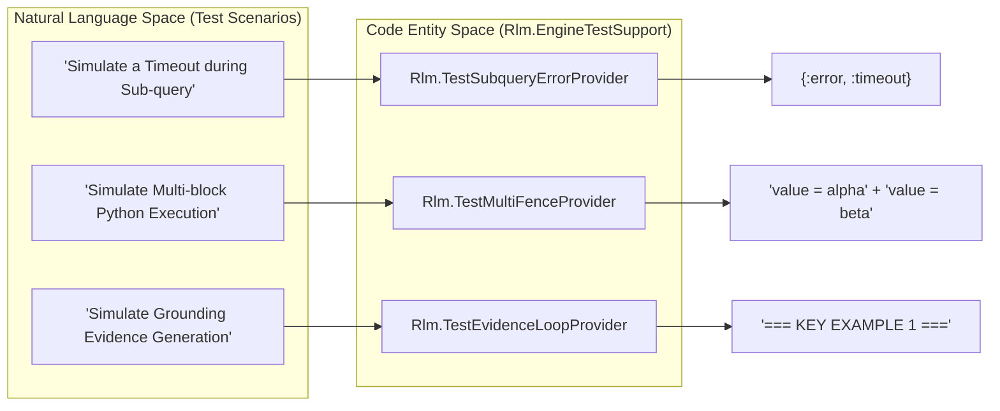
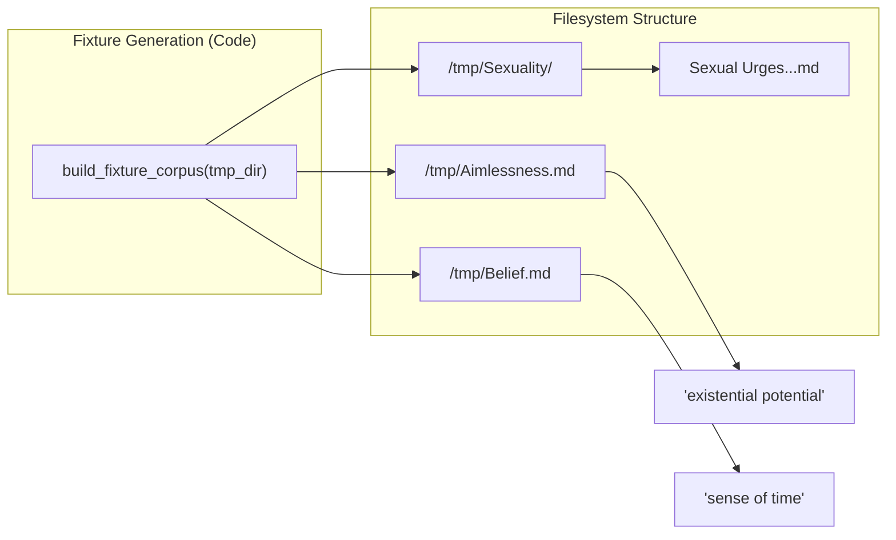

# Testing Infrastructure
Relevant source files
- [test/support/engine_test_support.ex](https://github.com/Cody-W-Tucker/rlm/blob/4bc8e1ba/test/support/engine_test_support.ex)
- [test/support/test_helpers.ex](https://github.com/Cody-W-Tucker/rlm/blob/4bc8e1ba/test/support/test_helpers.ex)
- [test/test_helper.exs](https://github.com/Cody-W-Tucker/rlm/blob/4bc8e1ba/test/test_helper.exs)

The `rlm` test suite is designed to validate the entire **Generate-Execute-Verify** loop, ranging from low-level HTTP streaming to complex multi-iteration engine recoveries. The infrastructure relies heavily on a "Mock Provider" architecture, allowing the engine to be tested against deterministic, pre-canned LLM responses that simulate specific failure modes or grounding scenarios.

## Test Suite Structure

The codebase utilizes `ExUnit` for its test runner and `Mox` for defining dynamic mocks of the provider behavior.

| Component | Location | Responsibility |
| --- | --- | --- |
| **Engine Integration** | `test/rlm/engine_test.exs` | End-to-end flow, iteration logic, and recovery. |
| **Mock Providers** | `test/support/engine_test_support.ex` | Specialized modules implementing the `Rlm.Providers.Provider` behavior. |
| **Fixture Data** | `test/fixtures/provider_responses/` | Raw text files simulating LLM output. |
| **Helpers** | `test/support/test_helpers.ex` | Utilities for temporary directories and `Rlm.Settings` generation. |

**Sources:**

- [test/test_helper.exs1-3](https://github.com/Cody-W-Tucker/rlm/blob/4bc8e1ba/test/test_helper.exs#L1-L3)
- [test/support/test_helpers.ex4-25](https://github.com/Cody-W-Tucker/rlm/blob/4bc8e1ba/test/support/test_helpers.ex#L4-L25)

## Mock Provider Ecosystem

Rather than relying on live LLM calls, the integration tests use a catalog of "Test Providers" defined in `Rlm.EngineTestSupport`. Each provider is hard-coded to return specific Python blocks or trigger specific errors to exercise the `Rlm.Engine` state machine.

### System Mapping: Engine to Mock Providers

**Key Mock Providers:**

- `Rlm.TestLoopProvider`: Returns a simple "working" print statement [test/support/engine_test_support.ex30-40](https://github.com/Cody-W-Tucker/rlm/blob/4bc8e1ba/test/support/engine_test_support.ex#L30-L40)
- `Rlm.TestAsyncProvider`: Exercises `async_llm_query` and the `FINAL` macro [test/support/engine_test_support.ex60-76](https://github.com/Cody-W-Tucker/rlm/blob/4bc8e1ba/test/support/engine_test_support.ex#L60-L76)
- `Rlm.TestRecoveringProvider`: Simulates a failure on the first attempt and successful recovery when it detects the "Recovery mode:" prompt in its history [test/support/engine_test_support.ex147-172](https://github.com/Cody-W-Tucker/rlm/blob/4bc8e1ba/test/support/engine_test_support.ex#L147-L172)
- `Rlm.TestMalformedFenceProvider`: Provides code without proper Markdown fences to test the `Salvage` heuristic [test/support/engine_test_support.ex174-189](https://github.com/Cody-W-Tucker/rlm/blob/4bc8e1ba/test/support/engine_test_support.ex#L174-L189)

**Sources:**

- [test/support/engine_test_support.ex30-250](https://github.com/Cody-W-Tucker/rlm/blob/4bc8e1ba/test/support/engine_test_support.ex#L30-L250)

## Fixtures and Corpus Generation

Tests often require a simulated filesystem to perform searches against. `Rlm.EngineTestSupport` provides `build_fixture_corpus/1` to generate a standard directory structure containing Markdown files with specific semantic content (e.g., "Aimlessness", "Belief Construction").

**Sources:**

- [test/support/engine_test_support.ex10-27](https://github.com/Cody-W-Tucker/rlm/blob/4bc8e1ba/test/support/engine_test_support.ex#L10-L27)
- [test/support/engine_test_support.ex2-8](https://github.com/Cody-W-Tucker/rlm/blob/4bc8e1ba/test/support/engine_test_support.ex#L2-L8)

## Child Pages

For detailed information on specific testing domains, refer to the following:

### [Engine Integration Tests and Mock Providers](/Cody-W-Tucker/rlm/8.1-engine-integration-tests-and-mock-providers)

Covers how the engine handles iteration budgets, recovery flags, and the transition from `Rlm.Engine.Iteration` to `Rlm.Engine.Finalizer`. Detailed look at the `fixture_response/2` mechanism for templating LLM responses.

### [Provider and Runtime Tests](/Cody-W-Tucker/rlm/8.2-provider-and-runtime-tests)

Focuses on unit tests for the `Rlm.Providers.RequestManager` (including SSE streaming and timeouts), grounding grade calculations in `Rlm.Engine.Grounding.Grade`, and the Python REPL protocol validation.